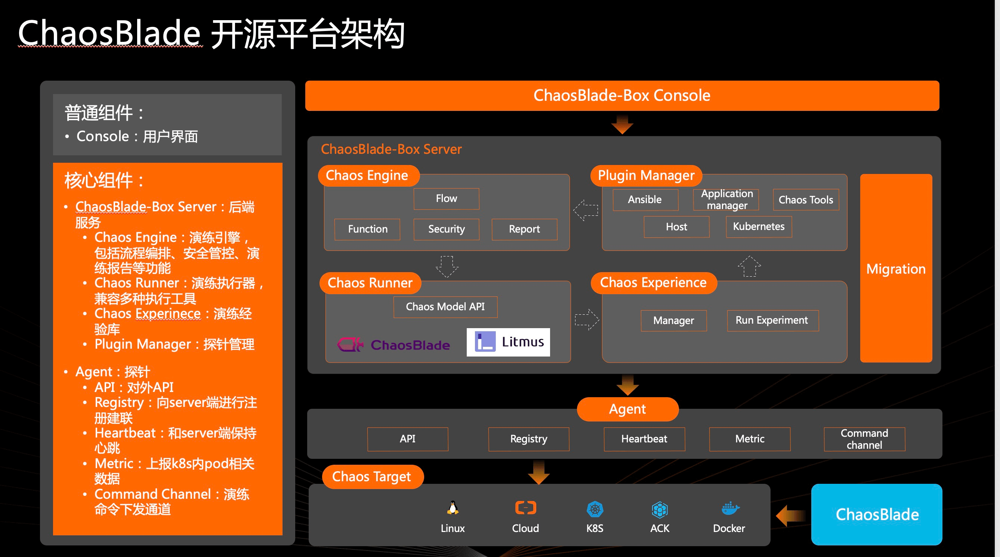
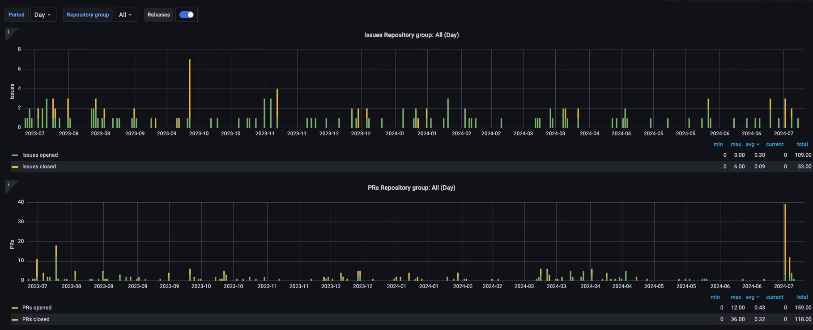
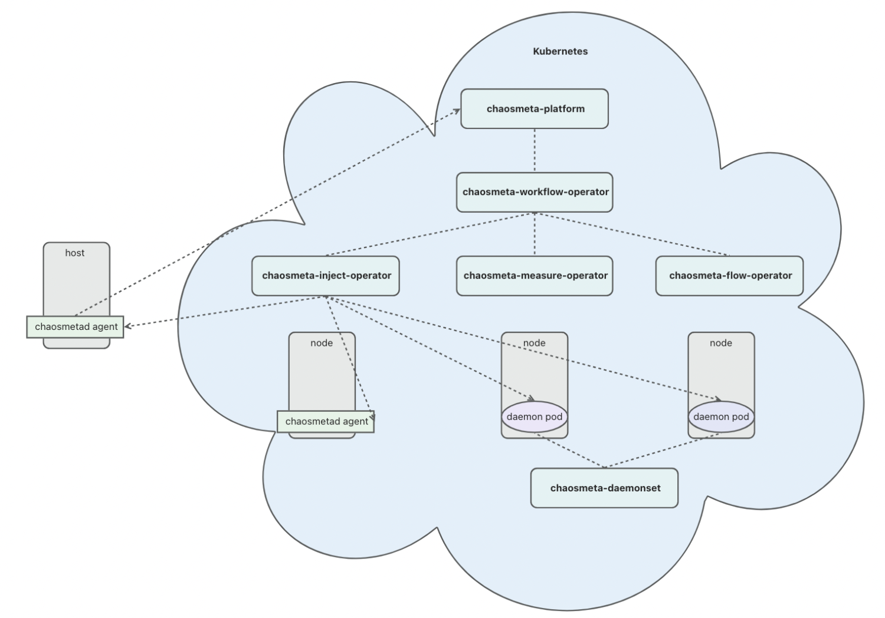
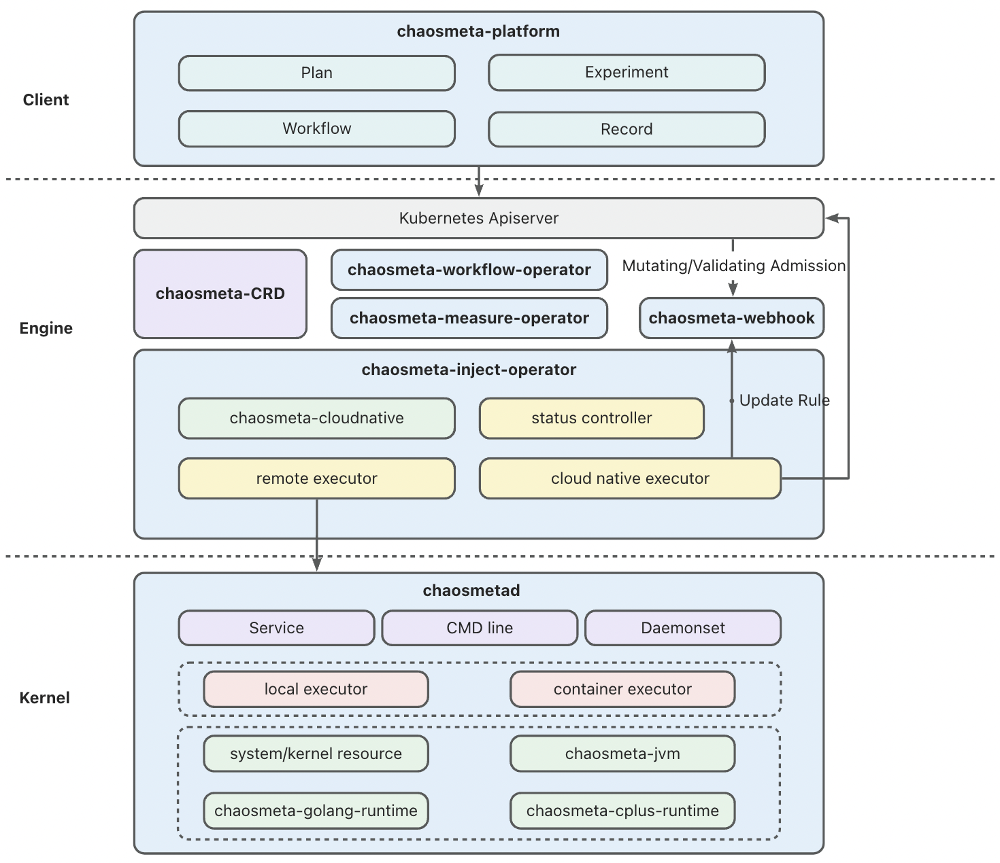
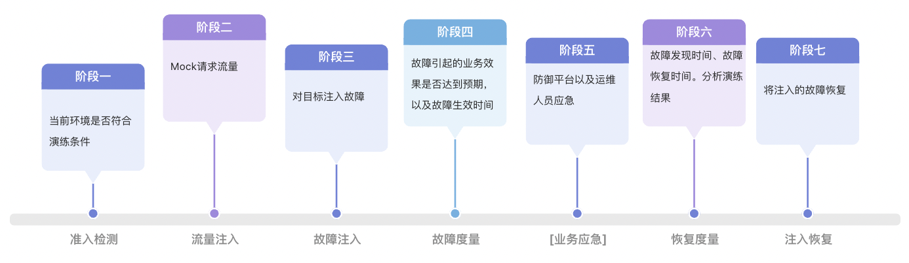
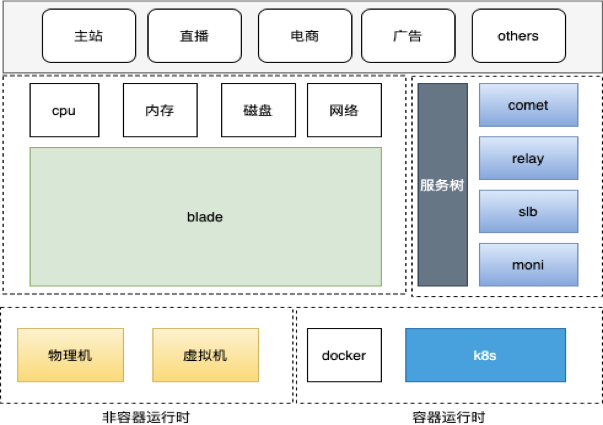
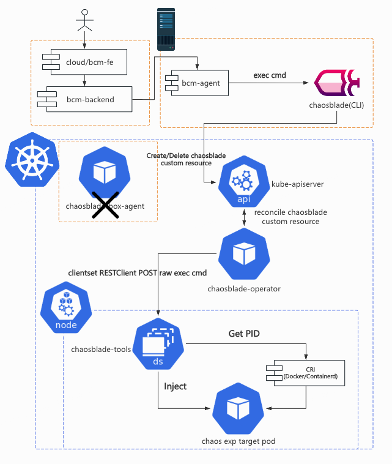

# 为什么 B 站还选择 ChaosBlade？

> 这篇博文摘录于《bcm-engine —— 我们如何给 ChaosBlade 第二春》。原文原本定稿于 2024 年 7 月 16
> 日，本以为老板要投稿到“哔哩哔哩技术”公众号上，后来却没有下文了。我认为这篇文章总结了我在
> B 站很大一部分工作精华内容，包含了许多我的思考和有意思的技术细节。
> 对“混沌工程”没有背景知识的读者不用担心读不懂，这篇文章主要讨论一些实际的系统实现问题。
>
> 摘录部分是原文的第一部分。本文主要介绍了当时国内混沌工程项目的现状，以及我们在选型时的考虑。
> 标题《为什么 B 站还选择 ChaosBlade？》是写个人博客时后取的。

## TL; DR

选择 ChaosBlade 作为公司新混沌工程平台的原因有以下几点：

- ChaosBlade 是国内最早开源的混沌工程项目，用户基础和企业用户数量最多。云原生程度
  较低，适合团队技术栈。
- 其他项目（如 Chaos Mesh 和 ChaosMeta）都需要较高的 Kubernetes 技术能力，团队技术储备不足，且有较大的适配难度。
- 公司和部门对 ChaosBlade 有接入经验，存在较强的“路径依赖”心理。

<!-- truncate -->

## 前言

关于混沌工程发展历程的文章很多，“他们”总是以 [Netflix chaosmonkey](https://github.com/Netflix/chaosmonkey)
开头，然后落到自己对混沌工程的实践上。

本文不落俗套，我们不再介绍混沌工程的概念与发展历史。本文主要介绍如何挑选开源项目来满足公司内的故障演练需求，如何进行合理有效的二次开发以更好地适配公司环境，最后作出展望，提出进一步优化设计。

bcm-engine 是我们 fork ChaosBlade 之后的项目名称，项目并没有开源。

对混沌工程还不太熟悉的读者可以阅读中国信通院混沌工程实验室发表的 [《中国混沌工程调查报告 （2021 年）》](http://www.caict.ac.cn/kxyj/qwfb/ztbg/202111/P020211115608682270800.pdf)。

## 背景

bilibili Chaos Manager (BCM) 哔哩哔哩混沌管理平台需要能够让用户在网页上对混沌演练进行全生命周期的管理，包括但不限于配置演练的目标、参数、观测指标、业务场景，执行、停止演练任务，编辑、查看演练报告等。

我们需要支持的故障注入类型多种多样，增加 CPU/内存/磁盘负载，影响网络数据包，篡改 DNS
解析。作为一个平台，我们更需要帮助用户组合多种故障及其参数，完成更复杂的演练。时间紧，任务重，人力有限，知识储备更有限，从 0 到
1 开发一个执行故障注入的引擎对我们来说是比较困难的，找一个能够适应 B 站演练需求，环境的故障执行引擎迫在眉睫。

## 选型

混沌实验执行引擎的选型是个十分关键的问题，项目启动以后就很难再换，这是一条不归路。

大家印象里， go 语言借着 Docker 容器和 Kubernetes(K8s) 编排引擎流行的历史洪流，开源生态发展迅猛，什么项目都能找到。出乎我们意料的是，2023
年 9 月技术选型时，许多 go 项目已经陷入了青黄不接的尴尬境地。以 CNCF
基金会公布的情况来看，开源社群的总人数没有稳步提升，项目越来越多，但老项目的维护愈发成为问题。这里给读者分享 2 篇来自一位
CNCF TOC（Technical Oversight Committee）的 Blog。

> Why Are CNCF Contributors Down: https://codeengineered.com/blog/2024/cncf-contributors-why-down/
>
> Retrospective After Two Years On The CNCF TOC: https://codeengineered.com/blog/2024/retro-cncf-toc/

### 国内的混沌工程项目近况

混沌工程领域的开源项目更是小众中的小众。笔者个人认为有 2 方面的原因：

1. 混沌工程是个非常“垂直”的领域，
   [CNCF Landscape](https://landscape.cncf.io/guide#observability-and-analysis--chaos-engineering)
   中混沌工程作为单独的一个领域存在。
   对于 GitHub 上的大多数开发者来说，他们没有实践混沌工程的需要或者条件。
2. 对于已经在实践混沌工程的公司或者开发者来说，混沌工程工具可能根据公司内部情况做了因地制宜的设计和实现，并不具有推广的普遍意义；混沌工程平台则是一种典型的企业级项目，需要整合许多公司内部资源，开源是有困难的。

难能可贵的是，阿里巴巴，PingCAP 和蚂蚁集团分别在 2019，2020 和 2023
年各自开源了 [ChaosBlade](https://chaosblade.io/)，[Chaos Mesh](https://chaos-mesh.org/)
和 [ChaosMeta](https://chaosmeta.gitbook.io/chaosmeta-cn)。相较于海外的 [Litmus](https://litmuschaos.io/)
（由 [MayaData](https://www.linkedin.com/company/mayadata/) 开源） 和 [Krkn](https://github.com/krkn-chaos/krkn)（由 RedHat
开源），他们都有比较清晰的中文文档，功能也更加强大和完整，我们还有机会在线下与 maintainer 进行沟通交流。

> 2025 年 5 月后记：选择开源项目不可避免地还要看看 star：

#### 国内先驱者—— ChaosBlade

根据公开资料显示，[ChaosBlade](https://github.com/chaosblade-io/chaosblade)
项目主体于 [2019 年 3 月](https://github.com/chaosblade-io/chaosblade/releases/tag/v0.0.1)
开源， [2021 年 4 月](https://www.cncf.io/projects/chaosblade/) 成为 CNCF Sandbox 项目，其中包括一个命令行程序 blade CLI
以及各种各样的故障注入
executor（如 [chaosblade-exec-os](https://github.com/chaosblade-io/chaosblade-exec-os)，[chaosblade-exec-cri](https://github.com/chaosblade-io/chaosblade-exec-cri)
等），使得用户可以在终端上执行 blade CLI，配合不同的命令和参数，对本地或者本地的容器环境执行故障注入。

[chaosblade-operator](https://github.com/chaosblade-io/chaosblade-operator)
于 [2019 年 11 月](https://github.com/chaosblade-io/chaosblade-operator/releases/tag/v0.4.0) 开源，其中包含了一套 K8s CRD
及其 Operator，使得用户可以创建针对 K8s Node/Pod/Container
的实验。它是一个用 [operator-sdk](https://sdk.operatorframework.io/) 搭建的 operator 项目。

[chaosblade-box](https://github.com/chaosblade-io/chaosblade-box)
于 [2021 年 2 月](https://github.com/chaosblade-io/chaosblade-box/releases/tag/v0.1.0)
开源，其中包含了一个混沌工程平台的前后端工程项目，使得用户可以自行搭建类似于 [阿里云 AHAS Chaos](https://help.aliyun.com/zh/ahas/user-guide/faq-about-failure-drill/)
（一款遵循混沌工程实验原理并融合了阿里巴巴内部实践的产品，提供丰富故障场景，能够帮助分布式系统提升容错性和可恢复性。）的混沌工程平台，在网页上构建并运行混沌实验流程。chaosblade-box
开源后，ChaosBlade 可以被真正地称为混沌工程平台产品，而不再是一个命令行工具。chaosblade-box 是一个用 Maven 组织的 Mono Java
项目，包含了多个 Module。chaosblade-box
中的前端页面源码则在另一个项目 [chaosblade-box-fe](https://github.com/chaosblade-io/chaosblade-box-fe) 中。

下图出自官方
Blog [《ChaosBlade-Box 全新混沌工程平台 -- 助力企业混沌工程落地》](https://chaosblade.io/blog/2022/06/24/ChaosBlade-Box-a-New-Version-of-the-Chaos-Engineering-Platform-Has-Released-ch)
，简单展示了引入 chaosblade-box 后系统的整体架构。其中 Agent 负责在目标机器/K8s 集群中与 chaosblade-box 进行交互，用来创建故障实验，调用
blade CLI 或者创建 ChaosBlade custom resource。
它在另一个项目 [chaosblade-box-agent](https://github.com/chaosblade-io/chaosblade-box-agent) 中。

ChaosBlade 项目里的命名不太清楚，可以发现很多东西都叫 “chaosblade”，很容易引起歧义，本文在此做一次解释，后文不再赘述。

- ChaosBlade 是指整个 ChaosBlade 项目，即 https://github.com/chaosblade-io 下的所有项目。
- chaosblade 是指 https://github.com/chaosblade-io/chaosblade ，它的产物包括 blade CLI 等可执行程序。笔者认为这个 repo 应该叫
  chaosblade-cli，以和组织（chaosblade-io），品牌加以区分。
- ChaosBlade custom resource
  是指定义在 [chaosblade-operator/pkg/apis/chaosblade/v1alpha1](https://github.com/chaosblade-io/chaosblade-operator/tree/master/pkg/apis/chaosblade/v1alpha1)
  中的 [ChaosBlade custom resource](https://github.com/chaosblade-io/chaosblade-operator/blob/master/pkg/apis/chaosblade/v1alpha1/types.go#L168)
  ，其中包含 `spec` 和 `status` 2 个字段，`spec` 中有实验的定义。笔者认为这个命名是最模糊的，`ChaosBlade` 根本不能将一个资源的含义表达清楚。（后记，这个 CRD 应该叫 `experiment`）

根据 CNCF 官方的 [统计数据](https://chaosblade.devstats.cncf.io/d/8/dashboards?orgId=1)，可以发现 ChaosBlade 在近一年都没有发布新的
release 版本，GitHub Activity（包括 Commit，PR，issue，Release 等）比较少。

经过笔者半年多对 ChaosBlade 的观察和参与，发现项目的 owner 是阿里云的 [@camix](https://github.com/MandssS)，ta
会每隔一段时间上线处理一些 Issue 和 PR，近期 ta 还向 CNCF 提出了将项目升级为 incubating
项目的 [申请](https://github.com/cncf/toc/pull/1278)。maintainer 之一的 [@tiny-x](https://github.com/tiny-x)
在钉钉群中算是比较活跃的，但他几乎不会去处理
Issue 和 PR。其他的 maintainer 如阿里云的 [@xcaspar](https://github.com/xcaspar)
，中国移动的 [@Yuaninga](https://github.com/Yuaninga) 和 GitLab 中国的 [@sunny0826](https://github.com/sunny0826)
则不活跃。比较重要的
Contributor 还有滴滴的 [@binbin0325](https://github.com/binbin0325)，他在钉钉群中透露过一些设计思路。

作为中国最早开源的混沌工程项目，它有着同类项目中最大的用户基础和企业用户数量，其中不乏国内知名 [大厂](https://github.com/chaosblade-io/chaosblade/issues/32)
。从上面笔者对其社群的观察就能发现，ChaosBlade 也不免落入国内开源项目“重开源轻运营维护”的困境：内外两套代码，黑箱决策，没有完整的
Issue-PR 讨论，维护停滞等。

> 2025 年 5 月后记：本文初稿成文后的半年至今，上文提到的 [@camix](https://github.com/MandssS)
> 和 [@tiny-x](https://github.com/tiny-x)
> 已经完全从钉钉群里消失，目前仍会说话的仅剩 [@xcaspar](https://github.com/xcaspar)。[@camix](https://github.com/MandssS)
> 提的
> CNCF incubating issue 也石沉大海了。但哪怕这样还是不断有新用户加入钉钉群，这个项目的影响力真的很夸张。

#### 云原生践行者—— Chaos Mesh

根据公开资料显示，[Chaos Mesh](https://github.com/chaos-mesh)
于 [2020 年 4 月](https://github.com/chaos-mesh/chaos-mesh/releases/tag/v0.8.0)
开源，[2020 年 7 月](https://chaos-mesh.org/blog/chaos-mesh-join-cncf-sandbox-project/) 成为 CNCF Sandbox
项目，[2022 年 2 月](https://www.cncf.io/blog/2022/02/16/chaos-mesh-moves-to-the-cncf-incubator/) 成为 CNCF Incubating
项目。Chaos Mesh 是一个“纯正”的云原生项目，核心组件必须运行在 K8s 中，内部组件交互也全都是标准的 gRPC 和 JSON-RPC。

[chaos-mesh](https://github.com/chaos-mesh/chaos-mesh) 是一个组织良好的 Mono Repo，其中包含以下主要组件。

- /cmd/chaos-dashboard 下的 [Chaos Dashboard](https://github.com/chaos-mesh/chaos-mesh/tree/master/cmd/chaos-dashboard)
  ，Chaos Mesh 的可视化组件，提供了一套用户友好的 Web 界面，用户可通过该界面对混沌实验进行操作和观测。同时，Chaos Dashboard
  还提供了 RBAC 权限管理机制。
- /cmd/chaos-controller-manager
  下的 [Chaos Controller Manager](https://github.com/chaos-mesh/chaos-mesh/tree/master/cmd/chaos-controller-manager)
  ，Chaos Mesh 的核心逻辑组件，主要负责混沌实验的调度与管理。该组件包含多个 CRD Controller，例如 Workflow、Scheduler
  Controller 以及各类故障类型的 Controller。
- /cmd/chaos-daemon 下的 [Chaos Daemon](https://github.com/chaos-mesh/chaos-mesh/tree/master/cmd/chaos-daemon)，Chaos
  Mesh 的主要执行组件。Chaos Daemon 以 DaemonSet 的方式运行，默认拥有 Privileged 权限（可以关闭）。该组件主要通过侵入目标 Pod
  Namespace 的方式干扰具体的网络设备、文件系统、内核等。

还有一些位于其他 repo 的重要组件。

- [Chaosd](https://github.com/chaos-mesh/chaosd) 用于在物理机环境上注入故障，并提供故障恢复功能。
- [chaos-tproxy](https://github.com/chaos-mesh/chaos-tproxy) 用于注入 HTTP 故障，借助 linux iptables extension tpproxy
  实现了 HTTP 代理，完成丢包，延迟等故障注入，使用 Rust 开发。
- [toda](https://github.com/chaos-mesh/toda) 用于注入文件 I/O 故障，它是一个 hook filesystem 工具，使用 Rust 开发。

上述 2 个 Rust 项目由于本身项目文档不足，笔者能力有限以及不甚了解具体的领域知识，在此就不作过多介绍了。

尽管和 ChaosBlade 一样，Chaos Mesh
也进入了长期维护阶段，但从下列 [图表](https://chaosmesh.devstats.cncf.io/d/12/issues-opened-closed-by-repository-group?orgId=1&var-period=d&var-repogroup_name=All)
中可以看出项目还是保持着稳定的维护。目前项目的主要
owner 是
[@STRRL](https://github.com/strrl)，他去年（后记：2023
年）还在 [上海 KubeCon](https://kccncosschn2023.sched.com/event/1PTKK/chaos-meshdaeppei-huan-chaos-mesh-overview-practice-and-future-zhou-zhiqiang-individual-cwen-yin-pingcap-xianglin-gao-tencent)
上推广了 Chaos Mesh，主要负责日常维护的 maintainer 是 [@g1eny0ung](https://github.com/g1eny0ung)，Rust 组件的维护由仍在
PingCAP 的 [@YangKeao](https://github.com/YangKeao) 维持。

PingCAP 自称是一家 “业界领先的企业级开源分布式数据库企业”，笔者认为 Chaos Mesh 没有给公司“拖后腿”。虽然晚于 ChaosBlade
几个月开源，但 Chaos Mesh 的项目组织和社区运营情况都比 ChaosBlade 好不少。由于云原生项目的性质，Chaos Mesh 的用户群体一定没有
ChaosBlade
多，但仍然吸引了包括腾讯、字节、小鹏汽车等 [大厂](https://github.com/chaos-mesh/chaos-mesh/blob/master/ADOPTERS.md) 使用，更吸引了
Microsoft Azure 用其打造了自己的混沌实验产品 [chaos studio](https://learn.microsoft.com/en-us/azure/chaos-studio/)。
Chaos Mesh 可以吸引来自国外的开发人员和组织参与贡献，这一点难能可贵。

> 2025 年 5 月后记：Chaos Mesh 目前来看仅有主项目 Chaos Mesh 还有持久的更新迭代，2 个令 Chaos Mesh ”突出重围“与众不同的“黑科技”项目
> chaos-tproxy 和 toda 已经沦落到和 ChaosBlade 一样，有多人评论的共性问题 issue
> 都长期无人应答了（比如：[[HELP] tproxy make network failed](https://github.com/chaos-mesh/chaos-tproxy/issues/67)）。我在
> 2024 年年末尝试将 [chaos-tproxy](https://github.com/chaos-mesh/chaos-tproxy) 集成进 bcm-engine
> 中，但难以解决的主机网络失联问题让我最终放弃。好在相关需求最终被老板“挡住”了，不然黔驴技穷的我会很尴尬。
>
> 对这几个社区的观察让我发现长期坚持无偿维护开源社区并持续投入是这个世界上最难的事情之一。

#### 后起之秀—— ChaosMeta

根据公开资料显示，[Chaos Meta](https://github.com/traas-stack/chaosmeta)
于 [2023 年 5 月](https://mp.weixin.qq.com/s/bw8Emb_19hv3SIv6ScvYAg) 开源，目前还处于快速迭代阶段。ChaosMeta 和 Chaos Mesh
的架构相近，但它“云原生化”的程度更高，引入了 4 个独立的 operator 用于处理不同的实验相关的工作。

1. chaosmeta-inject-operator 提供了故障注入调度能力：下发到目标机器 Agent 以及云原生注入能力，与 ChaosBlade 的
   chaosblade-operator，Chaos Mesh 的 Chaos Contoller Manager 功能基本一致。
2. chaosmeta-workflow-operator 用于编排实验，其实直接用的是 Argo Workflows 的 workflow-controller。Chaos Meta 利用 Argo
   Workflows 的 DAG，拼接 ResourceTemplate 和 SuspendTemplate，巧妙实现了“创建 Experiment custome resource”
   ，“持续一段时间”等工作流中事项的编排。
3. chaosmeta-measure-operator 用于度量故障注入和恢复是否成功。这一点在 chaosblade-box 中有所涉及，Chaos Mesh 则没有相关功能。
4. chaosmeta-flow-operator 用于注入 HTTP 流量，提供类似于压测的能力。

其他组件和 Chaos Mesh 都有一一对应。

ChaosMeta 的社区和 ChaosBlade 一样，主要依托钉钉群，但他们做得比较好的是会把钉钉群中的问题及时同步到 GitHub Issue
中。还在快速迭代的产品没有经历过大量用户的实际使用测试，钉钉群里活跃的人不算多，但开发人员回复的速度非常快，这一点值得称赞。

> 2025 年 5 月 9 日后记：这个项目也凉凉了，一两个月才有人在群里说句话，开源社区完全没有开放贡献。

### 如何选择

三个项目看起来都很好，我们究竟如何选出适合我们的项目呢？

#### 挑战

企业内部使用开源项目往往会遇到以下挑战：安全漏洞风险，版权合规风险，运维、适配、拓展难度大。

混沌工程平台在内部被严格限制进出网规则，仅限内网使用，哪怕项目存在大量的 CVE 漏洞（比如缺少维护的
ChaosBlade），不暴露公网的话总体风险仍然可控。

上述 3 个项目都受 [Apache-2.0 license](https://www.apache.org/licenses/LICENSE-2.0)
保护，它是对用户最友好的开源证书。作为公司内部使用项目，只要不借助他们的商业品牌做商业推广就不会有合规风险。关于这一点感兴趣的读者可以阅读这篇文章：[《企业开源该选什么软件许可证？》](https://www.tisonkun.org/2022/12/17/enterprise-choose-a-software-license/#Apache-License-2-0)。

对我们来说最具有挑战的是第三点：运维、适配、拓展难度大。笔者将从以下几个角度来分析上述 3 个开源项目。

- 项目是否契合产品需求和技术要求？
- 团队是否拥有维护，拓展项目所需的技术储备？
- 公司是否有充足并且合适的基础设施，技术支持来帮助我们更好地使用项目？
- 产品经理或上级领导是否给予了足够的时间让我们开展适配工作？

#### Why not ChaosMeta?

随着 K8s CRD 开发的配套设施（kubebuilder 等项目脚手架，以及相关文档资料等）日趋完善，以及云原生开发的理念在国内慢慢被各大公司接受，近几年才立项，去年才公布开源的
ChaosMeta 在架构设计上是最“优雅”的。它充分使用了 CRD 及 operator 来实现项目自身几乎所有的业务逻辑：实验的定义，编排实验，执行实验，实验观测方式的定义等等。CRUD
的”舞台“从数据库缓存转向了 K8s controller-runtime，降低了部分开发成本，但对开发人员的要求提高了不少。这样的设计还使得整个项目能更好地做到“无状态”。

实现流程编排是一项”繁重”的工作。多个节点按顺序执行，并发同时执行，根据条件执行，以 DAG
的方式执行，随便罗列一些需求就是需要许多人天的工作。在实现上，项目直接将 [Argo Workflows](https://argoproj.github.io/workflows/)
中的 [workflow-controller](https://argo-workflows.readthedocs.io/en/latest/architecture/) 拿来当作实验流程编排的实现非常讨巧。仅需将表单转化成
Argo Workflows 的 workflow custom resource，编排工作就完成了，其余的编排实现，流程执行都不需要自己实现。Argo 是一个成熟的项目，2020
年 3 月成为 CNCF incubating 项目，2022 年 12 月 Graduated 毕业。其中的 Argo Workflows 用于实现顺序多步骤或者 DAG
的工作流编排，以支撑 Argo CD。像 Chaos Meta 这样直接使用 Argo Workflows
的 [项目](https://github.com/argoproj/argo-workflows/blob/main/USERS.md)
不在少数，笔者比较了解的是机器学习任务相关的 [KubeFlow](https://www.kubeflow.org/) 和 [MetaFlow](https://metaflow.org/)。

抛开技术上的设计与实现不谈，来自蚂蚁的相关团队对混沌工程平台的理解，产品设计是三个项目里最完整的。如下图所示，他们对故障演练的认识非常充分。这些步骤和阶段与我们
BCM 平台实际使用情况基本一致。

但 ChaosMeta 仍然存在一些缺陷，导致我们无法选择它。在做技术选型的时候， ChaosMeta
仍处于起步阶段，刚刚开源不到半年，真实使用过的用户数量都没有公布（直到现在他们也没有创建 Adopters Issue）。这个项目内部潜在的
Bug 和设计缺陷没有充分暴露的机会，我们不敢做第一批“吃螃蟹的人”。Chaos Meta 的代码主要构成都在 Operator 上，团队在云原生方向的人力也不足以应付
Chaos Meta。项目还依赖了 Argo Workflows workflow-controller，目前团队中对 Argo Workflows 有使用和运维经验的也只有笔者一人。

最致命的是，Chaos Meta 直到笔者撰写本文时仍然不支持对非容器化目标进行演练，这一点我们不能接受，B
站仍有一些重要的组件没有容器化，它们仍有强烈的故障演练需求。

此外笔者在钉钉群里发现有用户在询问 Chaos Meta 项目中依赖的 Argo Workflows 如何与集群中现有的 Argo Workflows
共存的问题，maintainer 似乎之前没有认真思考过这个问题。这对我们来说也将会是个棘手的问题，虽然笔者曾经遇到过类似的情况（单一集群内多租户共用还是独用
Operator），但现在由于组织架构的关系，这样的运维问题需要跨团队协同处理，可行性和成本难以预估，我们无法接受。

#### Why not Chaos Mesh?

Chaos Mesh 也是一个优秀的云原生项目，依托于 PingCAP 在开源社区中良好的口碑和声誉，它拥有一个健康的社区，有着许多用户和国内外大型企业的背书，是三个项目中唯一一个走出国门的项目。其项目文档是
3 个项目中最全面，准确和清晰的，也有其他 2
个项目都没有的自动化 [e2e 测试](https://github.com/chaos-mesh/chaos-mesh/tree/master/e2e-test) 模块和一套完整的基于
GitHub Actions 的 [CI/CD 工作流](https://github.com/chaos-mesh/chaos-mesh/tree/master/.github)。

 

Chaos Mesh 与其他 2 个项目相比能够支持更多的实验类型。使用 Rust 开发的 chaos-tproxy 和 toda 十分“硬核”。ChaosBlade 的
maintainer [@tiny-x](https://github.com/tiny-x) 在钉钉群里都曾向笔者推荐过参考 toda 来重新实现 ChaosBlade 不太好用的磁盘
I/O 故障注入。

Chaos Mesh 也有强大的流程编排能力，它参考了 Argo Workflows 的设计与实现，但它为了不和 Argo 强绑定，实现了自己的
Workflow，定义起来和 Argo Workflows 无异。

Chaos Mesh 也不是完美的。据 [@STRRL](https://github.com/strrl) 自己所说，Chaos Mesh 目前缺少公司组织来投入人力做特性开发（但维护状况也比
ChaosBlade
好一些）。相较于阿里云的 ChaosBlade 和蚂蚁集团的 ChaosMeta，这 2 个项目的核心成员还任职于本公司。Chaos Mesh 的 maintainer
基本都已经离开了 PingCAP，公司不再向开源版本投入更多人力，这导致了 Chaos Mesh 无法再进行较大的版本更迭。

此外，由于 Chaos Mesh 中实验的 Duration（ChaosBlade 里叫 timeout）的实现是在 operator 里完成的：倒计时结束且状态符合预期后，operator
会向目标 daemonset pod server 发 grpc 请求执行恢复操作（ChaosBlade 是在目标 daemonset pod 里启动 nohup 进程，sleep
一段时间后无条件执行 destroy 命令），这导致了实验可能因为恢复请求没有送达，或各种各样的原因没有如期执行恢复，导致实验最终都无法被恢复，只能删除
Pod 来解决。[@STRRL](https://github.com/strrl) 举了一个极端的例子，当注入的文件 I/O 故障影响到了 TCP Socket FD
的时候，恢复请求就会受到影响。他认为
Chaos Mesh 还存在大量的边缘情况没有测试清楚。（不知道 ChaosBlade 社区是如何思考这些事情的。）

现在回过头来看，Chaos Mesh 在技术和产品需求上可以基本满足我们的要求。但选型时我们仍然放弃了它，主要考虑到以下问题。

1. 2023 年 9 月技术选型时团队没有足够的人力资源去研究开源项目，维护混沌实验引擎（笔者是自 2024 年 H1
   才专注于这方面的工作，接手了部分前人的工作）。
2. 对主机的混沌实验需求能否支持，能否完全满足需求成疑。在上述 1 的背景下我们没有足够的时间去调研和实践。（如今再仔细读 Chaos
   Mesh
   的文档，发现物理机其实是支持的，只不过需要创建对应的 [PhysicalMachine custom resource](https://chaos-mesh.org/zh/docs/simulate-physical-machine-chaos/)）
3. 目前 B 站的容器化应用发布由 B 站的 Paas 团队开发的平台统一管理，云原生项目往往是通过 Helm Chart
   分发和迭代的，目前没有平台能支持。绕开平台维护应用需要跨团队沟通协调，成本不可预估。Chaos Mesh 和 ChaosMeta 一样，都有许多
   CRD 需要维护，可能会有困难。
4. 需要进行混沌演练的 K8s 集群和物理机非常多，地域分布不确定，网络链路可能很复杂。平台 apiserver 和 operator
   到目标机器/集群的网络是否能够打通。把服务调度到特别的 Node，再做特别的网络安全组打通网络，其中的可行性和成本不可预估。这一点是最关键的，成为“压死骆驼的最后一根稻草”。

#### Why ChaosBlade?

排除了其他候选后，ChaosBlade 就是一个完美适合我们的项目了吗？当然不是，它的问题非常多，笔者在此举几个例子。

翻看市面上知名的 Go 项目就能发现，包含多个 module（可以不是单独的 go mod） 的 mono repo 是最好的组织代码方式。但 ChaosBlade
项目是以 repo 为单位封装 module 的。这导致每一个项目都需要单独管理依赖，做版本迭代时需要为每一个 repo 中的 go mod
升级版本，一旦遗漏了某个项目，最上层的项目的构建都会受到影响。再加上整个 ChaosBlade 项目在 GitHub
上没有任何自动化流水线（基于 [travis-ci](https://www.travis-ci.com/)
或者 [GitHub Actions](https://docs.github.com/en/actions) 都没有），导致经常出现因为底层的某一个 exec-\* 项目没有正确执行
go mod tidy，最上层的 chaosblade 无法成功构建。

ChaosBlade 项目时间跨度比较长，项目中代码风格有过明显的转变。作为一个 Go 项目，其中的许多接口设计和实现非常的
“Java-style”，违反了 go
开发者的许多常识。对我们来说“体感”最强烈的部分就是日志，早年间在 [chaosblade-spec-go](https://github.com/chaosblade-io/chaosblade-spec-go)
中封装的日志调用代码在后来 chaosblade-operator 就完全不使用了，使用了原生的 [logrus](https://github.com/sirupsen/logrus)
。甚至在 chaosblade-spec-go 内，都有 2 套同样基于 logrus
的日志封装实现，分别是 [/log](https://github.com/chaosblade-io/chaosblade-spec-go/tree/master/log)
和 [/util/log.go](https://github.com/chaosblade-io/chaosblade-spec-go/blob/master/util/log.go)。整个项目中有大量文件的 go
imports 都没有被 gofmt 过，maintainers 也不处理类似的 PR。

阿里云最为人诟病的一点就是文档建设，文档经常是过时和错误的，亦或是轻描淡写，一笔带过的，有什么问题往往都要咨询技术支持拉群解决。开源项目也没能幸免。ChaosBlade [站点](https://chaosblade.io/)
源码在 [chaosblade-website](https://github.com/chaosblade-io/chaosblade-website) 这个 repo
中，几乎从来没有人去修复过文档错误。一旦遇到什么使用上的问题，都需要翻阅源码或者在钉钉群里艾特 maintainer 才能解决。

##### “路径依赖”

选择 ChaosBlade 除了“无可奈何”，还因为在我们平台工程开发 BCM 平台前，已经有团队使用 chaosblade 搭建了类似的平台，笔者翻看过去的文档可以发现
B 站对混沌工程的实践由来已久。2019 年 EP 团队在 Hassan 平台中就已经集成了 ChaosBlade 对目标实例进行 CPU、内存、磁盘、DNS
和网络故障注入。2021 年 SRE 团队推出了混沌实验平台 chaos-mng，打通了公司内部的服务树和周边平台，增加了实验管理、场景实验等能力，简化了用户的操作流程。前面有过
2 个平台的集成使用，我们对用过的项目有“路径依赖”心理是完全合理的。

##### 改造成本低

ChaosBlade 虽然也自称是“云原生“项目，但它不像 CRD 开发时常见的 apiserver+operator
的架构（比如 [Argo Workflows 下的 /server](https://github.com/argoproj/argo-workflows/tree/main/server)，[KubeVela](https://github.com/kubevela/kubevela)
下的 [VelaUX](https://github.com/kubevela/velaux)，Chaos Mesh 的 Chaos Dashboard，ChaosMeta 的 chaosmeta-platform 等），它的
“apiserver” chaosblade-box 是一个传统 Java 项目，不直接与 K8s 集群和 CustomResource 交互，这给了我们机会去做组件替换，降低了适配成本。

首先我们自研了前端（后记：上图里的的 cloud/bcm-fe）和平台服务（后记：上图里的 bcm-backend，请不要在意这个糟糕的名字，是一个阿里老哥取的）以替换 chaosblade-box-fe 和 chaosblade-box。chaosblade-box-fe
中使用了大量的阿里巴巴内部组件，导致我们完全无法复用，不适配部门的 React 技术栈。而 chaosblade-box 是个 Java
项目，不适配我们部门 Go 语言的技术栈，组里能写好 Java
的同学也不多。它组织得比较复杂，似乎经历过几代维护者，他们的编码风格都不尽相同，而且有明显的从内部版本中脱敏剥离的痕迹，却没有留下任何开源文档。

---

本章完。

请看下一掌，[如何改造 ChaosBlade？](./2-internal-adaption.mdx)！
