# 如何改造 ChaosBlade？

> 这篇博文摘录于《bcm-engine —— 我们如何给 ChaosBlade 第二春》。原文原本定稿于 2024 年 7 月 16
> 日，本以为老板要投稿到“哔哩哔哩技术”公众号上，后来却没有下文了。我认为这篇文章总结了我在
> B 站很大一部分工作精华内容，包含了许多我的思考和有意思的技术细节。
> 对“混沌工程”没有背景知识的读者不用担心读不懂，这篇文章主要讨论一些实际的系统实现问题。
>
> 摘录部分是原文的第二部分，并做出了一定的删减和结构调整。本文主要介绍了我们如何改造 ChaosBlade 以适应公司和产品需求。
> 标题《如何改造 ChaosBlade？》是写个人博客时后取的。

2024 年 H1，团队决定正式开启对 ChaosBlade 的改造和二次开发，新项目命名为 bcm-engine。

## TL; DR

改造内容：

1. 架构改造：移除不适合的 K8s 集群组件，在物理机上引入新的命令转发组件以更好地适应公司网络环境。
2. 仓库改造：分散仓库 => mono repo。
3. 本地化：绕开一些我们难以解决的设计/实现缺陷。

第一个改造项目并不需要改动 ChaosBlade 任何源码。第三点是二次开发的原始动机。改动源码的基础是第二点。

<!-- truncate -->

## 适配公司网络环境

> 2025 年 5 月后记：这部分的工作我猜测大概在 2021-2022 年就被前人完成了。我只是接手了这些东西并作以技术分析。

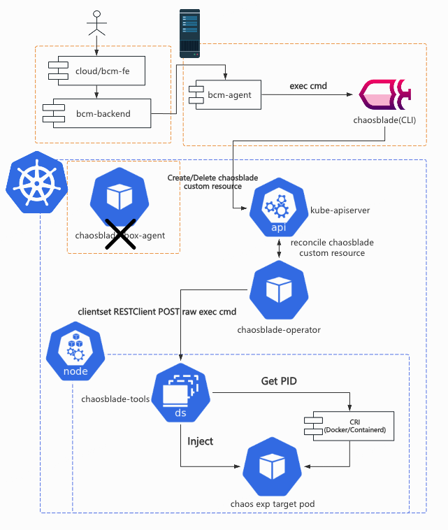

为了解决 [前文](1-open-source-project-selection.md) 中提到的跨地域网络问题，我们引入了一台物理机，上面部署了 bcm-agent 与
chaosblade，以此替代原本集群中的
chaosblade-box-agent。这样一来我们只要为单独的这一台物理机设置网络安全组就能解决所有的网络连同性问题。bcm-agent 摘取了部分
chaosblade-box-agent 中的代码，它是一个 HTTP Service，用来接受来自上层 bcm-backend 平台的请求（Create/Destroy/Query），将请求作为参数拼接在
blade 指令后，变成可以执行的 shell 命令。如果是对非容器化的机器进行演练，这样的链路就已经能满足演练需求了。

> 2025 年 5 月后记：在这补充更多的技术细节——
> 如果按照 ChaosBlade 原本的组件架构，chaosblade-box 需要直接和演练目标集群中的 chaosblade-box-agent 通信。
> 如果 chaosblade-box 是一个 K8s 容器化应用，那么意味着这个 Pod 很可能需要跨 K8s 集群通信。
> 这在 B 站是一个极具风险的操作，因为我们无法单独为一个 Pod 设置网络安全组。
> 如果把它单独部署到一个 Node 上又需要占用额外的机器和运维成本。
> 上述风险是显而易见的，因此 B 站之前集成 ChaosBlade 的团队选择了上文中描述的方式，写一个部署在物理机上的命令转发程序，简化运维成本。
> 其中的代码大部分都是从 chaosblade CLI 中的 server 模块和 chaosblade-box-agent 里复制出来的。

而集群中的 CRD，operator，Daemonset 等相关的资源，我们几乎没有做任何改动。这样一来，我们能够复用前文提到的 SRE 团队直接研发的
chaos-mng 平台所用的 chaosblade operator。

虽然这看起来这很“粗糙”，请求链路被拉得很长，HTTP 请求中调用 CLI
程序并不可靠，但这确实是当时最好的解决方案，既满足了产品的需求，又以最小的成本解决了网络连通性的问题。上线半年多以来，这样的架构支撑起了十余个重要平台服务，中间件的故障演练任务。

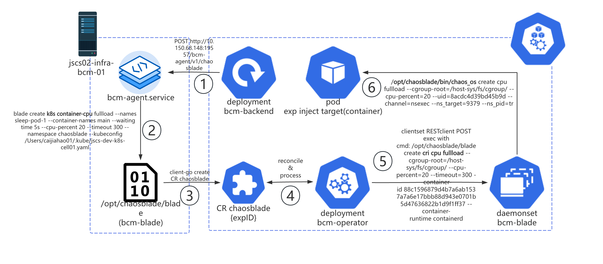

> 2025 年 5 月后记：现在整个 BCM 平台支持了将近 200 多个服务做混沌工程故障演练。

## Fork ChaosBlade 并改造成 mono repo

> 2025 年 5 月后记：这里其实说的是把 chaosblade CLI 和 chaosblade-operator 及其依赖的包 fork 下来改造成 mono
> repo。由于诞生的先后顺序和组织架构原因，我并没有把命令转发程序 bcm-agent、平台 bcm-backend 和前端 cloud/bcm-fe 也一并迁入这个仓库。

原本的 ChaosBlade 项目结构大致如下，每个 module 作用见行尾注释。

```shell
$ tree -L 1
.
├── chaosblade # 一个 cobra CLI 程序（下简称 blade），把所有的 exec module 串联起来，注册 cobra 命令。
├── chaosblade-box # 一个 Java Spring 服务用作引擎上层的平台产品，bcm-backend 参考了它的实现，不在本文的讨论范围。
├── chaosblade-exec-cloud # 云服务相关故障注入执行器。没有相关需求，不 fork。
├── chaosblade-exec-cplus # C++ 程序相关故障注入执行器，官方版本停留在了 1.5.0（目前最新版本是 1.7.3），猜测已经废弃。没有相关需求，不 fork。
├── chaosblade-exec-cri # cri 容器相关故障注入执行器，k8s 相关命令和 operator 依赖这个 module。但我们不会直接操作容器，都是从 K8s 向 Pod 容器注入故障。
├── chaosblade-exec-docker # docker 容器相关故障注入执行器。没有相关需求，不 fork。
├── chaosblade-exec-jvm # Java 程序相关故障注入执行器。没有相关需求，不 fork。
├── chaosblade-exec-middleware # 中间件（mysql，redis，nginx 等）相关故障注入执行器。没有相关需求，不 fork。
├── chaosblade-exec-os # OS（CPU，Mem，Network，File 等）相关故障注入执行器。这是我们最核心关注并需要二开的 module 之一。
├── chaosblade-operator # operator，用于注入 K8s 上的故障。Helm chart 中还囊括了一个包含 blade CLI 的 daemonset。
└── chaosblade-spec-go # 所有 module 都依赖的公共定义，工具类等。
```

结合我们的实际需求，我们仅挑选了 chaosblade-spec-go，chaosblade-exec-os，chaosblade-exec-os，chaosblade 和
chaosblade-operator。

```shell
. tree -L 1
├── go.mod
├── go.sum
├── chaosblade
├── chaosblade-exec-cri
├── chaosblade-exec-os
├── chaosblade-operator
└── chaosblade-spec-go
```

现在这个仓库是一个单 go mod，多目录的 go mono repo。每个目录下仍保留用于构建的 Makefile。这样一来，module 之间的依赖方式从`import
github.com/chaosblade-io/xxx `变成了` import bcm-engine/xxx`。在服务树等内部系统中，module chaosblade 称作 bcm-blade，appid：infra.bcm.bcm-blade；module
chaosblade-operator 称作 bcm-operator，appid：infra.bcm.bcm-operator。

重新命名后，新的架构图如下所示。

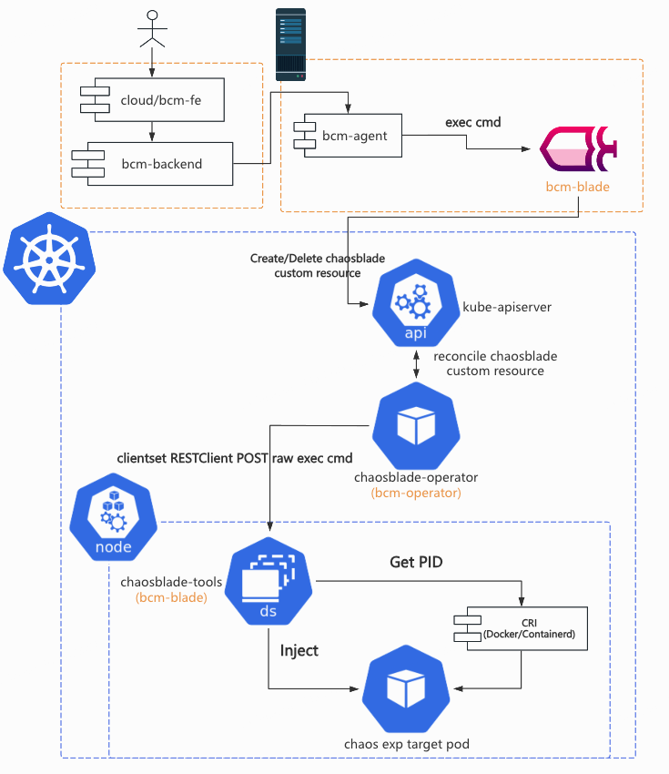

## 社区不认可的改造

> 2025 年 5 月后记：这部分的工作都是内部代码改造，并没有给社区提 issue 和 PR。我认为这些问题其实都是 ChaosBlade 的设计和实现缺陷，只是他们没有能力和动力去修复罢了。

通过和钉钉群中 ChaosBlade 中的 maintainers 讨论，笔者发现有一些 BCM 平台中碰到的 Bug，在社区看来完全不是问题。我们必须靠自己想办法解决，避免影响用户正常使用。

### 后序实验被前序实验的定时恢复而恢复

在一个演练任务中，有些用户会对同一个 Pod
容器顺序地注入不同的网络故障，有时候他们会发现后注入的故障会突然被恢复。结合日志、源码和用户提供的信息，排除了容器重启导致的故障恢复后，最终确认被异常恢复的实验是被它前序的实验的恢复操作恢复了。时间线如下图所示。

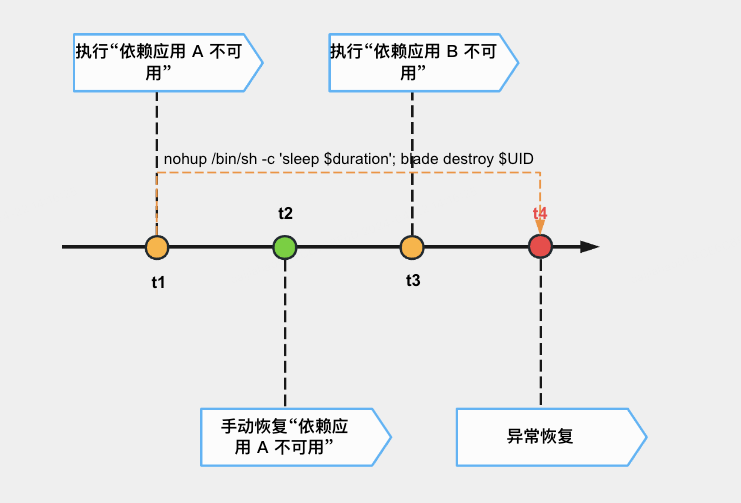

分析源码后，我们发现 bcm-blade 创建 ChaosBlade custom resource 后，会 fork 一个进程执行
`nohup /bin/sh c 'sleep $timeout; blade destroy $k8s-exp-uid'`，用于实现定时销毁实验，恢复注入的故障。在 bcm-operator 中，会把
K8s 实验转化成 CRI 实验，重新生成一个 CRI UID，并组装命令到指定 Pod 所在 Node 上的 Daemonset Pod 执行。Daemonset Pod 上的
bcm-blade 成功执行 cri 实验后，会和 K8s 一样，fork 一个进程等待一段时间后销毁实验。整个过程如下图所示。

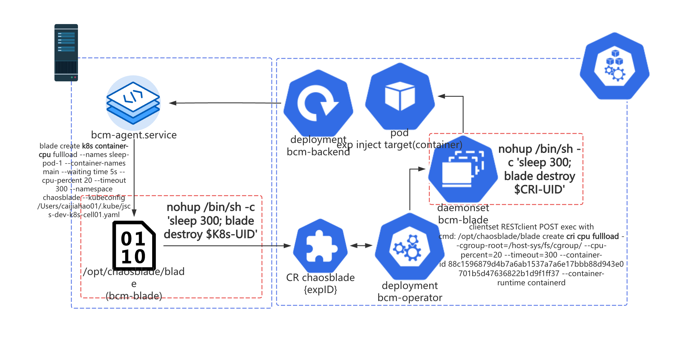

查看网络相关故障注入的恢复逻辑 [源码](https://github.com/chaosblade-io/chaosblade-exec-os/blob/52c677bf0d19b2f38df57c03869ba982db5208d7/exec/network/tc/network_tc.go#L370-L383)
后，我们找到了问题：tc 相关网络故障的销毁其实只需要 device 一个参数，直接将网卡上所有的 tc
规则全部删除。所以后一个注入的故障会被前一个故障的定时恢复任务恢复。笔者翻阅了其他实验的恢复代码（CPU，内存，DNS
等），发现几乎所有的恢复逻辑都会把“现场”彻底恢复原状，而不会考虑多个实验前后，单个实验中
K8s 实验到 CRI 实验前后的关联关系。

```go title="chaosblade-exec-os/exec/network/tc/network_tc.go#stopNet"
// stopNet
func stopNet(ctx context.Context, netInterface string, cl spec.Channel) *spec.Response {
  if os.Getuid() != 0 {
    return spec.ReturnFail(spec.Forbidden, fmt.Sprintf("tc no permission"))
  }
  response := cl.Run(ctx, "tc", fmt.Sprintf(`filter show dev %s parent 1: prio 4`, netInterface))
  if response.Success && response.Result != "" {
    response = cl.Run(ctx, "tc", fmt.Sprintf(`filter del dev %s parent 1: prio 4`, netInterface))
    if !response.Success {
        log.Errorf(ctx, "tc del filter err, %s", response.Err)
    }
  }
  return cl.Run(ctx, "tc", fmt.Sprintf(`qdisc del dev %s root`, netInterface))
}
```

总结一下，产生这个缺陷的原因是由于 chaosblade CLI 销毁 CRI 实验时会无条件执行恢复逻辑，而销毁 K8s 实验的时候由于依赖
K8s client，Delete API 如果没有正确返回结果，就不会修改 custom resource 状态，触发 operator reconcile 去执行恢复逻辑。想要从根本上解决，需要在
[
`chaosblade/exec/cri/executor.go`](https://github.com/chaosblade-io/chaosblade/blob/5c6002dc0251492a2c659c5c72662cb35f7b281f/exec/cri/executor.go#L42-L51)
中通过 UID 去校验实验状态，但由于 K8s 实验与 CRI 实验其实是不存在关联关系的（chaosblade 与
chaosblade-operator 中都没有维护这个关系），在这里加状态校验逻辑会比较困难。笔者认为由于没有一个 apiserver
并接入持久化存储（数据库等）以供所有 daemonset pod 上的 chaosblade-tools 去获取正确的实验状态和 K8s-> CRI 实验关联关系，这里
chaosblade CLI 的实现只能无条件地执行 destroy。

```go title="chaosblade/exec/cri/executor.go#Exec"
func (e *Executor) Exec(uid string, ctx context.Context, model *spec.ExpModel) *spec.Response {
  key := exec.GetExecutorKey(model.Target, model.ActionName)
  executor := e.executors[key]
  if executor == nil {
    log.Errorf(ctx, spec.CriExecNotFound.Sprintf(key))
    return spec.ResponseFailWithFlags(spec.CriExecNotFound, key)
  }
  executor.SetChannel(channel.NewLocalChannel())
  return executor.Exec(uid, ctx, model)
}
```

因此笔者设计的解决方案也比较“简单粗暴”，能够以最小的代价完成止损。由于我们没有直接对机器上容器注入故障的需求（即在一台物理机上对本机上的容器注入故障），所有的
CRI 实验都是从 K8s 实验转化而来的。那我们简单地移除 CRI 实验的定时销毁进程即可。

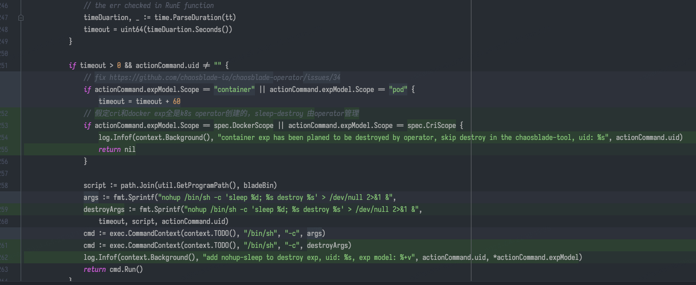

### 网络实验中目标 IP 过多导致故障注入失败

BCM 平台引入了“依赖应用不可用”这个实验，帮助用户找到依赖应用的所有实例 IP，拼接进 ChaosBlade 的网络故障注入实验参数中。2024
年 5 月开始，有些面向 C 端的服务研发/测试开始使用 BCM
平台测试他们的服务，偶尔会出现故障注入失败的问题。排查日志后发现注入过程中报 "argument list too long" 的错误。查看源码后发现，
chaosblade 的执行器本质上都是在目标 Pod/物理机上执行普通的 Linux 命令。在 tc 命令中，由于需要影响/豁免的 IP
端口过多，导致用 && 连接的 tc add filter 命令过多，使得最终命令超过 `getconf ARG_MAX` 的限制，就会报 “argument list too
long”。

解决方案也比较简单粗暴。既然是拼接命令执行，那我们可以把一条命令拆分成多条命令。无非就是要注意执行命令的时候 script 是
tc，紧跟着的第一条命令不能以 tc 开头，后面通过 && 连接的命令照旧。

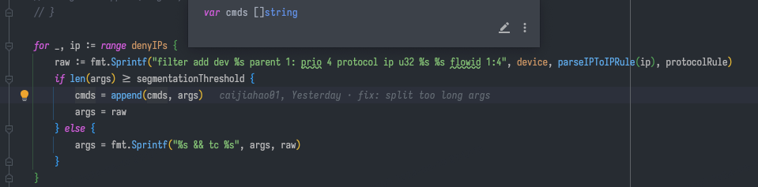

> 2025 年 5 月后记：你以为问题就这么解决了吗？
> 读到这里的读者如果仔细阅读了前面一节《适配公司网络环境》，
> 就会发现 bcm-agent 拉起 bcm-blade 进程这个行为实际上也是命令行调用，
> 它也会存在拼接出来的命令超过限制的瓶颈。想要彻底解决这个问题，就得把拉进程这个事情从链路里彻底去掉。
> 但这是一项工作量极大的工程，因为整个 ChaosBlade 项目从上到下都在拉起进程。
> 它不像 chaos-mesh，apiserver 和 daemonset pod 之间是用 gRPC 通信的，
> chaosblade-operator 调用 daemonset pod 上的 chaosblade CLI 的方式是直接请求 kube apiserver 的 exec API。
> 由此可见，ChaosBlade 就是个典型的大厂“缝缝补补又三年，三年又三年”的屎山项目。

## B 站的本土化故障演练需求

> 2025 年 5 月后记：这部分的工作都是内部代码改造，并没有给社区提 issue 和 PR。主要目的是为了简化上层平台对 chaosblade 命令的调用，让平台能从研究
> chaosblade network tc 参数中解放出来。

网络相关的故障注入是现阶段 B 站需求量最大的实验类型，上层平台 bcm-backend 会进一步封装 bcm-engine 提供的实验，帮助用户更方便地选择需要影响的目标
IP: 端口，网段 IP CIDR ，豁免的目标 IP: 端口等。但 chaosblade-exec-os 中的实现仍然不能满足我们的需求，很容易造成不熟悉 TC
的用户误操作，甚至还有一些 Bug。

### bilibili-network loss/delay

#### ChaosBlade network loss/delay

先来看看使用 chaosblade network loss/delay 时遇到的问题。

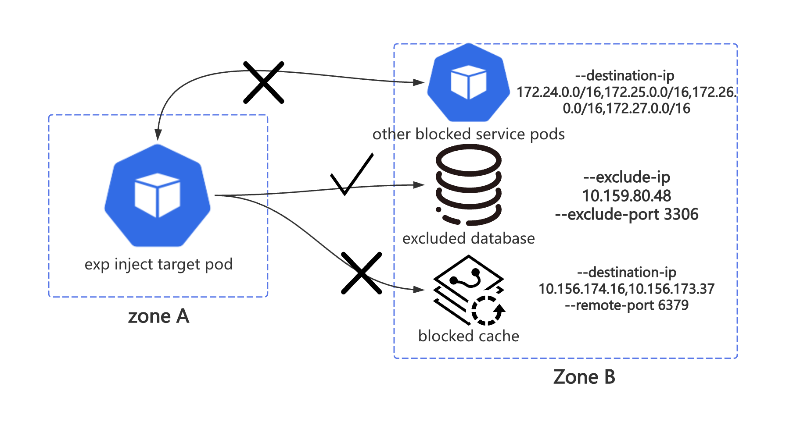

我们最早想到要重新实现网络故障注入实现是因为上图这个场景。我们需要阻断目标 Pod 对一些 IP 网段的访问，同时阻断它请求某些特定的
IP: Port， 另外还要豁免某些 IP: Port。ChaosBlade 的 network loss 的有关参数如下，其中的 `destination-ip`，`local-port`，
`remote-port` 分别与 linux tc filter 中的关键字 `match ip dst`，`match ip sport`，`match ip dport` 对应。（对不熟悉 TC
或者网络基础知识不扎实的用户来说，这些参数有些晦涩了）

> --destination-ip string 目标 IP. 支持通过子网掩码来指定一个网段的 IP 地址, 例如 192.168.1.0/24. 则 192.168.1.0~
> 192.168.1.255 都生效。你也可以指定固定的 IP，如 192.168.1.1 或者 192.168.1.1/32，也可以通过都号分隔多个参数，例如
> 192.168.1.1,192.168.2.1。
>
> --exclude-port string 排除掉的端口，默认会忽略掉通信的对端端口，目的是保留通信可用。可以指定多个，使用逗号分隔或者连接符表示范围，例如
> 22,8000 或者 8000-8010。 这个参数不能与 --local-port 或者 --remote-port 参数一起使用
>
> --exclude-ip string 排除受影响的 IP，支持通过子网掩码来指定一个网段的 IP 地址, 例如 192.168.1.0/24. 则 192.168.1.0~
> 192.168.1.255 都生效。你也可以指定固定的 IP，如 192.168.1.1 或者 192.168.1.1/32，也可以通过都号分隔多个参数，例如
> 192.168.1.1,192.168.2.1。
>
> --interface string 网卡设备，例如 eth0 (必要参数)
>
> --local-port string 本地端口，一般是本机暴露服务的端口。可以指定多个，使用逗号分隔或者连接符表示范围，例如 80,8000-8080
>
> --percent string 丢包百分比，取值在 [0, 100] 的正整数 (必要参数)
>
> --remote-port string 远程端口，一般是要访问的外部暴露服务的端口。可以指定多个，使用逗号分隔或者连接符表示范围，例如
> 80,8000-8080
>
> --force 强制覆盖已有的 tc 规则，请务必在明确之前的规则可覆盖的情况下使用
>
> --ignore-peer-port 针对添加 --exclude-port 参数，报 ss 命令找不到的情况下使用，忽略排除端口
>
> --timeout string 设定运行时长，单位是秒，通用参数

如果使用 ChaosBlade 版本，经过实测，我们是无法在一次故障注入中完全满足上图所描述的需求的。分析源码后我们发现，`remote-port`
会在外层循环中被遍历，与内层循环中的 `destination-port` 一起组合成 `match ip dst $IP match ip dport $port $portMask`
，这会导致只有目标 Pod 到目标 IP 网段中的部分端口的请求会受到影响，而端口的数量始终是有限给定的，总会有“漏网之鱼”。
`exclude-ip` 却没有和 `exclude-port` 的关联关系，它们 2 个会被分别处理，创建对应的 tc filter 规则。

如果按照上图方式传递参数，对 other blocked service pods 的影响仅限于指定的 IP CIDR 地址中对应 IP 的 6379 端口（也就是下面
blocked cache 中 `--remote-port` 指定的 6379 端口）。如果出现极端状况，`exclude-port` 中包含了 `remote-port`，那么
`remote-port` 将失效。

在没有自研 bilibili-network loss 前，上层平台 bcm-backend 只能为 `destination-ip` 添加常用的 `remote-port`，比如 8000-9000
等
HTTP/GRPC 服务常用的端口。经常有用户来投诉演练故障注入不生效，排查后发现用户的目标服务的端口不在我们给定的 `remote-port`
内（比如 K8s apiserver 的 6443 端口），导致很多 case 无法验证，影响演练最终效果。

#### 自研版本

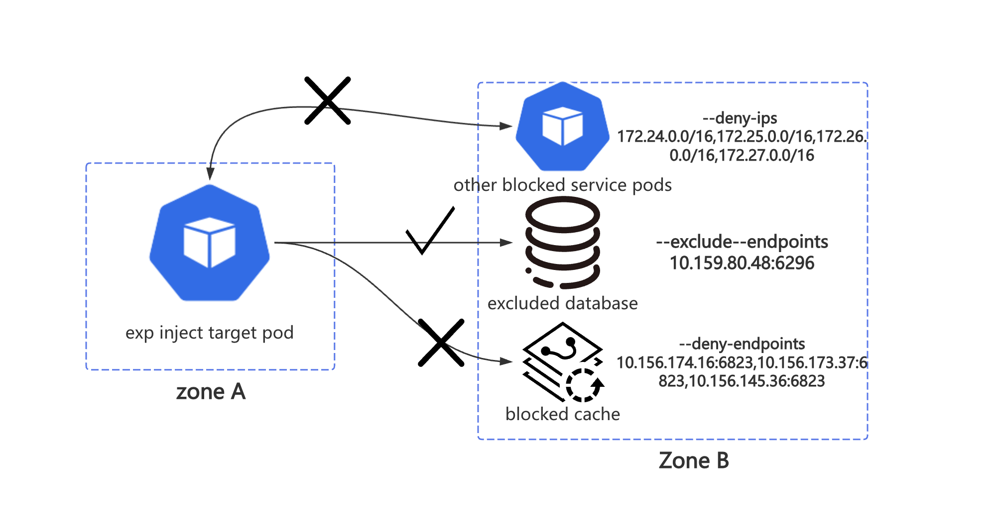

我们创造了 bilibili-network loss/delay，引入了一套与上层平台的封装需求完全一致的参数，也能供大部分用户直接使用。

> --deny-ips：需要阻断的 IP 地址（支持 CIDR 地址）。
>
> --deny-endpoints：区别于上面的 ip（往往是 CIDR 地址），需要阻断的 IP: Port，用于数据库，缓存等 endpoints。
>
> --exclude-ips：需要豁免的 IP（支持 CIDR 地址）。
>
> --exclude-endpoints：需要豁免的 IP: Port，用于白名单应用 endpoints。

在实现上，4 个参数的处理相互独立，不再像之前那样有依赖关系。创建出来的 tc filter 的数量级从 O(m IP 数量 \* n 端口数量) 下降到了
O(n endpoint 数量)。创建出来的 filter 也更符合我们的预期和直觉。

解决问题往往不会一帆风顺，在 Chaos Mesh
模拟网络故障的 [文档](https://chaos-mesh.org/zh/docs/simulate-network-chaos-on-kubernetes/) 中，其中一条注意事项就是：请在进行网络注入的过程中保证
Controller Manager 与 Chaos Daemon 之间的连接通畅，否则将无法恢复。从用户的使用体验角度考虑，开发内部平台的我们绝对不能让用户自己去注意这些有风险的情况。我们不能让用户的
`--deny-ips` 把上层平台 bcm-backend 给影响到了，否则故障将无法在平台上手动恢复，界面上的实验状态也都会不正确。经过讨论后，我们决定让
bcm-backend 对每一个网络故障注入都添加 `--exclude-endpoints` 参数，将平台自身的 IP: Port 豁免。

然而在对物理机进行演练的过程中，我们又发现了新的问题，当用户填写的 `--deny-ips` 是 `0.0.0.0/0`
时，所有的出入网请求都被影响了，这导致机器丢失，用户失去了观测实验目标的能力。因此，我们对 22（sshd），9100（node_exporter） 和
19557（bcm-agent）端口添加了 dport，sport 双向豁免规则。

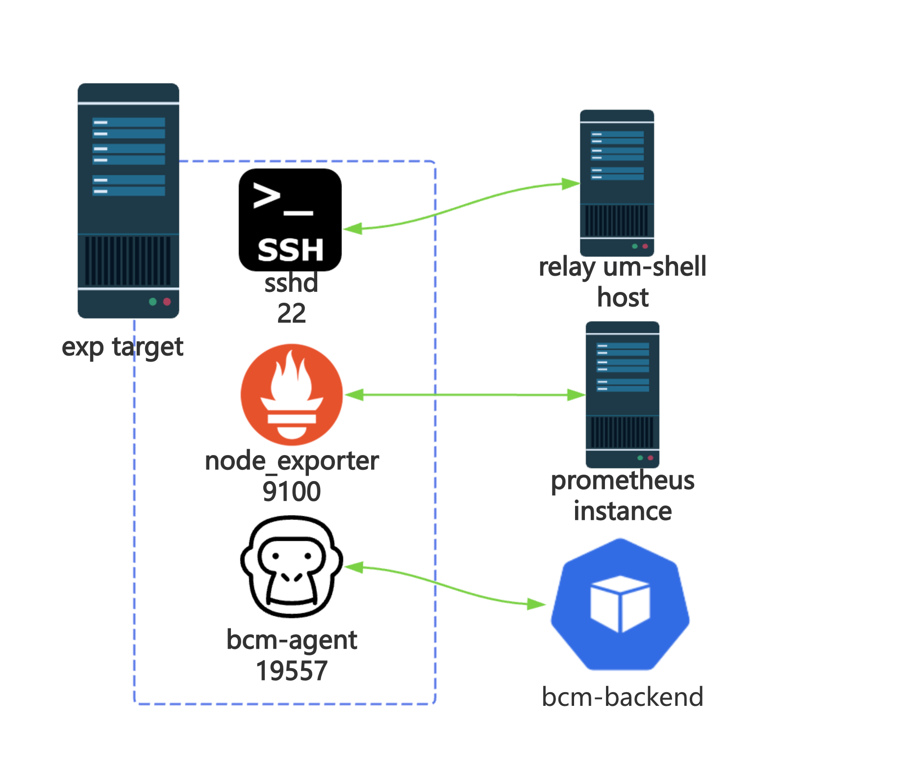

大公司内部的需求总是复杂多变的。在对堡垒机（即上图的 relay um-shell）进行物理机演练的过程中，我们发现对 22
端口的双向豁免又影响到了预期中的故障注入。用户当时就是希望无法 ssh 连上某一个 IP CIDR 网段内的机器，尽管上层平台已经指定了
`--deny-ips`，但由于底层放开了 22 端口，实验被迫中止。笔者接到 oncall 后单独手动回滚了实验目标机器上的 bcm-blade
的版本才得以让演练继续进行。

经此，我们讨论后决定，bilibili-network 仍然需要在未来（比如 24 H2）为有需要的用户暴露 `--remote-port`，`--exclude-port`
，并重新实现它们。

### bilibili-network dns

ChaosBlade network dns 篡改解析故障注入的实现过于简单，不能满足 BCM 平台的需求。

#### ChaosBlade network dns

chaosblade 的 DNS 篡改解析注入实现是这样的：

1. 使用逗号分割请求的 domain(s)
2. 使用 `grep -q  $IP $DOMAINS ` 来判断 /etc/hosts 中是否已经存在同样的 DNS
   pair，如果有的话就报错（后来笔者将报错改成了返回注入成功，与恢复时候的判断逻辑保持一致）
3. 使用 `echo $IP $DOMAINS` 将域名解析加入到文件末尾

恢复过程是这样的：

1. 使用逗号分割请求的 domain(s)
2. 使用 `grep -q  $IP $DOMAINS` 来判断 /etc/hosts 中是否存在同样的 DNS pair，如果没有的话就返回成功
3. `cat /etc/hosts | grep -v $IP $DOMAINS > $tmpfile && cat $tmpfile > /etc/hosts`。使用 `grep -v` 把目标 DNS pair
   过滤掉，写入到临时文件后再覆盖 /etc/hosts 文件。

在使用中我们遇到了如下问题：

1. 如果已经有了 `a.b.c.d foo.bar` 的解析（比如 paas 平台为容器添加的域名解析），如果这时候再往文件末尾添加解析，系统的重试机制会让注入达不到预期效果。（预期是用户给定的域名解析失败）
2. 用 grep 来过滤 DNS pair 非常粗糙，一旦 domains 在数据传输过程中顺序发生变化，就可能导致实验无法恢复。比如
   `127.0.0.1 foo.bar bar.baz #chaosblade` 和 `127.0.0.1 bar.baz foo.bar #chaosblade` 就是不同（不完全一致）的 DNS Pair，使用
   grep 是比较不出来的。

#### 自研版本

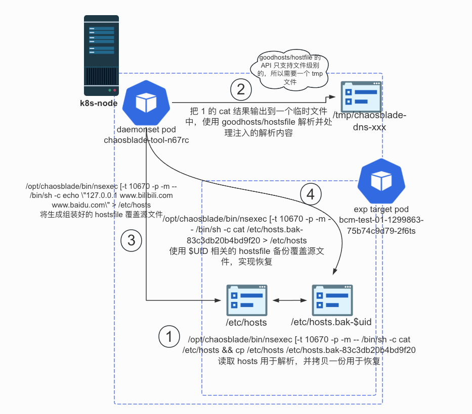

我们引入了 [goodhosts/hostfile](https://github.com/goodhosts/hostsfile) 库来帮助我们解析 hosts 文件。首先读取目标容器中的
/etc/hosts 文件并输出到 stdout，再复制一份用于恢复。将 stdout 的结果输出到 node 上的临时文件，使用 hostsfile
库解析它并添加新的解析。hostfile 库暴露了 Add, Remove 和 Flush 3 个主要方法。其中 Add 和 Remove
的实现会先删除已有的解析，再添加新的解析，这满足我们的演练需求。处理完 hosts 文件内容后，将新的 hostsfile 覆盖 Pod 中的
/etc/hosts 文件。恢复的时候仅需把备份文件重新覆盖回 /etc/hosts 即可。恢复文件以实验 UID 结尾，恢复到该实验生效前的版本，不会对
/etc/hosts 文件产生额外的副作用。

这样一来，我们的 DNS 篡改解析故障注入后，容器内已经的域名解析也能被正确移除，符合用户期望的指定域名不可用的预期。

> 2025 年 5 月后记：ChaosBlade 的所谓 DNS 故障和 chaos-mesh
> 的 [模拟 DNS 故障](https://chaos-mesh.org/zh/docs/simulate-dns-chaos-on-kubernetes/)
> 相比差太多了，差距就好比初等数学和高等数学（狗头）。ChaosBlade 的实现像小学生版本，我的修改像中学生版本。
> CoreDNS 提供了优雅的方式实现功能拓展，而 B 站内部的 DNS、服务发现模块并没有，因此我们只能对容器内的解析文件动脑筋。
> B 站根本不用 [kube-dns](https://kubernetes.io/docs/concepts/services-networking/dns-pod-service/)
> 和 [CoreDNS](https://github.com/coredns/coredns)
> ，[k8s_dns_chaos](https://github.com/chaos-mesh/k8s_dns_chaos)
> 对 B 站来说完全不合适。感兴趣的读者可以阅读 chaos-mesh 的相关组件 [源码](https://github.com/chaos-mesh/k8s_dns_chaos)。

---

本段完。

请看下集，真·Bug 修复：[修复 ChaosBlade 遗留多年的 Bug](./3-bugfix.md)！
