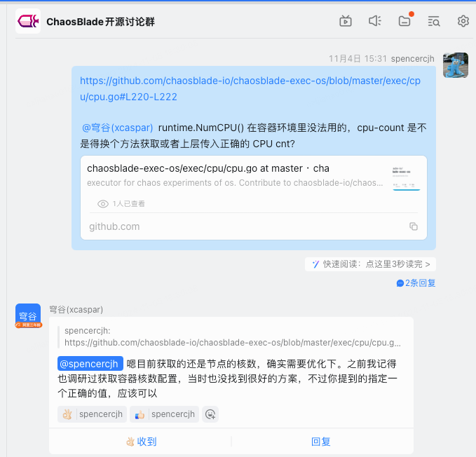
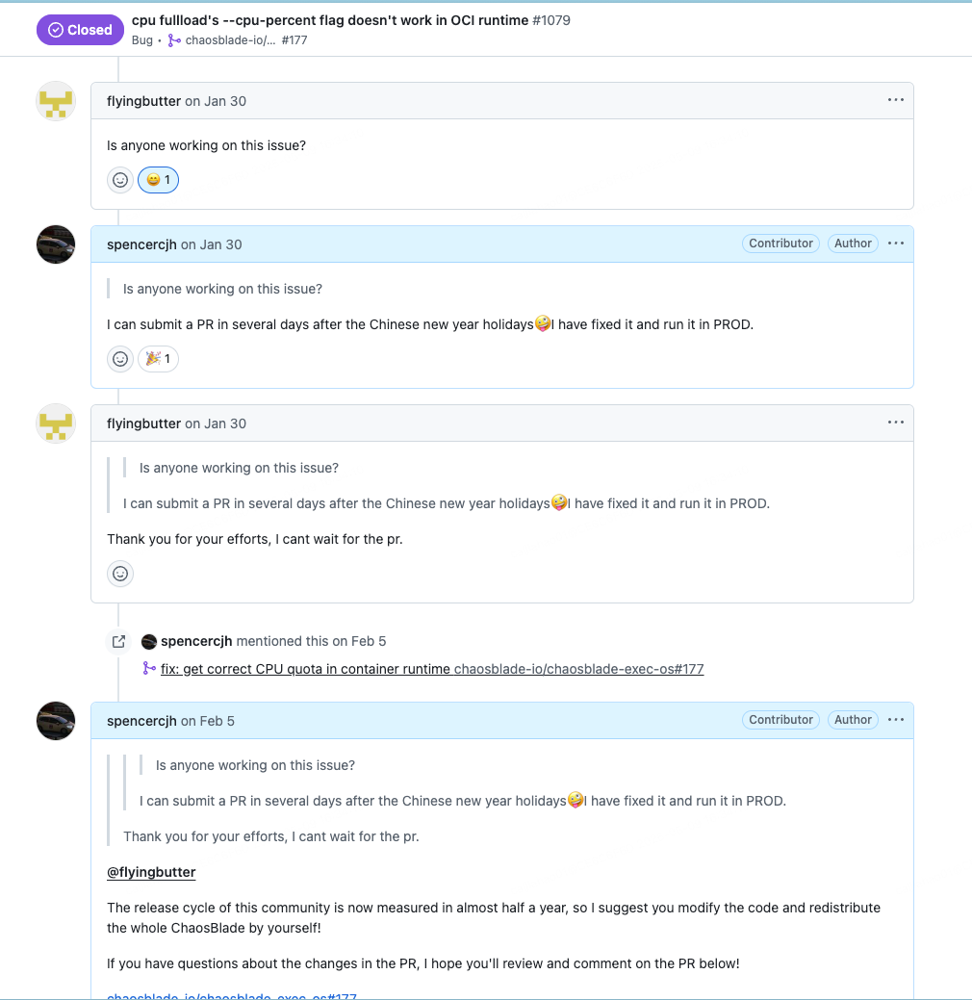

# 修复 ChaosBlade 遗留多年的 Bug

> 这一部分的内容是 2025 年 5 月加入的，初稿完成时候我还没有修复这些 Bug。没有公司的条条框框，行文会更加奔放和随意。

ChaosBlade 是一个“缝缝补补”的项目，它一开始肯定是不支持在容器上进行故障注入的！在容器环境执行故障注入时出现了很多真正的
BUG，且多年来社区都没有修复（足以可见 ChaosBlade 广大的用户群体到底是怎么用这个产品的。那么多人都没有能力完成修复并提出 PR？）。maintainer 对这些问题的态度是“你们要用就自己修复吧”，所以我决定把这些问题都修复掉。但由于我对 cgroupv2 并不了解，也没有生产环境去验证，所以我以下很多内容都还仅停留在
cgroupv1 版本。cgroup 这个问题可以说是 ChaosBlade 社区里的“经典话题”，maintainer 一直在
画饼说某年某月（时间都改过几次）就能完成，结果每次都过去半年没有动静。大概阿里云内部也和 B 站一样永远留在了 cgroupv1 吧。

> 题外话：修复以下 3 个 bug 才是捣鼓 ChaosBlade 项目过程中最有意义和收获的经历。

<!-- truncate -->

## 正确支持容器环境的 CPU 负载演练

> 原始技术文档写于 2024 年 11 月 5 日。

为什么这么说呢？因为我发现在社区中存在大量有关容器环境 CPU 负载实验结果不符预期的 issue：

- [pod fullload cpu result incorrect](https://github.com/chaosblade-io/chaosblade-operator/issues/102)
- [当我对容器 CPU 资源做了限制后，CPU 满载实验的--cpu-percent 参数限制好像有问题。](https://github.com/chaosblade-io/chaosblade/issues/463)
- [CPU not completely accurate](https://github.com/chaosblade-io/chaosblade/issues/805)
- [对于 cpu 负载实验指定 cpu-count 后，cpu-percent 指定了但无效](https://github.com/chaosblade-io/chaosblade/issues/928)
- ["cpu-percent" can not take effect in chaosblade.pod-cpu.fullload](https://github.com/chaosblade-io/chaosblade/issues/801)

一看源码就发现了问题：当用户没有指定 CPU
数量时（往往是不指定的），[chaosblade-exec-os/exec/cpu/cpu.go#Exec](https://github.com/chaosblade-io/chaosblade-exec-os/blob/8644cf98bae8565099e76bcf229a9aaa38821a82/exec/cpu/cpu.go#L210-L222)
会将其设置为 `runtime.NumCPU()`。这是个显而易见的错误，`runtime.NumCPU()` 会直接获取宿主机的 CPU 数量。B 站集群中的 Node
往往是几十个核的，无论取百分之多少的 CPU 负载，都会远远超过目标 Pod 的 CPU Limit。

```go title="chaosblade-exec-os/exec/cpu/cpu.go#Exec"
// if cpu-list value is not empty, then the cpu-count flag is invalid
var err error
cpuCountStr := model.ActionFlags["cpu-count"]
if cpuCountStr != "" {
  cpuCount, err = strconv.Atoi(cpuCountStr)
  if err != nil {
    log.Errorf(ctx, "`%s`: cpu-count is illegal, cpu-count value must be a positive integer", cpuCountStr)
    return spec.ResponseFailWithFlags(spec.ParameterIllegal, "cpu-count", cpuCountStr, "it must be a positive integer")
  }
}
if cpuCount <= 0 || cpuCount > runtime.NumCPU() {
  cpuCount = runtime.NumCPU()
}
```

我在公司里也碰到这个问题后，和 ChaosBlade 的阿里云 maintainer 也确认了问题。



受 [automaxprocs/internal/cgroups](https://github.com/uber-go/automaxprocs/tree/master/internal/cgroups) 启发并结合相关资料，一个容器的
CPU
Limit（Quota）应该是 **容器目录下** 的 `/sys/fs/cgroup/cpu/cpu.cfs_quota_us ÷ /sys/fs/cgroup/cpu/cpu.cfs_quota_us`。

> 没有相关知识背景的读者可以阅读以下参考资料：
>
> - [重学容器 29: 容器资源限制之限制容器的 CPU](https://blog.frognew.com/2021/07/relearning-container-29.html)
> - [Is Your Go Application Really Using the Correct Number of CPU Cores?](https://nemre.medium.com/is-your-go-application-really-using-the-correct-number-of-cpu-cores-20915d2b6ccb)
> - [重学容器 06: 容器资源限制背后的技术 cgroups](https://blog.frognew.com/2021/05/relearning-container-06.html)
> - [重学容器 10: 容器仅仅是一种特殊的进程](https://blog.frognew.com/2021/06/relearning-container-10.html)

上述资料和 uber-go 的 [automaxprocs](https://github.com/uber-go/automaxprocs) 解决了获取当前 Pod 容器的 CPU
资源（request&limit）的问题，但我们的需求其实是**在一个拥有特权（privilege）的 daemonset pod 里去获取所在 Node 上某一个 Pod
容器的 CPU 资源**。

由于公司机器全都仅支持 cgroup1，接下来的修复实现里不需要考虑 cgroup1 和 cgroup2 的差异。不管是 Docker 还是 K8s，容器终究是
Node 上的一个进程。那么我们可以通过宿主机的 `/proc/$pid/cgroup` 和 `/proc/$pid/mountinfo` 从宿主机上获取容器的 cgroup 子系统
cpu 信息。而 Pod 容器 pid 是 chaosblade 代码中已经正确获取到的了。在这里不再赘述参考资料中的知识，直接列出如何通过 cgroup
文件获取容器的 CPU 资源信息：

- 通过 `/proc/${pod-container-pid}/cgroup` 拿到子系统 `(cpu, cpuacct)` 的路径
  `/kubepods/burstable/podd74c5ead-a8ae-4b20-bc9d-8f006780db4a/8f60a0486d75d5f02d386869cb041800c896c4c2e79be64cf13cc3f334fe9823`
  - 通过 `/proc/${pod-container-pid}/mountinfo` 拿到
    `/kubepods/burstable/podd74c5ead-a8ae-4b20-bc9d-8f006780db4a/8f60a0486d75d5f02d386869cb041800c896c4c2e79be64cf13cc3f334fe9823`
    的挂载点 `/sys/fs/cgroup/cpu,cpuacct`
    - 在 daemonset pod 中，cgroup 子系统目录需要将 `/sys` 替换成 `/host-sys`（配置卷和挂载点时是这么配的）
      - 计算 `cpu.cfs_quota_us / cpu.cfs_quota_us` 的值，使用 `math.Ceil` 向上取整。

具体的实现代码可以看这个
PR [fix: get correct CPU quota in container runtime](https://github.com/chaosblade-io/chaosblade-exec-os/pull/177)
，在拷贝 [automaxprocs internal cgroups 包](https://github.com/uber-go/automaxprocs/tree/master/internal/cgroups)
的同时，拼接 Pod 具体子目录的逻辑也有细微变化，不能直接使用 automaxprocs 的源码。

> 题外话：这个 issue 的修复让我很开心，因为在地球的另外一个角落，老哥 [@muhammed.tanir](https://github.com/flyingbutter)
> 对我发出了 [殷切期盼](https://github.com/chaosblade-io/chaosblade/issues/1079#issuecomment-2623885167)
> ，希望我能帮助他解决问题。最后我也提交了 PR 并合入了主分支，但不知道老哥后面有没有解决重新分发 chaosblade-exec-os
> 包的问题。

## 正确支持容器环境的内存负载演练

> 原始技术文档写于 2024 年 11 月 19 日。

和 CPU 的问题类似，容器环境的内存负载演练也有问题。负载进程会不符预期地提前被 OOM Killer
杀死，导致用户无法模拟应用高内存水位的情形，使这个功能失去了原本的意义。

> The OOM Killer 是内核中的一个进程，当系统出现严重内存不足时，它就会启用自己的算法去选择某一个进程并杀掉.
> 之所以会发生这种情况，是因为 Linux 内核在给某个进程分配内存时，会比进程申请的内存多分配一些.
> 这是为了保证进程在真正使用的时候有足够的内存，因为进程在申请内存后并不一定立即使用，当真正使用的时候，可能部分内存已经被回收了.
> 比如 当一个进程申请 2G 内存时，内核可能会分配 2.5G 的内存给它.通常这不会导致什么问题.然而一旦系统内大量的进程在使用内存时，就会出现内存供不应求.很快就会导致内存耗尽这时就会触发这个
> oom
> killer, 它会选择性的杀掉某个进程以保证系统能够正常运行。The OOM Killer 通过检查所有正在运行的进程，然后根据自己的算法给每个进程一个
> badness 分数.拥有最高
> badness 分数的进程将会在内存不足时被杀掉.它打分的算法如下：某一个进程和它所有的子进程都占用了很多内存的将会打一个高分；优先选择进程号最小的那个进程；内核进程和其他较重要的进程会被打成相对较低的分。有
> 3 个文件与之相关。
>
> `/proc/$pid/oom_score`：这个文件显示了进程的 OOM 分数。OOM 分数是一个整数值，表示该进程在内存不足时被 OOM Killer
> 杀死的可能性。值越高，被杀死的可能性越大。可以通过读取这个文件来查看当前进程的 OOM 分数。
>
> `/proc/$pid/oom_score_adj`：这个文件允许你调整进程的 OOM 分数。oom_score_adj 的值范围是从 -1000 到
> 1000。值越小，进程被杀死的可能性越小；值越大，进程被杀死的可能性越大。可以通过写入这个文件来调整进程的 OOM 分。
>
> `/proc/$pid/oom_adj` 和上面那个一样，它的取值范围是 -17 到 15。但它已经被废弃，用于兼容老版本内核。`oom_score_adj` 和
> `oom_adj` 任何一个变动，另一个也会自动跟着改动。
>
> 我们可以通过 `dmesg | egrep -i “killed process”` 来查看 oom killer 的工作情况。

介绍这个 Bug 前我们先了解一下注入内存负载时的容器进程结构：

```
─ 目标 Pod 所在 Node DS Pod
└── 启动 chaosblade blade 进程: blade create cri mem load ...
  └── 启动 nsexec 进程以进入目标容器: /opt/chaosblade/bin/nsexec -s -t 25255 -p -n -- /opt/chaosblade/bin/chaos_os ...
    └── 在目标容器 namespace 内启动 chaos_os: /opt/chaosblade/bin/chaos_os create mem load --mode=ram --avoid-being-killed=true --cgroup-root=/host-sys/fs/cgroup/ --rate=100 --mem-percent=100 --uid=90dc070e2a32c12e --channel=nsexec --ns_target=25255 --ns_pid=true --ns_mnt=true
```

chaosblade 引入了 `--avoid-being-killed` 参数来避免最后占用内存的 `chaos_os`（上面进程树中最后一个进程） 进程被杀死，但这个
flag 在容器环境并不能正确工作。一看源码就发现了问题：

```go title="chaosblade-exec-os/exec/mem/mem.go#start"
// adjust process oom_score_adj to avoid being killed
if avoidBeingKilled {
  // not works for the channel.NSExecChannel
  if _, ok := cl.(*channel.NSExecChannel); !ok {
    scoreAdjFile := fmt.Sprintf(processOOMAdj, os.Getpid())
    if _, err := os.Stat(scoreAdjFile); err == nil || os.IsExist(err) {
      if err := os.WriteFile(scoreAdjFile, []byte(oomMinAdj), 0644); err != nil { //nolint:gosec
        log.Errorf(ctx, "run burn memory by %s mode failed, cannot edit the process oom_score_adj, %v", burnMemMode, err)
      } else {
        log.Infof(ctx, "write oom_adj %s to %s", oomMinAdj, scoreAdjFile)
      }
    } else {
      log.Errorf(ctx, "score adjust file: %s not exists, %v", scoreAdjFile, err)
    }
  }
}
```

在 [chaosblade-exec-os/exec/mem/mem.go#start](https://github.com/chaosblade-io/chaosblade-exec-os/blob/master/exec/mem/mem.go#L296-L306)
中的这段代码在主机环境，或者说当 `memExecutor` 的 `spec.channel` 是 `LocalExecutor` 时候不会有问题，`os.Getpid()` 能够正确返回
`chaos_os` 的当前进程号，完成对 `oom adj` 文件的修改。但一旦运行在容器环境，`os.Getpid()` 只会展示容器的 pid namespace
里的进程号，它和 daemonset pod 里的，也就是宿主机上的 pid namespace 存在一个映射关系，这时候我们将无法通过错误的 PID 找到预期的
`chaos_os` 进程目录。导致 `chaos_os` 一旦占用内存爬高，很快就会被杀掉。**
但用户的预期往往是故障注入进程应该把内存用完，导致正常运行的服务不能正常工作。**如果故障注入无法影响到真实的用户服务，那么演练将失去意义。

借鉴 chaos-mesh 的 [相关实现](https://github.com/chaos-mesh/chaos-mesh/blob/master/pkg/bpm/build_linux.go#L31-L51)
，我们可以发现
chaos-mesh 是在借助 `nsexec` 将故障注入进程挂入目标容器时加上了 `choom`
命令。

ChaosBlade
的层次结构导致了我们很难照搬这样的模式，我只能在执行故障注入的通用方法里加一段 [特殊逻辑](https://github.com/chaosblade-io/chaosblade-exec-cri/blob/fa3736287f1c1049ece48e2481988688f81c0952/exec/executor_common_linux.go#L265-L272)
，实属无奈：

```go title="chaosblade-exec-cri/exe/executor_common_linux.go#execForHangAction"
if expModel.Target == "mem" && expModel.ActionFlags["avoid-being-killed"] == "true" {
  if err := exec.Command("choom", "-n", "-1000", "-p", strconv.Itoa(command.Process.Pid)).Run(); err != nil { //nolint:gosec
    log.Errorf(ctx, "choom failed, %s", err.Error())
  } else {
    log.Infof(ctx, "choom success, target pid: %v, current pid: %v", command.Process.Pid, os.Getpid())
    choomChildProcesses(ctx, command.Process.Pid)
  }
}
```

`command.Process.Pid` 是 `nsexec` 进程的 pid，可以在 `/proc/$pid/task/$pid/childern` 找到它的子进程 `chaos_os`。相关 PR
如下：[fix: process
`avoid-being-killed` for mem exp](https://github.com/chaosblade-io/chaosblade-exec-cri/pull/23)，[fix: DO NOT process
`avoid-being-killed` for executor with `NSExecChannel`](https://github.com/chaosblade-io/chaosblade-exec-os/pull/178)。

## 正确实现移除容器

> 原始技术文档写于 2025 年 1 月 13 日

ChaosBlade
有一个功能是 [移除容器](https://chaosblade.io/docs/experiment-types/k8s/container/blade_create_k8s_container-container)
，这种混沌实验一般是没人用的，但我们一用就出问题……

> 我们今年开始利用它做一些骚操作，开展一些“业内独创的演练形式，这边暂时不方便多说。后面机会成熟以后我再写 blog。

使用它移除容器后，发现 Pod 的状态和就绪容器数量没有任何变化，但主容器已经无法操作，会报错 container
找不到。 到目标 Pod 所在 Node
上又能找到容器里的进程还在运行。这明显和我们期望的“移除容器”操作的结果不一致。


维护公司 Kubernetes 的同事说移除容器“应该”使用 `crictl`，并用 `crictl stop $CONTAINER_ID` 和 `crictl ` `rm`
`$CONTAINER_ID`
向我证明公司 kubelet 并没有魔改什么以影响这部分功能。

本人并没有 OCI Open Container Initiative、CRI Container Runtime Interface 相关研发工作经历，只是会使用相关工具。因此我没有第一时间看出
chaosblade 里 containerd client 的使用问题。既然 crictl 能够有效删除容器，那我们看看它相关的源码是怎么做的。

```go title="crictl/container.go#RemoveContainer"
// RemoveContainer sends a RemoveContainerRequest to the server, and parses
// the returned RemoveContainerResponse.
func RemoveContainer(ctx context.Context, client internalapi.RuntimeService, id string) error {
  if id == "" {
    return errors.New("ID cannot be empty")
  }

  logrus.Debugf("Removing container: %s", id)

  if _, err := InterruptableRPC(ctx, func(ctx context.Context) (any, error) {
    return nil, client.RemoveContainer(ctx, id)
  }); err != nil {
    return err
  }

  fmt.Println(id)

  return nil
}
```

[crictl#RemoveContainer](https://github.com/kubernetes-sigs/cri-tools/blob/master/cmd/crictl/container.go#L1017-L1029)
和其他的 go 生态项目一样，crictl 这里只是初始化 grpc client 向本机的 CRI server 发请求。

client
是这样 [创建](https://github.com/kubernetes-sigs/cri-tools/blob/619379e6e330c7006019ddc0ea8398cb7dcdc52e/cmd/crictl/main.go#L97-L122)
出来的：

```go title="kubernetes-sigs/cri-tools/cmd/crictl/main.go"
// If no EP set then use the default endpoint types
if !RuntimeEndpointIsSet {
  logrus.Warningf("runtime connect using default endpoints: %v. "+
      "As the default settings are now deprecated, you should set the "+
      "endpoint instead.", defaultRuntimeEndpoints)
  logrus.Debug("Note that performance maybe affected as each default " +
      "connection attempt takes n-seconds to complete before timing out " +
      "and going to the next in sequence.")

  for _, endPoint := range defaultRuntimeEndpoints {
    logrus.Debugf("Connect using endpoint %q with %q timeout", endPoint, t)

    res, err = remote.NewRemoteRuntimeService(endPoint, t, tp, &logger)
    if err != nil {
      logrus.Error(err)

      continue
    }

    logrus.Debugf("Connected successfully using endpoint: %s", endPoint)

    break
  }

  return res, err
}
```

可以看到在没有指定容器运行时 ep 的情况下会和本地的 3
种容器运行时尝试连接：`containerd`，`crio`，`cri-dockerd`（即变量 `defaultRuntimeEndpoints`）。结合 containerd
的文档：[containerd#cri](https://github.com/containerd/containerd?tab=readme-ov-file#cri)，由此我们知道 crictl
是在和本地的容器运行时的 cri 插件服务通信。

containerd 整个 repo 存在 v1、v2 两个重大版本分支。经过确认，公司使用的 containerd 版本是 1.6.5。containerd 1.6.5 的 cri
plugin 中，处理 RemoveContainer
的代码如下：https://github.com/containerd/containerd/blob/v1.6.5/pkg/cri/server/container_remove.go#L34-L112

 其中最关键的就是以下操作：

1. 如果容器状态是 RUNNING 或者 UNKNOWN，停止容器
   1. 处理 UNKNOWN 容器的残留 Task 和进程
   2. 杀死 Task
2. 移除容器
3. 移除容器 checkpoint，清理容器相关磁盘目录
4. 清理本地缓存
5. 校验删除结果

再看看 chaosblade 里的相关代码，与之对比就能看出 chaosblade 遗漏了什么。

chaosblade-exec-cri 为 containerd
操作封装了一个结构体，对移除容器的 [实现](https://github.com/chaosblade-io/chaosblade-exec-cri/blob/1d05c9e7821250820338bdc822fc5903e99410c5/exec/container/containerd/containerd_linux.go#L168-L179)
如下：

```go title="chaosblade-exec-cri/exec/container/containerd/containerd_linux.go#RemoveContainer"
func (c *Client) RemoveContainer(ctx context.Context, containerId string, force bool) error {
  err := c.cclient.ContainerService().Delete(c.Ctx, containerId)
  if err == nil {
    return nil
  }

  if errdefs.IsNotFound(err) {
    return nil
  }

  return err
}
```

可以明显看到，这里仅调用了 `ContainerService().Delete` 方法，这意味着它只会删去容器元信息，并不会处理容器相关进程。这就是为什么
kubelet 无法获取到容器信息，但 Node 上容器进程依旧在正常运行，可以通过 `crictl` 停止并删除。

在修复这个问题的时候，我在公司内部版本和 [开源版本](https://github.com/chaosblade-io/chaosblade-exec-cri/pull/22)
上做出了不同的实现。如果完全删除容器信息，它被杀死、重启的信息将无法再被查到，这在公司环境里是不能被接受的。因此，我们仅需将
containerd task 杀死（表现是容器以 137 code 错误退出），随后借助公司容器平台标准配置的 livenessProbe
来帮助我们实现移除容器的根本目标。这样一来这些操作就都留了痕迹。


---

本段完。

请看下集，未来展望：[展望](./4-future.md)！
