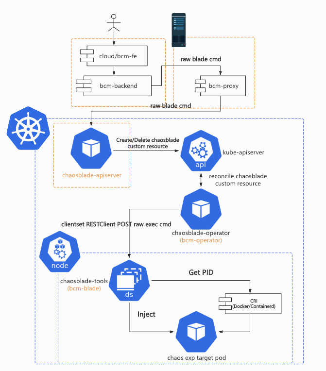
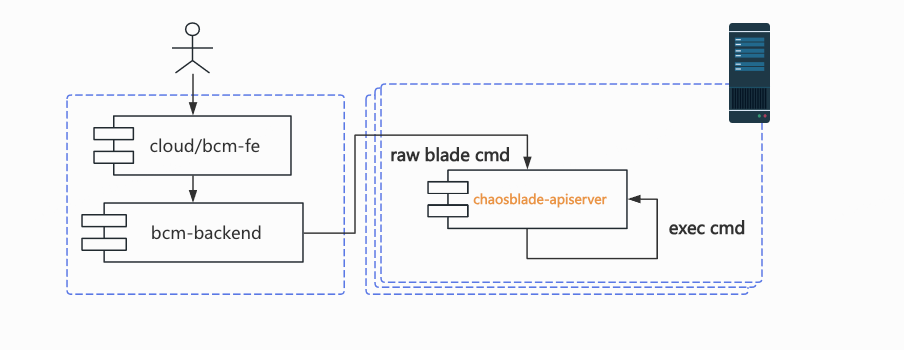

# 展望

> 这篇博文摘录于《bcm-engine —— 我们如何给 ChaosBlade 第二春》。原文原本定稿于 2024 年 7 月 16
> 日，本以为老板要投稿到“哔哩哔哩技术”公众号上，后来却没有下文了。我认为这篇文章总结了我在
> B 站很大一部分工作精华内容，包含了许多我的思考和有意思的技术细节。
> 对“混沌工程”没有背景知识的读者不用担心读不懂，这篇文章主要讨论一些实际的系统实现问题。
>
> 摘录部分是原文的最后一部分。本文主要介绍了 bcm-engine 的未来。
> 标题《展望》是写个人博客时后取的。

<!-- truncate -->

## 引入 chaosblade-apiserver

### 背景

上文已经介绍过，我们对 `chaosblade-box->chaosblade-box-agent->K8s apiserver` 的链路做了改造，引入了一个简单的命令拼装程序
bcm-agent，将 bcm-backend 传来的参数传给机器上的 blade，执行本机演练或者在目标 K8s 集群上创建 ChaosBlade custom resource。

半年多用下来，我们发现了 2 个问题。

> 2025 年 5 月后记：不仅有下文描述的 2 个问题（其实这 2
> 个问题都不痛不痒，导致我们并没有决心去改造这个系统），还有一个更致命的“瓶颈”。整个系统中存在多处启动进程（bcm-agent->
> bcm-blade，bcm-operator-> chaosblade-cli daemonset，chaosblade-cli daemonset ->
> chaos_os/tc/...），这些 fork 操作都存在参数过长的瓶颈。想要彻底解决，就得把所有的启动进程变成 RPC/HTTP
> 调用。这就导致，哪怕我们把 chaosblade-exec-os 里拼 tc 的问题解决了，把 bcm-agent 用 apiserver 替换了，还存在 operator 到 daemonset
> pod 这一段进程调用。这段调用还是通过 `POST /api/v1/namespaces/{namespace}/pods/{name}/exec` 这个“鲜为人知”的方法完成的，想要把它改掉不亚于重写
> ChaosBlade，这个“忒修斯之船”问题我是解决不了了。

一是 chaosblade CLI 创建 custom resource 后的行为与一般的云原生项目 CLI （比如 kubectl，Argo CLI 等）不一致。形象地说，它的实现说将
`kubectl create/apply ***` 和 `kubectl get *** -w`
结合在了一起，不太符合用户的预期。阅读 [chaosblade/exec/kubernetes/executor.go#exec](https://github.com/chaosblade-io/chaosblade/blob/5c6002dc0251492a2c659c5c72662cb35f7b281f/exec/kubernetes/executor.go#L162-L191)
源码发现，`blade create k8s ***` 创建完 ChaosBlade custom resource 后，会开启默认 20s 的超时 context，并以 1s
的间隔不断获取实验的最新状态，直到超时或者判断实验进入了终态或运行中才结束整个创建过程。我们将 blade CLI
的调用放在了创建实验的链路中，一旦这里等待的时间过长，整个 HTTP
请求就会超时，上层平台就认为实验创建失败，故障注入没有成功，但实际上实验早就成功了，实验“脱离”了平台的管控。blade CLI
将原本应该异步的观测实验状态事项，放在了同步的创建实验的命令里，团队一致认为这样的设计和实现不太妥当。

```go title="chaosblade/exec/kubernetes/executor.go#Exec"
// 创建 custom resource 后...

var duration time.Duration
waitingTime := expModel.ActionFlags[WaitingTimeFlag.Name]
if waitingTime == "" {
    waitingTime = DefaultWaitingTime
}
d, err := time.ParseDuration(waitingTime)
if err != nil {
    d, _ = time.ParseDuration(DefaultWaitingTime)
}
duration = d
if duration > time.Second {
    ctx, cancel := context.WithTimeout(ctx, duration)
    defer cancel()
    ticker := time.NewTicker(time.Second)
TickerLoop:
    for range ticker.C {
        select {
        case <-ctx.Done():
            ticker.Stop()
            break TickerLoop
        default:
            response, completed = QueryStatus(ctx, operation, config)
            if completed {
                return response
            }
        }
    }
}
return response
```

二是 chaosblade CLI 分散在演练目标机器以及 K8s 集群 daemonset pod 里，它会将实验记录都存在 SQLite
中，这显然不适合在公司的生产环境里使用。显然我们没有也不会去开发收集这些里的数据的程序。这导致一旦出现了上文提到的“实验脱离平台管控“的问题以后，由于
HTTP 请求超时，平台没有获得 blade CLI 的返回结果，实验 UID 就没有被存下来。用户 on-call 来了之后想要恢复实验，我们只能通过日志去分析，猜测当时执行的实验
UID
是多少。特别是 K8s Node 上往往不太方便去装 sqlite3 来读取 chaosblade SQLite 文件。最糟糕的一次，我们只能让用户把 Pod 删了来恢复

#### K8s 实验中替代 bcm-agent 与 chaosblade CLI



参考 [Argo Workflows 下的 /server](https://github.com/argoproj/argo-workflows/tree/main/server)，[KubeVela](https://github.com/kubevela/kubevela)
下的 [VelaUX](https://github.com/kubevela/velaux)，Chaos Mesh 的 Chaos Dashboard，ChaosMeta 的 chaosmeta-platform 等
apiserver 的设计，我们计划引入了 chaosblade-apiserver 作为上层平台与 K8s apiserver 沟通的桥梁，物理机上的 bcm-proxy
将是一个简单的请求转发工具，根据 kubeconfig 名字或者其他参数把上层平台的请求转发到目标集群 chaosblade-apiserver。

chaosblade-apiserver 将会使用 B 站内部的 kratos 版本进行开发，再也不用担心日志、指标采集不到的问题了；在具体实现命令翻译，转化
custom resource 的过程中，将尽可能参考 ChaosBlade 已有的代码，保证功能正确；我们还可以借此机会利用自动化工具（如
golangci-lint 和 kratos cli）修复所有的 bad-smell code。

如下图所示，chaosblade-apiserver 将承担原本 bcm-agent 与 bcm-blade 转化上层平台命令请求的职能，将请求转化为 ChaosBlade
custom resource，提交到目标集群后就返回 UID 结果。这样一来，创建实验的过程变得足够轻量，我们可以将治理 HTTP
流量时的手段都用起来了：超时控制，链路追踪。

此外，我们还可以修改 bcm-operator（chaosblade-operator）里修改 ChaosBlade custom resource 实验状态的逻辑，添加到
chaosblade-apiserver 的 callback，随后 chaosblade-apiserver 再调用上层平台接口去修改上层业务状态。这样一来，平台上演练任务里节点的状态就能真正地和具体在运行的实验状态保持一致。


#### 物理机实验中替代 bcm-agent 与 chaosblade CLI

出于维护的角度，保持 2 套组件不同的链路是不现实的。K8s 实验的链路重构了以后，物理机实验的链路也需要相应适配。因此，我们计划将
chaosblade-apiserver 适配物理机环境。与 K8s 中不同的是，这时需要将请求转化为 blade 命令在本机执行。物理机部分应该尽可能地复用
K8s 部分的代码，形成公共逻辑。



### 感知演练目标的变化，动态注入故障

最后，我们还希望能在未来解决现在所有混沌工程项目都没能解决的问题：动态感知演练目标（比如
Pods）的变化，动态注入故障。比如当你使用 [label selector](https://kubernetes.io/docs/concepts/overview/working-with-objects/labels/)
（ChaosBlade 里是 `sepc.experiments[*].matchers[*].name: labels`，Chaos Mesh 里是 `spec.selector.labelSelectors`，Chaos
Meta
里是 `spec.selector.label`）选择了一些 Pods 作为故障注入目标后，实验过程中如果有新增的符合要求的 Pod 出现，新 Pod
不会被被注入故障。流量进入新的 Pod 后可能会导致用户不能得到符合预期的测试结果。

当然了，并不是所有用户都需要这个功能。笔者也曾经以为这是一个很特别的需求，只有大公司里才可能会出现。但在撰写本文时，Chaos
Mesh 的 maintainer [@STRRL](https://github.com/strrl) 介绍 Chaos Mesh 项目中的工程问题时就提到了这个问题。

实现它的方法并不难想到：实现一个 watch Pod 的 controller，reconcile Pod 时判断它是否需要被正在进行中的实验注入故障，然后交给已有的
operator 注入故障代码即可。但笔者认为难就难在如何判断 Pod 是否需要被正在进行中的实验注入故障。混沌实验的参数往往都是以非关系型的方式存储的，如果要对
selector 相关信息进行快速检索，那么我们就需要将这些信息提前存到方便搜索的介质中。

其次，在超大集群中，Pod 的数量成千上万，Pod 的变化量也很多。如何正确实现 reconcile 过程，使得整个服务没有性能瓶颈，很考验研发人员对
Operator 开发的经验与能力。

---

全文完。

最后再聊聊我对混沌工程的几点认识和看法：

- 很多公司的混沌工程是测试团队搞的，（但接触过中国互联网公司测试的人都知道）他们其实很难有能力独立开展混沌实验。
  把平台注入故障的过程做得跟点外卖一样容易并不能移除故障注入所需的心智门槛。可惜的是目前我们还没有能力让 LLM 成为用户的辅导老师。
- 没有写测试能力和习惯的研发注定也不会借助浑沌工程平台来“主动”验证服务的可靠性。
- HTTP 故障注入真的是个很痛的点，可惜了。
