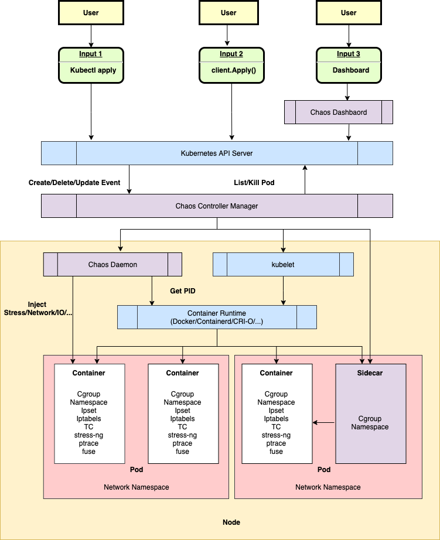
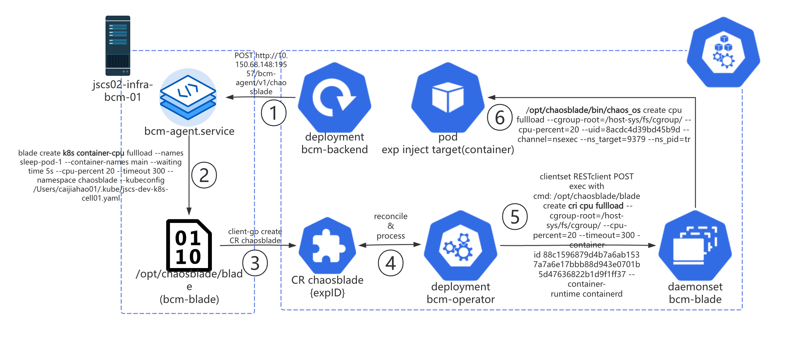
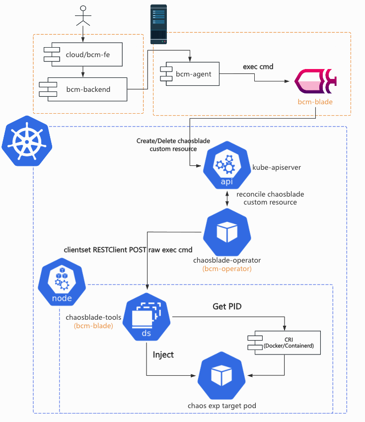
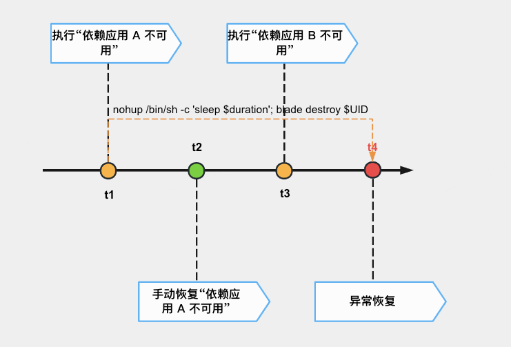
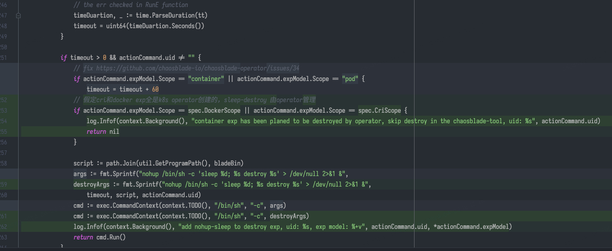
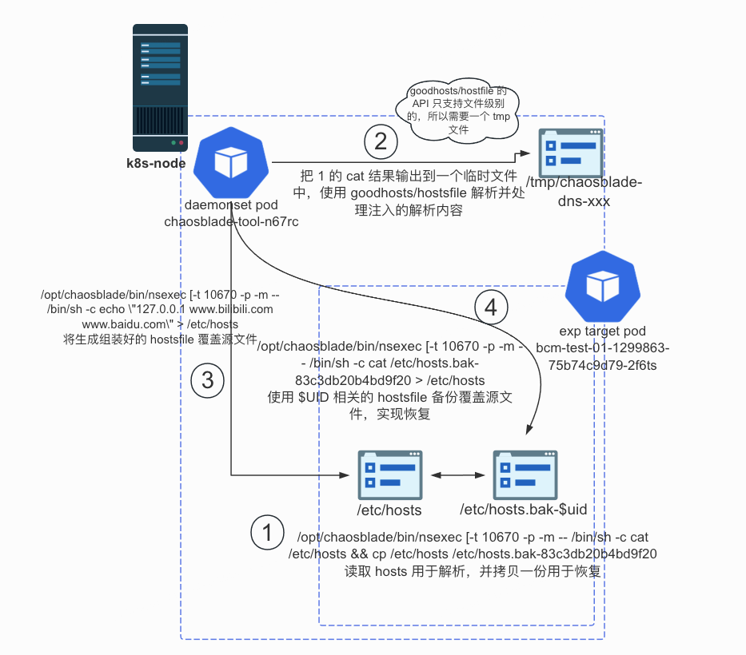

# bcm-engine —— 我们如何给 ChaosBlade 第二春

> 这篇文章原本定稿于 2024 年 7 月 16 日，本以为老板要投稿到“哔哩哔哩技术”公众号上，后来却没有下文了。我认为这篇文章总结了我在
> B 站很大一部分工作精华内容，包含了许多我的思考和有意思的技术细节。对“混沌工程”没有背景知识的读者不用担心读不懂，这篇文章主要讨论一些实际的系统实现问题。
>
> 因此，我将它作为博客的第一篇文章发布出来，供大家参考学习。我在将它修改成个人博客时新增了一些内容，调整了一些代码和链接的展示方式。最近添加的内容会有特别的标记，烦请读者留意。

## 前言

关于混沌工程发展历程的文章很多，“他们”总是以 [Netflix chaosmonkey](https://github.com/Netflix/chaosmonkey)
开头，然后落到自己对混沌工程的实践上。

本文不落俗套，我们不再介绍混沌工程的概念与发展历史。本文主要介绍如何挑选开源项目来满足公司内的故障演练需求，如何进行合理有效的二次开发以更好地适配公司环境，最后作出展望，提出进一步优化设计。

bcm-engine 是我们 folk ChaosBlade 之后的项目名称，项目并没有开源。

对混沌工程还不太熟悉的读者可以阅读中国信通院混沌工程实验室发表的 [《中国混沌工程调查报告 （2021 年）》](http://www.caict.ac.cn/kxyj/qwfb/ztbg/202111/P020211115608682270800.pdf)。

<!-- truncate -->

## 背景

bilibili Chaos Manager (BCM) 哔哩哔哩混沌管理平台需要能够让用户在网页上对混沌演练进行全生命周期的管理，包括但不限于配置演练的目标、参数、观测指标、业务场景，执行、停止演练任务，编辑、查看演练报告等。

我们需要支持的故障注入类型多种多样，增加 CPU/内存/磁盘负载，影响网络数据包，篡改 DNS
解析。作为一个平台，我们更需要帮助用户组合多种故障及其参数，完成更复杂的演练。时间紧，任务重，人力有限，知识储备更有限，从 0 到
1 开发一个执行故障注入的引擎对我们来说是比较困难的，找一个能够适应 B 站演练需求，环境的故障执行引擎迫在眉睫。

## 选型

混沌实验执行引擎的选型是个十分关键的问题，项目启动以后就很难再换，这是一条不归路。

大家印象里， go 语言借着 Docker 容器和 Kubernetes(K8s) 编排引擎流行的历史洪流，开源生态发展迅猛，什么项目都能找到。出乎我们意料的是，2023
年 9 月技术选型时，许多 go 项目已经陷入了青黄不接的尴尬境地。以 CNCF
基金会公布的情况来看，开源社群的总人数没有稳步提升，项目越来越多，但老项目的维护愈发成为问题。这里给读者分享 2 篇来自一位
CNCF TOC（Technical Oversight Committee）的 Blog。

> Why Are CNCF Contributors Down: https://codeengineered.com/blog/2024/cncf-contributors-why-down/
>
> Retrospective After Two Years On The CNCF TOC: https://codeengineered.com/blog/2024/retro-cncf-toc/

### 国内的混沌工程项目近况

混沌工程领域的开源项目更是小众中的小众。笔者个人认为有 2 方面的原因：

1. 混沌工程是个非常“垂直”的领域，
   [CNCF Landscape](https://landscape.cncf.io/guide#observability-and-analysis--chaos-engineering)
   中混沌工程作为单独的一个领域存在。
   对于 GitHub 上的大多数开发者来说，他们没有实践混沌工程的需要或者条件。
2. 对于已经在实践混沌工程的公司或者开发者来说，混沌工程工具可能根据公司内部情况做了因地制宜的设计和实现，并不具有推广的普遍意义；混沌工程平台则是一种典型的企业级项目，需要整合许多公司内部资源，开源是有困难的。

难能可贵的是，阿里巴巴，PingCAP 和蚂蚁集团分别在 2019，2020 和 2023
年各自开源了 [ChaosBlade](https://chaosblade.io/)，[Chaos Mesh](https://chaos-mesh.org/)
和 [ChaosMeta](https://chaosmeta.gitbook.io/chaosmeta-cn)。相较于海外的 [Litmus](https://litmuschaos.io/)
（由 [MayaData](https://www.linkedin.com/company/mayadata/) 开源） 和 [Krkn](https://github.com/krkn-chaos/krkn)（由 RedHat
开源），他们都有比较清晰的中文文档，功能也更加强大和完整，我们还有机会在线下与 maintainer 进行沟通交流。

#### 国内先驱者—— ChaosBlade

根据公开资料显示，[ChaosBlade](https://github.com/chaosblade-io/chaosblade)
项目主体于 [2019 年 3 月](https://github.com/chaosblade-io/chaosblade/releases/tag/v0.0.1)
开源， [2021 年 4 月](https://www.cncf.io/projects/chaosblade/) 成为 CNCF Sandbox 项目，其中包括一个命令行程序 blade CLI
以及各种各样的故障注入
executor（如 [chaosblade-exec-os](https://github.com/chaosblade-io/chaosblade-exec-os)，[chaosblade-exec-cri](https://github.com/chaosblade-io/chaosblade-exec-cri)
等），使得用户可以在终端上执行 blade CLI，配合不同的命令和参数，对本地或者本地的容器环境执行故障注入。

[chaosblade-operator](https://github.com/chaosblade-io/chaosblade-operator)
于 [2019 年 11 月](https://github.com/chaosblade-io/chaosblade-operator/releases/tag/v0.4.0) 开源，其中包含了一套 K8s CRD
及其 Operator，使得用户可以创建针对 K8s Node/Pod/Container
的实验。它是一个用 [operator-sdk](https://sdk.operatorframework.io/) 搭建的 operator 项目。

[chaosblade-box](https://github.com/chaosblade-io/chaosblade-box)
于 [2021 年 2 月](https://github.com/chaosblade-io/chaosblade-box/releases/tag/v0.1.0)
开源，其中包含了一个混沌工程平台的前后端工程项目，使得用户可以自行搭建类似于 [阿里云 AHAS Chaos](https://help.aliyun.com/zh/ahas/user-guide/faq-about-failure-drill/)
（一款遵循混沌工程实验原理并融合了阿里巴巴内部实践的产品，提供丰富故障场景，能够帮助分布式系统提升容错性和可恢复性。）的混沌工程平台，在网页上构建并运行混沌实验流程。chaosblade-box
开源后，ChaosBlade 可以被真正地称为混沌工程平台产品，而不再是一个命令行工具。chaosblade-box 是一个用 Maven 组织的 Mono Java
项目，包含了多个 Module。chaosblade-box
中的前端页面源码则在另一个项目 [chaosblade-box-fe](https://github.com/chaosblade-io/chaosblade-box-fe) 中。

下图出自官方
Blog [《ChaosBlade-Box 全新混沌工程平台 -- 助力企业混沌工程落地》](https://chaosblade.io/blog/2022/06/24/ChaosBlade-Box-a-New-Version-of-the-Chaos-Engineering-Platform-Has-Released-ch)
，简单展示了引入 chaosblade-box 后系统的整体架构。其中 Agent 负责在目标机器/K8s 集群中与 chaosblade-box 进行交互，用来创建故障实验，调用
blade CLI 或者创建 ChaosBlade custom resource。
它在另一个项目 [chaosblade-box-agent](https://github.com/chaosblade-io/chaosblade-box-agent) 中。


ChaosBlade 项目里的命名不太清楚，可以发现很多东西都叫 “chaosblade”，很容易引起歧义，本文在此做一次解释，后文不再赘述。

- ChaosBlade 是指整个 ChaosBlade 项目，即 https://github.com/chaosblade-io 下的所有项目。
- chaosblade 是指 https://github.com/chaosblade-io/chaosblade，它的产物包括 blade CLI 等可执行程序。笔者认为这个 repo 应该叫
  chaosblade-cli，以和组织（chaosblade-io），品牌加以区分。
- ChaosBlade custom resource
  是指定义在 [chaosblade-operator/pkg/apis/chaosblade/v1alpha1](https://github.com/chaosblade-io/chaosblade-operator/tree/master/pkg/apis/chaosblade/v1alpha1)
  中的 [ChaosBlade custom resource](https://github.com/chaosblade-io/chaosblade-operator/blob/master/pkg/apis/chaosblade/v1alpha1/types.go#L168)
  ，其中包含 `spec` 和 `status` 2 个字段，`spec` 中有实验的定义。笔者认为这个命名是最模糊的，`ChaosBlade` 根本不能将一个资源的含义表达清楚。

根据 CNCF 官方的 [统计数据](https://chaosblade.devstats.cncf.io/d/8/dashboards?orgId=1)，可以发现 ChaosBlade 在近一年都没有发布新的
release 版本，GitHub Activity（包括 Commit，PR，issue，Release 等）比较少。


> https://chaosblade.devstats.cncf.io/d/12/issues-opened-closed-by-repository-group?orgId = 1&var-period = d&var-repogroup_name = All

经过笔者半年多对 ChaosBlade 的观察和参与，发现项目的 owner 是阿里云的 @camix（GitHub username，下文中所有的 @username
都是如此，不再解释），ta 会每隔一段时间上线处理一些 Issue 和 PR，近期 ta 还向 CNCF 提出了将项目升级为 incubating
项目的 [申请](https://github.com/cncf/toc/pull/1278)。maintainer 之一的 @tiny-x 在钉钉群中算是比较活跃的，但他几乎不会去处理
Issue 和 PR。其他的 maintainer 如阿里云的 @xcaspar ，中国移动的 @Yuaninga 和 GitLab 中国的 @sunny0826 则不活跃。比较重要的
Contributor 还有滴滴的 @binbin0325，他在钉钉群中透露过一些设计思路。

作为中国最早开源的混沌工程项目，它有着同类项目中最大的用户基础和企业用户数量，其中不乏国内知名 [大厂](https://github.com/chaosblade-io/chaosblade/issues/32)
。从上面笔者对其社群的观察就能发现，ChaosBlade 也不免落入国内开源项目“重开源轻运营维护”的困境：内外两套代码，黑箱决策，没有完整的
Issue-PR 讨论，维护停滞等。

#### 云原生践行者—— Chaos Mesh

根据公开资料显示，[Chaos Mesh](https://github.com/chaos-mesh)
于 [2020 年 4 月](https://github.com/chaos-mesh/chaos-mesh/releases/tag/v0.8.0)
开源，[2020 年 7 月](https://chaos-mesh.org/blog/chaos-mesh-join-cncf-sandbox-project/) 成为 CNCF Sandbox
项目，[2022 年 2 月](https://www.cncf.io/blog/2022/02/16/chaos-mesh-moves-to-the-cncf-incubator/) 成为 CNCF Incubating
项目。Chaos Mesh 是一个“纯正”的云原生项目，核心组件必须运行在 K8s 中，内部组件交互也全都是标准的 gRPC 和 JSON-RPC。

[chaos-mesh](https://github.com/chaos-mesh/chaos-mesh) 是一个组织良好的 Mono Repo，其中包含以下主要组件。

- /cmd/chaos-dashboard 下的 [Chaos Dashboard](https://github.com/chaos-mesh/chaos-mesh/tree/master/cmd/chaos-dashboard)
  ，Chaos Mesh 的可视化组件，提供了一套用户友好的 Web 界面，用户可通过该界面对混沌实验进行操作和观测。同时，Chaos Dashboard
  还提供了 RBAC 权限管理机制。
- /cmd/chaos-controller-manager
  下的 [Chaos Controller Manager](https://github.com/chaos-mesh/chaos-mesh/tree/master/cmd/chaos-controller-manager)
  ，Chaos Mesh 的核心逻辑组件，主要负责混沌实验的调度与管理。该组件包含多个 CRD Controller，例如 Workflow、Scheduler
  Controller 以及各类故障类型的 Controller。
- /cmd/chaos-daemon 下的 [Chaos Daemon](https://github.com/chaos-mesh/chaos-mesh/tree/master/cmd/chaos-daemon)，Chaos
  Mesh 的主要执行组件。Chaos Daemon 以 DaemonSet 的方式运行，默认拥有 Privileged 权限（可以关闭）。该组件主要通过侵入目标 Pod
  Namespace 的方式干扰具体的网络设备、文件系统、内核等。

还有一些位于其他 repo 的重要组件。

- [Chaosd](https://github.com/chaos-mesh/chaosd) 用于在物理机环境上注入故障，并提供故障恢复功能。
- [chaos-tproxy](https://github.com/chaos-mesh/chaos-tproxy) 用于注入 HTTP 故障，借助 linux iptables extension tpproxy
  实现了 HTTP 代理，完成丢包，延迟等故障注入，使用 Rust 开发。
- [toda](https://github.com/chaos-mesh/toda) 用于注入文件 I/O 故障，它是一个 hook filesystem 工具，使用 Rust 开发。

上述 2 个 Rust 项目由于本身项目文档不足，笔者能力有限以及不甚了解具体的领域知识，在此就不作过多介绍了。


尽管和 ChaosBlade 一样，Chaos Mesh 也进入了长期维护阶段，但从下列图表中可以看出项目还是保持着稳定的维护。目前项目的主要
owner 是
@STRRL，他去年还在 [上海 KubeCon](https://kccncosschn2023.sched.com/event/1PTKK/chaos-meshdaeppei-huan-chaos-mesh-overview-practice-and-future-zhou-zhiqiang-individual-cwen-yin-pingcap-xianglin-gao-tencent)
上推广了 Chaos Mesh，主要负责日常维护的 maintainer 是 @g1eny0ung，Rust 组件的维护由仍在 PingCAP 的 @YangKeao 维持。


> https://chaosmesh.devstats.cncf.io/d/12/issues-opened-closed-by-repository-group?orgId = 1&var-period = d&var-repogroup_name = All

PingCAP 自称是一家 “业界领先的企业级开源分布式数据库企业”，笔者认为 Chaos Mesh 没有给公司“拖后腿”。虽然晚于 ChaosBlade
几个月开源，但 Chaos Mesh 的项目组织和社区运营情况都比 ChaosBlade 好不少。由于云原生项目的性质，Chaos Mesh 的用户群体一定没有
ChaosBlade
多，但仍然吸引了包括腾讯、字节、小鹏汽车等 [大厂](https://github.com/chaos-mesh/chaos-mesh/blob/master/ADOPTERS.md) 使用，更吸引了
Microsoft Azure 用其打造了自己的混沌实验产品 [chaos studio](https://learn.microsoft.com/en-us/azure/chaos-studio/)。
Chaos Mesh 可以吸引来自国外的开发人员和组织参与贡献，这一点难能可贵。

> 2025 年 5 月后记：Chaos Mesh 目前来看仅有主项目 Chaos Mesh 还有持久的更新迭代，2 个令 Chaos Mesh ”突出重围“与众不同的“黑科技”项目
> chaos-tproxy 和 toda 已经沦落到和 chaosblade 一样，有多人评论的共性问题 issue
> 都长期无人应答了（比如：[[HELP] tproxy make network failed](https://github.com/chaos-mesh/chaos-tproxy/issues/67)）。我在
> 2024 年年末尝试将 [chaos-tproxy](https://github.com/chaos-mesh/chaos-tproxy) 集成进 bcm-engine
> 中，但难以解决的主机网络失联问题让我最终放弃。好在相关需求最终被老板“挡住”了，不然黔驴技穷的我会很尴尬。

#### 后起之秀—— ChaosMeta

根据公开资料显示，[Chaos Meta](https://github.com/traas-stack/chaosmeta)
于 [2023 年 5 月](https://mp.weixin.qq.com/s/bw8Emb_19hv3SIv6ScvYAg) 开源，目前还处于快速迭代阶段。ChaosMeta 和 Chaos Mesh
的架构相近，但它“云原生化”的程度更高，引入了 4 个独立的 operator 用于处理不同的实验相关的工作。

1. chaosmeta-inject-operator 提供了故障注入调度能力：下发到目标机器 Agent 以及云原生注入能力，与 ChaosBlade 的
   chaosblade-operator，Chaos Mesh 的 Chaos Contoller Manager 功能基本一致。
2. chaosmeta-workflow-operator 用于编排实验，其实直接用的是 Argo Workflows 的 workflow-controller。Chaos Meta 利用 Argo
   Workflows 的 DAG，拼接 ResourceTemplate 和 SuspendTemplate，巧妙实现了“创建 Experiment custome resource”
   ，“持续一段时间”等工作流中事项的编排。
3. chaosmeta-measure-operator 用于度量故障注入和恢复是否成功。这一点在 chaosblade-box 中有所涉及，Chaos Mesh 则没有相关功能。
4. chaosmeta-flow-operator 用于注入 HTTP 流量，提供类似于压测的能力。

其他组件和 Chaos Mesh 都有一一对应。


ChaosMeta 的社区和 ChaosBlade 一样，主要依托钉钉群，但他们做得比较好的是会把钉钉群中的问题及时同步到 GitHub Issue
中。还在快速迭代的产品没有经历过大量用户的实际使用测试，钉钉群里活跃的人不算多，但开发人员回复的速度非常快，这一点值得称赞。


> 2025 年 5 月 9 日后记：这个项目也凉凉了，一两个月才有人在群里说句话，开源社区完全没有开放贡献。

### 如何选择

三个项目看起来都很好，我们究竟如何选出适合我们的项目呢？

#### 挑战

企业内部使用开源项目往往会遇到以下挑战：安全漏洞风险，版权合规风险，运维、适配、拓展难度大。

混沌工程平台在内部被严格限制进出网规则，仅限内网使用，哪怕项目存在大量的 CVE 漏洞（比如缺少维护的
ChaosBlade），不暴露公网的话总体风险仍然可控。

上述 3 个项目都受 [Apache-2.0 license](https://www.apache.org/licenses/LICENSE-2.0)
保护，它是对用户最友好的开源证书。作为公司内部使用项目，只要不借助他们的商业品牌做商业推广就不会有合规风险。关于这一点感兴趣的读者可以阅读这篇文章：[《企业开源该选什么软件许可证？》](https://www.tisonkun.org/2022/12/17/enterprise-choose-a-software-license/#Apache-License-2-0)。

对我们来说最具有挑战的是第三点：运维、适配、拓展难度大。笔者将从以下几个角度来分析上述 3 个开源项目。

- 项目是否契合产品需求和技术要求？
- 团队是否拥有维护，拓展项目所需的技术储备？
- 公司是否有充足并且合适的基础设施，技术支持来帮助我们更好地使用项目？
- 产品经理或上级领导是否给予了足够的时间让我们开展适配工作？

#### Why not ChaosMeta?


随着 K8s CRD 开发的配套设施（kubebuilder 等项目脚手架，以及相关文档资料等）日趋完善，以及云原生开发的理念在国内慢慢被各大公司接受，近几年才立项，去年才公布开源的
ChaosMeta 在架构设计上是最“优雅”的。它充分使用了 CRD 及 operator 来实现项目自身几乎所有的业务逻辑：实验的定义，编排实验，执行实验，实验观测方式的定义等等。CRUD
的”舞台“从数据库缓存转向了 K8s controller-runtime，降低了部分开发成本，但对开发人员的要求提高了不少。这样的设计还使得整个项目能更好地做到“无状态”。

实现流程编排是一项”繁重”的工作。多个节点按顺序执行，并发同时执行，根据条件执行，以 DAG
的方式执行，随便罗列一些需求就是需要许多人天的工作。在实现上，项目直接将 [Argo Workflows](https://argoproj.github.io/workflows/)
中的 [workflow-controller](https://argo-workflows.readthedocs.io/en/latest/architecture/) 拿来当作实验流程编排的实现非常讨巧。仅需将表单转化成
Argo Workflows 的 workflow custom resource，编排工作就完成了，其余的编排实现，流程执行都不需要自己实现。Argo 是一个成熟的项目，2020
年 3 月成为 CNCF incubating 项目，2022 年 12 月 Graduated 毕业。其中的 Argo Workflows 用于实现顺序多步骤或者 DAG
的工作流编排，以支撑 Argo CD。像 Chaos Meta 这样直接使用 Argo Workflows
的 [项目](https://github.com/argoproj/argo-workflows/blob/main/USERS.md)
不在少数，笔者比较了解的是机器学习任务相关的 [KubeFlow](https://www.kubeflow.org/) 和 [MetaFlow](https://metaflow.org/)。

抛开技术上的设计与实现不谈，来自蚂蚁的相关团队对混沌工程平台的理解，产品设计是三个项目里最完整的。如下图所示，他们对故障演练的认识非常充分。这些步骤和阶段与我们
BCM 平台实际使用情况基本一致。


但 ChaosMeta 仍然存在一些缺陷，导致我们无法选择它。在做技术选型的时候， ChaosMeta
仍处于起步阶段，刚刚开源不到半年，真实使用过的用户数量都没有公布（直到现在他们也没有创建 Adopters Issue）。这个项目内部潜在的
Bug 和设计缺陷没有充分暴露的机会，我们不敢做第一批“吃螃蟹的人”。Chaos Meta 的代码主要构成都在 Operator 上，团队在云原生方向的人力也不足以应付
Chaos Meta。项目还依赖了 Argo Workflows workflow-controller，目前团队中对 Argo Workflows 有使用和运维经验的也只有笔者一人。

最致命的是，Chaos Meta 直到笔者撰写本文时仍然不支持对非容器化目标进行演练，这一点我们不能接受，B
站仍有一些重要的组件没有容器化，它们仍有强烈的故障演练需求。

此外笔者在钉钉群里发现有用户在询问 Chaos Meta 项目中依赖的 Argo Workflows 如何与集群中现有的 Argo Workflows
共存的问题，maintainer 似乎之前没有认真思考过这个问题。这对我们来说也将会是个棘手的问题，虽然笔者曾经遇到过类似的情况（单一集群内多租户共用还是独用
Operator），但现在由于组织架构的关系，这样的运维问题需要跨团队协同处理，可行性和成本难以预估，我们无法接受。

#### Why not Chaos Mesh?


ç
Chaos Mesh 也是一个优秀的云原生项目，依托于 PingCAP 在开源社区中良好的口碑和声誉，它拥有一个健康的社区，有着许多用户和国内外大型企业的背书，是三个项目中唯一一个走出国门的项目。其项目文档是
3 个项目中最全面，准确和清晰的，也有其他 2
个项目都没有的自动化 [e2e 测试](https://github.com/chaos-mesh/chaos-mesh/tree/master/e2e-test) 模块和一套完整的基于
GitHub Actions 的 [CI/CD 工作流](https://github.com/chaos-mesh/chaos-mesh/tree/master/.github)。

 

Chaos Mesh 与其他 2 个项目相比能够支持更多的实验类型。使用 Rust 开发的 chaos-tproxy 和 toda 十分“硬核”。ChaosBlade 的
maintainer @tiny-x 在钉钉群里都曾向笔者推荐过参考 toda 来重新实现 ChaosBlade 不太好用的磁盘 I/O 故障注入。


Chaos Mesh 也有强大的流程编排能力，它参考了 Argo Workflows 的设计与实现，但它为了不和 Argo 强绑定，实现了自己的
Workflow，定义起来和 Argo Workflows 无异。

Chaos Mesh 也不是完美的。据 @STRRL 自己所说，Chaos Mesh 目前缺少公司组织来投入人力做特性开发（但维护状况也比 ChaosBlade
好一些）。相较于阿里云的 ChaosBlade 和蚂蚁集团的 ChaosMeta，这 2 个项目的核心成员还任职于本公司。Chaos Mesh 的 maintainer
基本都已经离开了 PingCAP，公司不再向开源版本投入更多人力，这导致了 Chaos Mesh 无法再进行较大的版本更迭。

此外，由于 Chaos Mesh 中实验的 Duration（ChaosBlade 里叫 timeout）的实现是在 operator 里完成的：倒计时结束且状态符合预期后，operator
会向目标 daemonset pod server 发 grpc 请求执行恢复操作（ChaosBlade 是在目标 daemonset pod 里启动 nohup 进程，sleep
一段时间后无条件执行 destroy 命令），这导致了实验可能因为恢复请求没有送达，或各种各样的原因没有如期执行恢复，导致实验最终都无法被恢复，只能删除
Pod 来解决。@STRRL 举了一个极端的例子，当注入的文件 I/O 故障影响到了 TCP Socket FD 的时候，恢复请求就会受到影响。他认为
Chaos Mesh 还存在大量的边缘情况没有测试清楚。（不知道 ChaosBlade 社区是如何思考这些事情的。）

现在回过头来看，Chaos Mesh 在技术和产品需求上可以基本满足我们的要求。但选型时我们仍然放弃了它，主要考虑到以下问题。

1. 2023 年 9 月技术选型时团队没有足够的人力资源去研究开源项目，维护混沌实验引擎（笔者是自 2024 年 H1
   才专注于这方面的工作，接手了部分前人的工作）。
2. 对主机的混沌实验需求能否支持，能否完全满足需求成疑。在上述 1 的背景下我们没有足够的时间去调研和实践。（如今再仔细读 Chaos
   Mesh
   的文档，发现物理机其实是支持的，只不过需要创建对应的 [PhysicalMachine custom resource](https://chaos-mesh.org/zh/docs/simulate-physical-machine-chaos/)）
3. 目前 B 站的容器化应用发布由 B 站的 Paas 团队开发的平台统一管理，云原生项目往往是通过 Helm Chart
   分发和迭代的，目前没有平台能支持。绕开平台维护应用需要跨团队沟通协调，成本不可预估。Chaos Mesh 和 ChaosMeta 一样，都有许多
   CRD 需要维护，可能会有困难。
4. 需要进行混沌演练的 K8s 集群和物理机非常多，地域分布不确定，网络链路可能很复杂。平台 apiserver 和 operator
   到目标机器/集群的网络是否能够打通。把服务调度到特别的 Node，再做特别的网络安全组打通网络，其中的可行性和成本不可预估。这一点是最关键的，成为“压死骆驼的最后一根稻草”。

#### Why ChaosBlade?

排除了其他候选后，ChaosBlade 就是一个完美适合我们的项目了吗？当然不是，它的问题非常多，笔者在此举几个例子。

翻看市面上知名的 Go 项目就能发现，包含多个 module（可以不是单独的 go mod） 的 mono repo 是最好的组织代码方式。但 ChaosBlade
项目是以 repo 为单位封装 module 的。这导致每一个项目都需要单独管理依赖，做版本迭代时需要为每一个 repo 中的 go mod
升级版本，一旦遗漏了某个项目，最上层的项目的构建都会受到影响。再加上整个 ChaosBlade 项目在 GitHub
上没有任何自动化流水线（基于 [travis-ci](https://www.travis-ci.com/)
或者 [GitHub Actions](https://docs.github.com/en/actions) 都没有），导致经常出现因为底层的某一个 exec-\* 项目没有正确执行
go mod tidy，最上层的 chaosblade 无法成功构建。

ChaosBlade 项目时间跨度比较长，项目中代码风格有过明显的转变。作为一个 Go 项目，其中的许多接口设计和实现非常的
“Java-style”，违反了 go
开发者的许多常识。对我们来说“体感”最强烈的部分就是日志，早年间在 [chaosblade-spec-go](https://github.com/chaosblade-io/chaosblade-spec-go)
中封装的日志调用代码在后来 chaosblade-operator 就完全不使用了，使用了原生的 [logrus](https://github.com/sirupsen/logrus)
。甚至在 chaosblade-spec-go 内，都有 2 套同样基于 logrus
的日志封装实现，分别是 [/log](https://github.com/chaosblade-io/chaosblade-spec-go/tree/master/log)
和 [/util/log.go](https://github.com/chaosblade-io/chaosblade-spec-go/blob/master/util/log.go)。整个项目中有大量文件的 go
imports 都没有被 gofmt 过，maintainers 也不处理类似的 PR。

阿里云最为人诟病的一点就是文档建设，文档经常是过时和错误的，亦或是轻描淡写，一笔带过的，有什么问题往往都要咨询技术支持拉群解决。开源项目也没能幸免。ChaosBlade [站点](https://chaosblade.io/)
源码在 [chaosblade-website](https://github.com/chaosblade-io/chaosblade-website) 这个 repo
中，几乎从来没有人去修复过文档错误。一旦遇到什么使用上的问题，都需要翻阅源码或者在钉钉群里艾特 maintainer 才能解决。

##### “路径依赖”

选择 ChaosBlade 除了“无可奈何”，还因为在我们平台工程开发 BCM 平台前，已经有团队使用 chaosblade 搭建了类似的平台，笔者翻看过去的文档可以发现
B 站对混沌工程的实践由来已久。2019 年 EP 团队在 Hassan 平台中就已经集成了 ChaosBlade 对目标实例进行 CPU、内存、磁盘、DNS
和网络故障注入。2021 年 SRE 团队推出了混沌实验平台 chaos-mng，打通了公司内部的服务树和周边平台，增加了实验管理、场景实验等能力，简化了用户的操作流程。前面有过
2 个平台的集成使用，我们对用过的项目有“路径依赖”心理是完全合理的。


##### 改造成本低


ChaosBlade 虽然也自称是“云原生“项目，但它不像 CRD 开发时常见的 apiserver+operator
的架构（比如 [Argo Workflows 下的 /server](https://github.com/argoproj/argo-workflows/tree/main/server)，[KubeVela](https://github.com/kubevela/kubevela)
下的 [VelaUX](https://github.com/kubevela/velaux)，Chaos Mesh 的 Chaos Dashboard，ChaosMeta 的 chaosmeta-platform 等），它的
“apiserver” chaosblade-box 是一个传统 Java 项目，不直接与 K8s 集群和 CustomResource 交互，这给了我们机会去做组件替换，降低了适配成本。


首先我们自研了前端和平台服务以替换 chaosblade-box-fe 和 chaosblade-box。chaosblade-box-fe
中使用了大量的阿里巴巴内部组件，导致我们完全无法复用，不适配基础架构部云平台的 React 技术栈。而 chaosblade-box 是个 Java
项目，不适配我们部门 Go 语言的技术栈，组里能写好 Java
的同学也不多。它组织得比较复杂，似乎经历过几代维护者，他们的编码风格都不尽相同，而且有明显的从内部版本中脱敏剥离的痕迹，却没有留下任何开源文档。

为了解决前文中提到的跨地域网络问题，我们引入了一台物理机，上面部署了 bcm-agent 与 chaosblade，以此替代原本集群中的
chaosblade-box-agent。这样一来我们只要为单独的这一台物理机设置网络安全组就能解决所有的网络连同性问题。bcm-agent 摘取了部分
chaosblade-box-agent 中的代码，它是一个 HTTP Service，用来接受来自上层 bcm-backend 平台的请求（Create/Destroy/Query），将请求作为参数拼接在
blade 指令后，变成可以执行的 shell 命令。如果是对非容器化的机器进行演练，这样的链路就已经能满足演练需求了。


而集群中的 CRD，operator，Daemonset 等相关的资源，我们几乎没有做任何改动。这样一来，我们能够复用前文提到的 SRE 团队直接研发的
chaos-mng 平台所用的 chaosblade operator。

虽然这看起来这很“粗糙”，请求链路被拉长了，HTTP 请求中调用 CLI
程序并不可靠，但这确实是当时最好的解决方案，既满足了产品的需求，又以最小的成本解决了网络连通性的问题。上线半年多以来，这样的架构支撑起了十余个重要平台服务，中间件的故障演练任务。



## 迭代

2024 年 H1，团队决定正式开启对 ChaosBlade 的改造和二次开发，新项目命名为 bcm-engine。

### Folk ChaosBlade 到 bcm-engine

原本的 ChaosBlade 项目结构大致如下，每个 module 作用见行尾注释。

```shell
$ tree -L 1
.
├── chaosblade # 一个 cobra CLI 程序（下简称 blade），把所有的 exec module 串联起来，注册 cobra 命令。
├── chaosblade-box # 一个 Java Spring 服务用作引擎上层的平台产品，bcm-backend 参考了它的实现，不在本文的讨论范围。
├── chaosblade-exec-cloud # 云服务相关故障注入执行器。没有相关需求，不 folk。
├── chaosblade-exec-cplus # C++ 程序相关故障注入执行器，官方版本停留在了 1.5.0（目前最新版本是 1.7.3），猜测已经废弃。没有相关需求，不 folk。
├── chaosblade-exec-cri # cri 容器相关故障注入执行器，k8s 相关命令和 operator 依赖这个 module。但我们不会直接操作容器，都是从 K8s 向 Pod 容器注入故障。
├── chaosblade-exec-docker # docker 容器相关故障注入执行器。没有相关需求，不 folk。
├── chaosblade-exec-jvm # Java 程序相关故障注入执行器。没有相关需求，不 folk。
├── chaosblade-exec-middleware # 中间件（mysql，redis，nginx 等）相关故障注入执行器。没有相关需求，不 folk。
├── chaosblade-exec-os # OS（CPU，Mem，Network，File 等）相关故障注入执行器。这是我们最核心关注并需要二开的 module 之一。
├── chaosblade-operator # operator，用于注入 K8s 上的故障。Helm chart 中还囊括了一个包含 blade CLI 的 daemonset。
└── chaosblade-spec-go # 所有 module 都依赖的公共定义，工具类等。
```

结合我们的实际需求，我们仅挑选了 chaosblade-spec-go，chaosblade-exec-os，chaosblade-exec-os，chaosblade 和
chaosblade-operator。

```shell
. tree -L 1
├── go.mod
├── go.sum
├── chaosblade
├── chaosblade-exec-cri
├── chaosblade-exec-os
├── chaosblade-operator
└── chaosblade-spec-go
```

现在这个仓库是一个单 go mod，多目录的 go mono repo。每个目录下仍保留用于构建的 Makefile。这样一来，module 之间的依赖方式从“import
github.com/chaosblade-io/xxx”变成了“import http://github.com/chaosblade-io/xxx”变成了“import
bcm-engine/xxx”。在服务树等内部系统中，module chaosblade 称作 bcm-blade，appid：infra.bcm.bcm-blade；module
chaosblade-operator 称作 bcm-operator，appid：infra.bcm.bcm-operator。

重新命名后，新的架构图如下所示。



### 集成公司基础设施

#### 持续集成

按照上述方法 Folk 了以后，我们就得重构原本项目自带的 Makefile。chaosblade 原本的 Makefile 中的构建规则会下载 GitHub 上依赖的
exec-\* repo 主分支源代码到本地临时目录，分别调用每个 repo 里的 Makefile 来构建出产物（二进制文件以及实验元信息定义 YAML
文件）后再聚合到一个目录用于后续的打包。各个组件 Folk 到一起后，就不再需要外部依赖了。集成到公司 CI
平台后，只要执行一次构建命令，就可以确保整个项目所有的 module 的代码都可以通过编译，就不会再出现开源版本 chaosblade
经常由于依赖组件主分支没有就绪而影响本体构建的问题。

#### 持续部署


上述架构图中，部署在多个物理机上的 bcm-agent 和 bcm-blade 需要集成 B 站现有的持续部署平台，否则手工部署的成本比较高。前文已经提到
bcm-agent 是一个接受 bcm-backend HTTP 请求的服务，它由 systemd 管理，在部署的时候需要分发二进制，systemd unit
配置文件和服务本身的配置文件。而 bcm-blade 仅仅是个二进制文件。值得一提的是，chaosblade 由于依赖了 SQLITE，它需要打开 CGO
才能构建成功。开源版本的 chaosblade 使用了 musl 库而不是 glibc 构建。它是“臭名昭著”的 alpine 上唯一的动态链接库，但在大多数
B 站的 debian/centos 机器上并没有安装过。所以我们需要在安装脚本中增加相关命令使得 bcm-blade 不仅被放置到了正确的位置，还要能正确运行。如果缺少了依赖的
musl 库，系统会报一个很奇怪的 file not found，而不直接告诉你是依赖库的问题。


#### 日志采集

B 站内部使用的 go-common/library/log 可以直接把日志上报到平台，但把 bcm-engine 中所有的日志都改一遍工作量有点太大了。经过和
paas 以及日志平台的相关同事的讨论，我们决定使用 log-agent 采集日志文件再上报的方式。

| 组件                                 | 现有日志情况                                      | 改造后                                                                                                                                    |
| ------------------------------------ | ------------------------------------------------- | ----------------------------------------------------------------------------------------------------------------------------------------- |
| bcm-operator                         | stdout/stderr                                     | 输出日志文件到 /data/log/bcm-operator/\*。添加 log-agent 配置文件到容器内指定位置后，node 所在机器上的 log-agent 会采集指定目录下的日志。 |
| (daemonset chaosblade-tool)bcm-blade | 输出日志文件到/opt/chaosblade/logs/chaosblade.log | 保持日志现状。添加 log-agent 配置文件到容器内指定位置后，node 所在机器上的 log-agent 会采集指定目录下的日志。                             |
| (与 bcm-agent 部署在一起的)bcm-blade | 输出日志文件到/opt/chaosblade/logs/chaosblade.log | 保持日志现状。添加 log-agent 配置文件到机器上内指定位置后，机器上的 log-agent 会采集指定目录下的日志。                                    |
| bcm-agent                            | 输出日志文件到/data/log/bcm-agent/                | 保持日志现状。添加 log-agent 配置文件到机器上内指定位置后，机器上的 log-agent 会采集指定目录下的日志。                                    |

其中，K8s node 所在机器上的 log-agent 会读取每一个容器中的 `LOG_COLLECTOR_CONF`
所指定的配置文件，采集配置中指定的目录下文件后进行上传。从可维护性的角度出发，我们将 bcm-operator 和 (daemonset
chaosblade-tool)bcm-blade 的 log-agent 采集配置文件作为 ConfigMap 挂载到容器中，而不是在构建镜像时就放入。

#### 指标采集

集成到 B 站的 K8s Pod 基础指标采集系统需要为 Pod 增加 4 个环境变量：`APP_ID`，`DEPLOY_ENV`，`POD_NAME`，`POD_CONTAINER`，4 个
label：`monitor`，`env`，`app_id`，`appgroup`。此外，K8s controller-runtime 默认为每一个 controller 都暴露了一些指标，它可以帮助我们更好地监控
reconcile 失败的 ChaosBlade custom resource。

### “问题”修复

通过和钉钉群中 ChaosBlade 中的 maintainers 讨论，笔者发现有一些 BCM 平台中碰到的 Bug，在社区看来完全不是问题。我们必须靠自己想办法解决，避免影响用户正常使用。

#### 后序实验被前序实验的定时恢复而恢复

在一个演练任务中，有些用户会对同一个 Pod
容器顺序地注入不同的网络故障，有时候他们会发现后注入的故障会突然被恢复。结合日志、源码和用户提供的信息，排除了容器重启导致的故障恢复后，最终确认被异常恢复的实验是被它前序的实验的恢复操作恢复了。时间线如下图所示。



分析源码后，我们发现 bcm-blade 创建 ChaosBlade custom resource 后，会 folk 一个进程执行
`nohup /bin/sh c 'sleep $timeout; blade destroy $k8s-exp-uid'`，用于实现定时销毁实验，恢复注入的故障。在 bcm-operator 中，会把
K8s 实验转化成 CRI 实验，重新生成一个 CRI UID，并组装命令到指定 Pod 所在 Node 上的 Daemonset Pod 执行。Daemonset Pod 上的
bcm-blade 成功执行 cri 实验后，会和 K8s 一样，folk 一个进程等待一段时间后销毁实验。整个过程如下图所示。


查看网络相关故障注入的恢复逻辑 [源码](https://github.com/chaosblade-io/chaosblade-exec-os/blob/52c677bf0d19b2f38df57c03869ba982db5208d7/exec/network/tc/network_tc.go#L370-L383)
后，我们找到了问题：tc 相关网络故障的销毁其实只需要 device 一个参数，直接将网卡上所有的 tc
规则全部删除。所以后一个注入的故障会被前一个故障的定时恢复任务恢复。笔者翻阅了其他实验的恢复代码（CPU，内存，DNS 等），发现几乎所有的恢复逻辑都会把“现场”彻底恢复原状，而不会考虑多个实验前后，单个实验中
K8s 实验到 CRI 实验前后的关联关系。

```go title="chaosblade-exec-os/exec/network/tc/network_tc.go#stopNet"
// stopNet
func stopNet(ctx context.Context, netInterface string, cl spec.Channel) *spec.Response {
	if os.Getuid() != 0 {
		return spec.ReturnFail(spec.Forbidden, fmt.Sprintf("tc no permission"))
	}
	response := cl.Run(ctx, "tc", fmt.Sprintf(`filter show dev %s parent 1: prio 4`, netInterface))
	if response.Success && response.Result != "" {
		response = cl.Run(ctx, "tc", fmt.Sprintf(`filter del dev %s parent 1: prio 4`, netInterface))
		if !response.Success {
			log.Errorf(ctx, "tc del filter err, %s", response.Err)
		}
	}
	return cl.Run(ctx, "tc", fmt.Sprintf(`qdisc del dev %s root`, netInterface))
}
```

总结一下，产生这个缺陷的原因是由于 chaosblade CLI 销毁 CRI 实验时会无条件执行恢复逻辑，而销毁 K8s 实验的时候由于依赖
K8s client，Delete API 如果没有正确返回结果，就不会修改 custom resource 状态，触发 operator reconcile 去执行恢复逻辑。想要从根本上解决，需要在
[`chaosblade/exec/cri/executor.go`](https://github.com/chaosblade-io/chaosblade/blob/5c6002dc0251492a2c659c5c72662cb35f7b281f/exec/cri/executor.go#L42-L51) 中通过 UID 去校验实验状态，但由于 K8s 实验与 CRI 实验其实是不存在关联关系的（chaosblade 与
chaosblade-operator 中都没有维护这个关系），在这里加状态校验逻辑会比较困难。笔者认为由于没有一个 apiserver
并接入持久化存储（数据库等）以供所有 daemonset pod 上的 chaosblade-tools 去获取正确的实验状态和 K8s-> CRI 实验关联关系，这里
chaosblade CLI 的实现只能无条件地执行 destroy。

```go title="chaosblade/exec/cri/executor.go#Exec"
func (e *Executor) Exec(uid string, ctx context.Context, model *spec.ExpModel) *spec.Response {
	key := exec.GetExecutorKey(model.Target, model.ActionName)
	executor := e.executors[key]
	if executor == nil {
		log.Errorf(ctx, spec.CriExecNotFound.Sprintf(key))
		return spec.ResponseFailWithFlags(spec.CriExecNotFound, key)
	}
	executor.SetChannel(channel.NewLocalChannel())
	return executor.Exec(uid, ctx, model)
}
```

因此笔者设计的解决方案也比较“简单粗暴”，能够以最小的代价完成止损。由于我们没有直接对机器上容器注入故障的需求（即在一台物理机上对本机上的容器注入故障），所有的
CRI 实验都是从 K8s 实验转化而来的。那我们简单地移除 CRI 实验的定时销毁进程即可。



#### 网络实验中目标 IP 过多导致故障注入失败

BCM 平台引入了“依赖应用不可用”这个实验，帮助用户找到依赖应用的所有实例 IP，拼接进 ChaosBlade 的网络故障注入实验参数中。2024
年 5 月开始，有些面向 C 端的服务研发/测试开始使用 BCM
平台测试他们的服务，偶尔会出现故障注入失败的问题。排查日志后发现注入过程中报 "argument list too long" 的错误。查看源码后发现，
chaosblade 的执行器本质上都是在目标 Pod/物理机上执行普通的 Linux 命令。在 tc 命令中，由于需要影响/豁免的 IP
端口过多，导致用 && 连接的 tc add filter 命令过多，使得最终命令超过 `getconf ARG_MAX` 的限制，就会报 “argument list too
long”。

解决方案也比较简单粗暴。既然是拼接命令执行，那我们可以把一条命令拆分成多条命令。无非就是要注意执行命令的时候 script 是
tc，紧跟着的第一条命令不能以 tc 开头，后面通过 && 连接的命令照旧。


### Bug 修复

> 这一部分的内容是 2025 年 5 月加入的，初稿完成时候我还没有修复这些 Bug。

ChaosBlade 是一个“缝缝补补”的项目，它一开始肯定是不支持在容器上进行故障注入的！在容器环境执行故障注入时出现了很多真正的 BUG，且多年来社区都没有修复。

#### 正确支持容器环境的 CPU 负载演练

> 原始技术文档写于 2024 年 11 月 5 日。

为什么这么说呢？因为我发现在社区中存在大量有关容器环境 CPU 负载实验结果不符预期的 issue：

- [pod fullload cpu result incorrect](https://github.com/chaosblade-io/chaosblade-operator/issues/102)
- [当我对容器 CPU 资源做了限制后，CPU 满载实验的--cpu-percent 参数限制好像有问题。](https://github.com/chaosblade-io/chaosblade/issues/463)
- [CPU not completely accurate](https://github.com/chaosblade-io/chaosblade/issues/805)
- [对于 cpu 负载实验指定 cpu-count 后，cpu-percent 指定了但无效](https://github.com/chaosblade-io/chaosblade/issues/928)
- ["cpu-percent" can not take effect in chaosblade.pod-cpu.fullload](https://github.com/chaosblade-io/chaosblade/issues/801)

一看源码就发现了问题：当用户没有指定 CPU
数量时（往往是不指定的），[chaosblade-exec-os/exec/cpu/cpu.go#Exec](https://github.com/chaosblade-io/chaosblade-exec-os/blob/8644cf98bae8565099e76bcf229a9aaa38821a82/exec/cpu/cpu.go#L210-L222)
会将其设置为 `runtime.NumCPU()`。这是个显而易见的错误，`runtime.NumCPU()` 会直接获取宿主机的 CPU 数量。B 站集群中的 Node
往往是几十个核的，无论取百分之多少的 CPU 负载，都会远远超过目标 Pod 的 CPU Limit。

```go title="chaosblade-exec-os/exec/cpu/cpu.go#Exec"
// if cpu-list value is not empty, then the cpu-count flag is invalid
var err error
cpuCountStr := model.ActionFlags["cpu-count"]
if cpuCountStr != "" {
    cpuCount, err = strconv.Atoi(cpuCountStr)
    if err != nil {
        log.Errorf(ctx, "`%s`: cpu-count is illegal, cpu-count value must be a positive integer", cpuCountStr)
        return spec.ResponseFailWithFlags(spec.ParameterIllegal, "cpu-count", cpuCountStr, "it must be a positive integer")
    }
}
if cpuCount <= 0 || cpuCount > runtime.NumCPU() {
    cpuCount = runtime.NumCPU()
}
```

我在公司里也碰到这个问题后，和 ChaosBlade 的阿里云 maintainer 也确认了问题。


受 [automaxprocs/internal/cgroups](https://github.com/uber-go/automaxprocs/tree/master/internal/cgroups) 启发并结合相关资料，一个容器的 CPU
Limit（Quota）应该是 **容器目录下** 的 `/sys/fs/cgroup/cpu/cpu.cfs_quota_us ÷ /sys/fs/cgroup/cpu/cpu.cfs_quota_us`。

> 没有相关知识背景的读者可以阅读以下参考资料：
>
> - [重学容器 29: 容器资源限制之限制容器的 CPU](https://blog.frognew.com/2021/07/relearning-container-29.html)
> - [Is Your Go Application Really Using the Correct Number of CPU Cores?](https://nemre.medium.com/is-your-go-application-really-using-the-correct-number-of-cpu-cores-20915d2b6ccb)
> - [重学容器 06: 容器资源限制背后的技术 cgroups](https://blog.frognew.com/2021/05/relearning-container-06.html)
> - [重学容器 10: 容器仅仅是一种特殊的进程](https://blog.frognew.com/2021/06/relearning-container-10.html)

上述资料和 uber-go 的 [automaxprocs](https://github.com/uber-go/automaxprocs) 解决了获取当前 Pod 容器的 CPU
资源（request&limit）的问题，但我们的需求其实是**在一个拥有特权（privilege）的 daemonset pod 里去获取所在 Node 上某一个 Pod
容器的 CPU 资源**。

由于公司机器全都仅支持 cgroup1，接下来的修复实现里不需要考虑 cgroup1 和 cgroup2 的差异。不管是 Docker 还是 K8s，容器终究是
Node 上的一个进程。那么我们可以通过宿主机的 `/proc/$pid/cgroup` 和 `/proc/$pid/mountinfo` 从宿主机上获取容器的 cgroup 子系统
cpu 信息。而 Pod 容器 pid 是 chaosblade 代码中已经正确获取到的了。在这里不再赘述参考资料中的知识，直接列出如何通过 cgroup
文件获取容器的 CPU 资源信息：

- 通过 `/proc/${pod-container-pid}/cgroup` 拿到子系统（cpu, cpuacct）的路径
  `/kubepods/burstable/podd74c5ead-a8ae-4b20-bc9d-8f006780db4a/8f60a0486d75d5f02d386869cb041800c896c4c2e79be64cf13cc3f334fe9823`
  - 通过 `/proc/${pod-container-pid}/mountinfo` 拿到
    `/kubepods/burstable/podd74c5ead-a8ae-4b20-bc9d-8f006780db4a/8f60a0486d75d5f02d386869cb041800c896c4c2e79be64cf13cc3f334fe9823`
    的挂载点 `/sys/fs/cgroup/cpu,cpuacct`
    - 在 daemonset pod 中，cgroup 子系统目录需要将 `/sys` 替换成 `/host-sys`（配置卷和挂载点时是这么配的）
      - 计算 `cpu.cfs_quota_us / cpu.cfs_quota_us` 的值，使用 `math.Ceil` 向上取整。

具体的实现代码可以看这个 PR [fix: get correct CPU quota in container runtime](https://github.com/chaosblade-io/chaosblade-exec-os/pull/177)
，在拷贝 [automaxprocs internal cgroups 包](https://github.com/uber-go/automaxprocs/tree/master/internal/cgroups)
的同时，拼接 Pod 具体子目录的逻辑也有细微变化，不能直接使用 automaxprocs 的源码。

> 题外话：这个 issue 的修复让我很开心，因为在地球的另外一个角落，老哥 muhammed.tanir@flyingbutter
> 对我发出了 [殷切期盼](https://github.com/chaosblade-io/chaosblade/issues/1079#issuecomment-2623885167)
> ，希望我能帮助他解决问题。最后我也提交了 PR 并合入了主分支，但不知道老哥后面有没有解决重新分发 chaosblade-exec-os
> 包的问题。

#### 正确支持容器环境的内存负载演练

> 原始技术文档写于 2024 年 11 月 19 日。

和 CPU 的问题类似，容器环境的内存负载演练也有问题。负载进程会不符预期地提前被 OOM Killer
杀死，导致用户无法模拟应用高内存水位的情形，使这个功能失去了原本的意义。

> The OOM Killer 是内核中的一个进程，当系统出现严重内存不足时，它就会启用自己的算法去选择某一个进程并杀掉.
> 之所以会发生这种情况，是因为 Linux 内核在给某个进程分配内存时，会比进程申请的内存多分配一些.
> 这是为了保证进程在真正使用的时候有足够的内存，因为进程在申请内存后并不一定立即使用，当真正使用的时候，可能部分内存已经被回收了.
> 比如 当一个进程申请 2G 内存时，内核可能会分配 2.5G 的内存给它.通常这不会导致什么问题.然而一旦系统内大量的进程在使用内存时，就会出现内存供不应求.很快就会导致内存耗尽这时就会触发这个 oom
> killer, 它会选择性的杀掉某个进程以保证系统能够正常运行。The OOM Killer 通过检查所有正在运行的进程，然后根据自己的算法给每个进程一个 badness 分数.拥有最高
> badness 分数的进程将会在内存不足时被杀掉.它打分的算法如下：某一个进程和它所有的子进程都占用了很多内存的将会打一个高分；优先选择进程号最小的那个进程；内核进程和其他较重要的进程会被打成相对较低的分。有
> 3 个文件与之相关。
>
> `/proc/$pid/oom_score`：这个文件显示了进程的 OOM 分数。OOM 分数是一个整数值，表示该进程在内存不足时被 OOM Killer
> 杀死的可能性。值越高，被杀死的可能性越大。可以通过读取这个文件来查看当前进程的 OOM 分数。
>
> `/proc/$pid/oom_score_adj`：这个文件允许你调整进程的 OOM 分数。oom_score_adj 的值范围是从 -1000 到
> 1000。值越小，进程被杀死的可能性越小；值越大，进程被杀死的可能性越大。可以通过写入这个文件来调整进程的 OOM 分。
>
> `/proc/$pid/oom_adj` 和上面那个一样，它的取值范围是 -17 到 15。但它已经被废弃，用于兼容老版本内核。`oom_score_adj` 和
> `oom_adj` 任何一个变动，另一个也会自动跟着改动。
>
> 我们可以通过 `dmesg | egrep -i “killed process”` 来查看 oom killer 的工作情况。

介绍这个 Bug 前我们先了解一下注入内存负载时的容器进程结构：

```
─ 目标 Pod 所在 Node DS Pod
  └── 启动 chaosblade blade 进程: blade create cri mem load ...
	└── 启动 nsexec 进程以进入目标容器: /opt/chaosblade/bin/nsexec -s -t 25255 -p -n -- /opt/chaosblade/bin/chaos_os ...
	  └── 在目标容器 namespace 内启动 chaos_os: /opt/chaosblade/bin/chaos_os create mem load --mode=ram --avoid-being-killed=true --cgroup-root=/host-sys/fs/cgroup/ --rate=100 --mem-percent=100 --uid=90dc070e2a32c12e --channel=nsexec --ns_target=25255 --ns_pid=true --ns_mnt=true
```

chaosblade 引入了 `--avoid-being-killed` 参数来避免最后占用内存的 `chaos_os`（上面进程树中最后一个进程） 进程被杀死，但这个
flag 在容器环境并不能正确工作。一看源码就发现了问题：

```go title="chaosblade-exec-os/exec/mem/mem.go#start"
// adjust process oom_score_adj to avoid being killed
if avoidBeingKilled {
    // not works for the channel.NSExecChannel
    if _, ok := cl.(*channel.NSExecChannel); !ok {
        scoreAdjFile := fmt.Sprintf(processOOMAdj, os.Getpid())
        if _, err := os.Stat(scoreAdjFile); err == nil || os.IsExist(err) {
            if err := os.WriteFile(scoreAdjFile, []byte(oomMinAdj), 0644); err != nil { //nolint:gosec
                log.Errorf(ctx, "run burn memory by %s mode failed, cannot edit the process oom_score_adj, %v", burnMemMode, err)
            } else {
                log.Infof(ctx, "write oom_adj %s to %s", oomMinAdj, scoreAdjFile)
            }
        } else {
            log.Errorf(ctx, "score adjust file: %s not exists, %v", scoreAdjFile, err)
        }
    }
}
```

在 [chaosblade-exec-os/exec/mem/mem.go#start](https://github.com/chaosblade-io/chaosblade-exec-os/blob/master/exec/mem/mem.go#L296-L306)
中的这段代码在主机环境，或者说当 `memExecutor` 的 `spec.channel` 是 `LocalExecutor` 时候不会有问题，`os.Getpid()` 能够正确返回
`chaos_os` 的当前进程号，完成对 `oom adj` 文件的修改。但一旦运行在容器环境，`os.Getpid()` 只会展示容器的 pid namespace
里的进程号，它和 daemonset pod 里的，也就是宿主机上的 pid namespace 存在一个映射关系，这时候我们将无法通过错误的 PID 找到预期的
`chaos_os` 进程目录。导致 `chaos_os` 一旦占用内存爬高，很快就会被杀掉。**
但用户的预期往往是故障注入进程应该把内存用完，导致正常运行的服务不能正常工作。**如果故障注入无法影响到真实的用户服务，那么演练将失去意义。

借鉴 chaos-mesh 的 [相关实现](https://github.com/chaos-mesh/chaos-mesh/blob/master/pkg/bpm/build_linux.go#L31-L51)，我们可以发现
chaos-mesh 是在借助 nsexec 将故障注入进程挂入目标容器时加上了 choom
命令。

ChaosBlade
的层次结构导致了我们很难照搬这样的模式，我只能在执行故障注入的通用方法里加一段特殊逻辑，实属无奈：

`command.Process.Pid` 是 `nsexec` 进程的 pid，可以在 `/proc/$pid/task/$pid/childern` 找到它的子进程 `chaos_os`。相关 PR
如下：[fix: process
`avoid-being-killed` for mem exp](https://github.com/chaosblade-io/chaosblade-exec-cri/pull/23)，[fix: DO NOT process
`avoid-being-killed` for executor with `NSExecChannel`](https://github.com/chaosblade-io/chaosblade-exec-os/pull/178)。

#### 正确实现移除容器

> 原始技术文档写于 2025 年 1 月 13 日

ChaosBlade
有一个功能是 [移除容器](https://chaosblade.io/docs/experiment-types/k8s/container/blade_create_k8s_container-container)
，这种混沌实验一般是没人用的，但我们一用就出问题……

> 我们今年开始利用它做一些骚操作，开展一些“业内独创的演练形式，这边暂时不方便多说。后面机会成熟以后我再写 blog。

使用它移除容器后，发现 Pod 的状态和就绪容器数量没有任何变化，但主容器已经无法操作，会报错 container
找不到。 到目标 Pod 所在 Node
上又能找到容器里的进程还在运行。这明显和我们期望的“移除容器”操作的结果不一致。


维护公司 Kubernetes 的同事说移除容器“应该”使用 `crictl`，并用 `crictl stop $CONTAINER_ID` 和 `crictl ` `rm` `$CONTAINER_ID`
向我证明公司 kubelet 并没有魔改什么以影响这部分功能。

本人并没有 OCI Open Container Initiative、CRI Container Runtime Interface 相关研发工作经历，只是会使用相关工具。因此我没有第一时间看出
chaosblade 里 containerd client 的使用问题。既然 crictl 能够有效删除容器，那我们看看它相关的源码是怎么做的。

```go title="crictl/container.go#RemoveContainer"
// RemoveContainer sends a RemoveContainerRequest to the server, and parses
// the returned RemoveContainerResponse.
func RemoveContainer(ctx context.Context, client internalapi.RuntimeService, id string) error {
	if id == "" {
		return errors.New("ID cannot be empty")
	}

	logrus.Debugf("Removing container: %s", id)

	if _, err := InterruptableRPC(ctx, func(ctx context.Context) (any, error) {
		return nil, client.RemoveContainer(ctx, id)
	}); err != nil {
		return err
	}

	fmt.Println(id)

	return nil
}
```

[crictl#RemoveContainer](https://github.com/kubernetes-sigs/cri-tools/blob/master/cmd/crictl/container.go#L1017-L1029)
和其他的 go 生态项目一样，crictl 这里只是初始化 grpc client 向本机的 CRI server 发请求。

client 是这样 [创建](https://github.com/kubernetes-sigs/cri-tools/blob/619379e6e330c7006019ddc0ea8398cb7dcdc52e/cmd/crictl/main.go#L97-L122) 出来的：

```go title="kubernetes-sigs/cri-tools/cmd/crictl/main.go"
// If no EP set then use the default endpoint types
if !RuntimeEndpointIsSet {
    logrus.Warningf("runtime connect using default endpoints: %v. "+
        "As the default settings are now deprecated, you should set the "+
        "endpoint instead.", defaultRuntimeEndpoints)
    logrus.Debug("Note that performance maybe affected as each default " +
        "connection attempt takes n-seconds to complete before timing out " +
        "and going to the next in sequence.")

    for _, endPoint := range defaultRuntimeEndpoints {
        logrus.Debugf("Connect using endpoint %q with %q timeout", endPoint, t)

        res, err = remote.NewRemoteRuntimeService(endPoint, t, tp, &logger)
        if err != nil {
            logrus.Error(err)

            continue
        }

        logrus.Debugf("Connected successfully using endpoint: %s", endPoint)

        break
    }

    return res, err
}
```

可以看到在没有指定容器运行时 ep 的情况下会和本地的 3
种容器运行时尝试连接：`containerd`，`crio`，`cri-dockerd`（即变量 `defaultRuntimeEndpoints`）。结合 containerd
的文档：[containerd#cri](https://github.com/containerd/containerd?tab=readme-ov-file#cri)，由此我们知道 crictl
是在和本地的容器运行时的 cri 插件服务通信。

containerd 整个 repo 存在 v1、v2 两个重大版本分支。经过确认，公司使用的 containerd 版本是 1.6.5。containerd 1.6.5 的 cri
plugin 中，处理 RemoveContainer
的代码如下：https://github.com/containerd/containerd/blob/v1.6.5/pkg/cri/server/container_remove.go#L34-L112

 其中最关键的就是以下操作：

1. 如果容器状态是 RUNNING 或者 UNKNOWN，停止容器
   1. 处理 UNKNOWN 容器的残留 Task 和进程
   2. 杀死 Task
2. 移除容器
3. 移除容器 checkpoint，清理容器相关磁盘目录
4. 清理本地缓存
5. 校验删除结果

再看看 chaosblade 里的相关代码，与之对比就能看出 chaosblade 遗漏了什么。

chaosblade-exec-cri 为 containerd
操作封装了一个结构体，对移除容器的 [实现](https://github.com/chaosblade-io/chaosblade-exec-cri/blob/1d05c9e7821250820338bdc822fc5903e99410c5/exec/container/containerd/containerd_linux.go#L168-L179)
如下：

```go title="chaosblade-exec-cri/exec/container/containerd/containerd_linux.go#RemoveContainer"
func (c *Client) RemoveContainer(ctx context.Context, containerId string, force bool) error {
	err := c.cclient.ContainerService().Delete(c.Ctx, containerId)
	if err == nil {
		return nil
	}

	if errdefs.IsNotFound(err) {
		return nil
	}

	return err
}
```

可以明显看到，这里仅调用了 `ContainerService().Delete` 方法，这意味着它只会删去容器元信息，并不会处理容器相关进程。这就是为什么
kubelet 无法获取到容器信息，但 Node 上容器进程依旧在正常运行，可以通过 `crictl` 停止并删除。

在修复这个问题的时候，我在公司内部版本和 [开源版本](https://github.com/chaosblade-io/chaosblade-exec-cri/pull/22)
上做出了不同的实现。如果完全删除容器信息，它被杀死、重启的信息将无法再被查到，这在公司环境里是不能被接受的。因此，我们仅需将
containerd task 杀死（表现是容器以 137 code 错误退出），随后借助公司容器平台标准配置的 livenessProbe
来帮助我们实现移除容器的根本目标。这样一来这些操作就都留了痕迹。


### 特性开发

网络相关的故障注入是现阶段 B 站需求量最大的实验类型，上层平台 bcm-backend 会进一步封装 bcm-engine 提供的实验，帮助用户更方便地选择需要影响的目标
IP: 端口，网段 IP CIDR ，豁免的目标 IP: 端口等。但 chaosblade-exec-os 中的实现仍然不能满足我们的需求，很容易造成不熟悉 TC
的用户误操作，甚至还有一些 Bug。

#### bilibili-network loss/delay

##### ChaosBlade network loss/delay


我们最早想到要重新实现网络故障注入实现是因为上图这个场景。我们需要阻断目标 Pod 对一些 IP 网段的访问，同时阻断它请求某些特定的
IP: Port， 另外还要豁免某些 IP: Port。ChaosBlade 的 network loss 的有关参数如下，其中的 `destination-ip`，`local-port`，
`remote-port` 分别与 linux tc filter 中的关键字 `match ip dst`，`match ip sport`，`match ip dport` 对应。（对不熟悉 TC
或者网络基础知识不扎实的用户来说，这些参数有些晦涩了）

> --destination-ip string 目标 IP. 支持通过子网掩码来指定一个网段的 IP 地址, 例如 192.168.1.0/24. 则 192.168.1.0~
> 192.168.1.255 都生效。你也可以指定固定的 IP，如 192.168.1.1 或者 192.168.1.1/32，也可以通过都号分隔多个参数，例如
> 192.168.1.1,192.168.2.1。
>
> --exclude-port string 排除掉的端口，默认会忽略掉通信的对端端口，目的是保留通信可用。可以指定多个，使用逗号分隔或者连接符表示范围，例如
> 22,8000 或者 8000-8010。 这个参数不能与 --local-port 或者 --remote-port 参数一起使用
>
> --exclude-ip string 排除受影响的 IP，支持通过子网掩码来指定一个网段的 IP 地址, 例如 192.168.1.0/24. 则 192.168.1.0~
> 192.168.1.255 都生效。你也可以指定固定的 IP，如 192.168.1.1 或者 192.168.1.1/32，也可以通过都号分隔多个参数，例如
> 192.168.1.1,192.168.2.1。
>
> --interface string 网卡设备，例如 eth0 (必要参数)
>
> --local-port string 本地端口，一般是本机暴露服务的端口。可以指定多个，使用逗号分隔或者连接符表示范围，例如 80,8000-8080
>
> --percent string 丢包百分比，取值在 [0, 100] 的正整数 (必要参数)
>
> --remote-port string 远程端口，一般是要访问的外部暴露服务的端口。可以指定多个，使用逗号分隔或者连接符表示范围，例如
> 80,8000-8080
>
> --force 强制覆盖已有的 tc 规则，请务必在明确之前的规则可覆盖的情况下使用
>
> --ignore-peer-port 针对添加 --exclude-port 参数，报 ss 命令找不到的情况下使用，忽略排除端口
>
> --timeout string 设定运行时长，单位是秒，通用参数

如果使用 ChaosBlade 版本，经过实测，我们是无法在一次故障注入中完全满足上图所描述的需求的。分析源码后我们发现，`remote-port`
会在外层循环中被遍历，与内层循环中的 `destination-port` 一起组合成 `match ip dst $IP match ip dport $port $portMask`
，这会导致只有目标 Pod 到目标 IP 网段中的部分端口的请求会受到影响，而端口的数量始终是有限给定的，总会有“漏网之鱼”。
`exclude-ip` 却没有和 `exclude-port` 的关联关系，它们 2 个会被分别处理，创建对应的 tc filter 规则。

如果按照上图方式传递参数，对 other blocked service pods 的影响仅限于指定的 IP CIDR 地址中对应 IP 的 6379 端口（也就是下面
blocked cache 中 `--remote-port` 指定的 6379 端口）。如果出现极端状况，`exclude-port` 中包含了 `remote-port`，那么
`remote-port` 将失效。

在没有自研 bilibili-network loss 前，上层平台 bcm-backend 只能为 `destination-ip` 添加常用的 `remote-port`，比如 8000-9000 等
HTTP/GRPC 服务常用的端口。经常有用户来投诉演练故障注入不生效，排查后发现用户的目标服务的端口不在我们给定的 `remote-port`
内（比如 K8s apiserver 的 6443 端口），导致很多 case 无法验证，影响演练最终效果。

##### 自研版本


我们创造了 bilibili-network loss/delay，引入了一套与上层平台的封装需求完全一致的参数，也能供大部分用户直接使用。

> --deny-ips：需要阻断的 IP 地址（支持 CIDR 地址）。
>
> --deny-endpoints：区别于上面的 ip（往往是 CIDR 地址），需要阻断的 IP: Port，用于数据库，缓存等 endpoints。
>
> --exclude-ips：需要豁免的 IP（支持 CIDR 地址）。
>
> --exclude-endpoints：需要豁免的 IP: Port，用于白名单应用 endpoints。

在实现上，4 个参数的处理相互独立，不再像之前那样有依赖关系。创建出来的 tc filter 的数量级从 O(m IP 数量 \* n 端口数量) 下降到了
O(n endpoint 数量)。创建出来的 filter 也更符合我们的预期和直觉。

解决问题往往不会一帆风顺，在 Chaos Mesh
模拟网络故障的 [文档](https://chaos-mesh.org/zh/docs/simulate-network-chaos-on-kubernetes/) 中，其中一条注意事项就是：请在进行网络注入的过程中保证
Controller Manager 与 Chaos Daemon 之间的连接通畅，否则将无法恢复。从用户的使用体验角度考虑，开发内部平台的我们绝对不能让用户自己去注意这些有风险的情况。我们不能让用户的
`--deny-ips` 把上层平台 bcm-backend 给影响到了，否则故障将无法在平台上手动恢复，界面上的实验状态也都会不正确。经过讨论后，我们决定让
bcm-backend 对每一个网络故障注入都添加 `--exclude-endpoints` 参数，将平台自身的 IP: Port 豁免。

然而在对物理机进行演练的过程中，我们又发现了新的问题，当用户填写的 `--deny-ips` 是 `0.0.0.0/0`
时，所有的出入网请求都被影响了，这导致机器丢失，用户失去了观测实验目标的能力。因此，我们对 22（sshd），9100（node_exporter） 和
19557（bcm-agent）端口添加了 dport，sport 双向豁免规则。


大公司内部的需求总是复杂多变的。在对堡垒机（即上图的 relay um-shell）进行物理机演练的过程中，我们发现对 22
端口的双向豁免又影响到了预期中的故障注入。用户当时就是希望无法 ssh 连上某一个 IP CIDR 网段内的机器，尽管上层平台已经指定了
`--deny-ips`，但由于底层放开了 22 端口，实验被迫中止。笔者接到 oncall 后单独手动回滚了实验目标机器上的 bcm-blade
的版本才得以让演练继续进行。

经此，我们讨论后决定，bilibili-network 仍然需要在未来（比如 24 H2）为有需要的用户暴露 `--remote-port`，`--exclude-port`
，并重新实现它们。

#### bilibili-network dns

ChaosBlade network dns 篡改解析故障注入的实现过于简单，不能满足 BCM 平台的需求。

##### ChaosBlade network dns

chaosblade 的 DNS 篡改解析注入实现是这样的：

1. 使用逗号分割请求的 domain(s)
2. 使用 `grep -q  $IP $DOMAINS ` 来判断 /etc/hosts 中是否已经存在同样的 DNS
   pair，如果有的话就报错（后来笔者将报错改成了返回注入成功，与恢复时候的判断逻辑保持一致）
3. 使用 `echo $IP $DOMAINS` 将域名解析加入到文件末尾

恢复过程是这样的：

1. 使用逗号分割请求的 domain(s)
2. 使用 `grep -q  $IP $DOMAINS` 来判断 /etc/hosts 中是否存在同样的 DNS pair，如果没有的话就返回成功
3. `cat /etc/hosts | grep -v $IP $DOMAINS > $tmpfile && cat $tmpfile > /etc/hosts`。使用 `grep -v` 把目标 DNS pair
   过滤掉，写入到临时文件后再覆盖 /etc/hosts 文件。

在使用中我们遇到了如下问题：

1. 如果已经有了 `a.b.c.d foo.bar` 的解析（比如 paas 平台为容器添加的域名解析），如果这时候再往文件末尾添加解析，系统的重试机制会让注入达不到预期效果。（预期是用户给定的域名解析失败）
2. 用 grep 来过滤 DNS pair 非常粗糙，一旦 domains 在数据传输过程中顺序发生变化，就可能导致实验无法恢复。比如
   `127.0.0.1 foo.bar bar.baz #chaosblade` 和 `127.0.0.1 bar.baz foo.bar #chaosblade` 就是不同（不完全一致）的 DNS Pair，使用
   grep 是比较不出来的。

##### 自研版本



我们引入了 [goodhosts/hostfile](https://github.com/goodhosts/hostsfile) 库来帮助我们解析 hosts 文件。首先读取目标容器中的
/etc/hosts 文件并输出到 stdout，再复制一份用于恢复。将 stdout 的结果输出到 node 上的临时文件，使用 hostsfile
库解析它并添加新的解析。hostfile 库暴露了 Add, Remove 和 Flush 3 个主要方法。其中 Add 和 Remove
的实现会先删除已有的解析，再添加新的解析，这满足我们的演练需求。处理完 hosts 文件内容后，将新的 hostsfile 覆盖 Pod 中的
/etc/hosts 文件。恢复的时候仅需把备份文件重新覆盖回 /etc/hosts 即可。恢复文件以实验 UID 结尾，恢复到该实验生效前的版本，不会对
/etc/hosts 文件产生额外的副作用。

这样一来，我们的 DNS 篡改解析故障注入后，容器内已经的域名解析也能被正确移除，符合用户期望的指定域名不可用的预期。

## 展望

### 引入 chaosblade-apiserver

#### 背景

在上面“改造成本低”一节中已经介绍过，我们对 `chaosblade-box->chaosblade-box-agent->K8s apiserver` 的链路做了改造，引入了一个简单的命令拼装程序
bcm-agent，将 bcm-backend 传来的参数传给机器上的 blade，执行本机演练或者在目标 K8s 集群上创建 ChaosBlade custom resource。

半年多用下来，我们发现了 2 个问题。

> 2025 年 5 月后记：不仅有下文描述的 2 个问题（其实这 2 个问题都不痛不痒，导致我们并没有决心去改造这个系统），还有一个更致命的“瓶颈”。4
> 月份出了个 bug，查下来发现是平台拼好的 chaosblade 命令参数过长，导致 bcm-agent 拉起 chaosblade CLI
> 的时候报了命令过长的错误。这让我们哭笑不得：平台数据库字段过长、拼装 tc 命令过长都解决了，结果 bcm-agent
> 这个用了很多年的东西还出幺蛾子。短时间我们的解决办法是优化平台层面的业务逻辑，尽量避免拼出过长的 blade
> 参数。长期来看，一个接收平台参数，直接创建 K8s CR 的服务是必不可少的。毕竟 HTTP Body size 可以调很大，但 Linux max args
> 很难调整。

一是 chaosblade CLI 创建 custom resource 后的行为与一般的云原生项目 CLI （比如 kubectl，Argo CLI 等）不一致。形象地说，它的实现说将
`kubectl create/apply ***` 和 `kubectl get *** -w`
结合在了一起，不太符合用户的预期。阅读 [chaosblade/exec/kubernetes/executor.go#exec](https://github.com/chaosblade-io/chaosblade/blob/5c6002dc0251492a2c659c5c72662cb35f7b281f/exec/kubernetes/executor.go#L162-L191)
源码发现，`blade create k8s ***` 创建完 ChaosBlade custom resource 后，会开启默认 20s 的超时 context，并以 1s
的间隔不断获取实验的最新状态，直到超时或者判断实验进入了终态或运行中才结束整个创建过程。我们将 blade CLI
的调用放在了创建实验的链路中，一旦这里等待的时间过长，整个 HTTP
请求就会超时，上层平台就认为实验创建失败，故障注入没有成功，但实际上实验早就成功了，实验“脱离”了平台的管控。blade CLI
将原本应该异步的观测实验状态事项，放在了同步的创建实验的命令里，团队一致认为这样的设计和实现不太妥当。

```go title="chaosblade/exec/kubernetes/executor.go#Exec"
// 创建 custom resource 后...

var duration time.Duration
waitingTime := expModel.ActionFlags[WaitingTimeFlag.Name]
if waitingTime == "" {
    waitingTime = DefaultWaitingTime
}
d, err := time.ParseDuration(waitingTime)
if err != nil {
    d, _ = time.ParseDuration(DefaultWaitingTime)
}
duration = d
if duration > time.Second {
    ctx, cancel := context.WithTimeout(ctx, duration)
    defer cancel()
    ticker := time.NewTicker(time.Second)
TickerLoop:
    for range ticker.C {
        select {
        case <-ctx.Done():
            ticker.Stop()
            break TickerLoop
        default:
            response, completed = QueryStatus(ctx, operation, config)
            if completed {
                return response
            }
        }
    }
}
return response
```

二是 chaosblade CLI 分散在演练目标机器以及 K8s 集群 daemonset pod 里，它会将实验记录都存在 SQLite
中，这显然不适合在公司的生产环境里使用。显然我们没有也不会去开发收集这些里的数据的程序。这导致一旦出现了上文提到的“实验脱离平台管控“的问题以后，由于
HTTP 请求超时，平台没有获得 blade CLI 的返回结果，实验 UID 就没有被存下来。用户 oncall 来了之后想要恢复实验，我们只能通过日志去分析，猜测当时执行的实验 UID
是多少。特别是 K8s Node 上往往不太方便去装 sqlite3 来读取 chaosblade SQLite 文件。最糟糕的一次，我们只能让用户把 Pod 删了来恢复

#### K8s 实验中替代 bcm-agent 与 chaosblade CLI


参考 [Argo Workflows 下的 /server](https://github.com/argoproj/argo-workflows/tree/main/server)，[KubeVela](https://github.com/kubevela/kubevela)
下的 [VelaUX](https://github.com/kubevela/velaux)，Chaos Mesh 的 Chaos Dashboard，ChaosMeta 的 chaosmeta-platform 等
apiserver 的设计，我们计划引入了 chaosblade-apiserver 作为上层平台与 K8s apiserver 沟通的桥梁，物理机上的 bcm-proxy
将是一个简单的请求转发工具，根据 kubeconfig 名字或者其他参数把上层平台的请求转发到目标集群 chaosblade-apiserver。

chaosblade-apiserver 将会使用 B 站内部的 kratos 版本进行开发，再也不用担心日志、指标采集不到的问题了；在具体实现命令翻译，转化
custom resource 的过程中，将尽可能参考 ChaosBlade 已有的代码，保证功能正确；我们还可以借此机会利用自动化工具（如
golangci-lint 和 kratos cli）修复所有的 bad-smell code。

如下图所示，chaosblade-apiserver 将承担原本 bcm-agent 与 bcm-blade 转化上层平台命令请求的职能，将请求转化为 ChaosBlade
custom resource，提交到目标集群后就返回 UID 结果。这样一来，创建实验的过程变得足够轻量，我们可以将治理 HTTP
流量时的手段都用起来了：超时控制，链路追踪。

此外，我们还可以修改 bcm-operator（chaosblade-operator）里修改 ChaosBlade custom resource 实验状态的逻辑，添加到
chaosblade-apiserver 的 callback，随后 chaosblade-apiserver 再调用上层平台接口去修改上层业务状态。这样一来，平台上演练任务里节点的状态就能真正地和具体在运行的实验状态保持一致。


#### 物理机实验中替代 bcm-agent 与 chaosblade CLI

出于维护的角度，保持 2 套组件不同的链路是不现实的。K8s 实验的链路重构了以后，物理机实验的链路也需要相应适配。因此，我们计划将
chaosblade-apiserver 适配物理机环境。与 K8s 中不同的是，这时需要将请求转化为 blade 命令在本机执行。物理机部分应该尽可能地复用
K8s 部分的代码，形成公共逻辑。


### 感知演练目标的变化，动态注入故障

最后，我们还希望能在未来解决现在所有混沌工程项目都没能解决的问题：动态感知演练目标（比如
Pods）的变化，动态注入故障。比如当你使用 [label selector](https://kubernetes.io/docs/concepts/overview/working-with-objects/labels/)
（ChaosBlade 里是 `sepc.experiments[*].matchers[*].name: labels`，Chaos Mesh 里是 `spec.selector.labelSelectors`，Chaos Meta
里是 `spec.selector.label`）选择了一些 Pods 作为故障注入目标后，实验过程中如果有新增的符合要求的 Pod 出现，新 Pod
不会被被注入故障。流量进入新的 Pod 后可能会导致用户不能得到符合预期的测试结果。

当然了，并不是所有用户都需要这个功能。笔者也曾经以为这是一个很特别的需求，只有大公司里才可能会出现。但在撰写本文时，Chaos
Mesh 的 maintainer @STRRL 介绍 Chaos Mesh 项目中的工程问题时就提到了这个问题。

实现它的方法并不难想到：实现一个 watch Pod 的 controller，reconcile Pod 时判断它是否需要被正在进行中的实验注入故障，然后交给已有的
operator 注入故障代码即可。但笔者认为难就难在如何判断 Pod 是否需要被正在进行中的实验注入故障。混沌实验的参数往往都是以非关系型的方式存储的，如果要对
selector 相关信息进行快速检索，那么我们就需要将这些信息提前存到方便搜索的介质中。

其次，在超大集群中，Pod 的数量成千上万，Pod 的变化量也很多。如何正确实现 reconcile 过程，使得整个服务没有性能瓶颈，很考验研发人员对
Operator 开发的经验与能力。

## 总结

BCM 团队在 ChaosBlade，Chaos Mesh 和 ChaosMeta 中选择了资历最老的 ChaosBlade 作为混沌实验工具，并以此为底座搭建了上层平台。本文介绍了上述
3 个项目的情况，阐述了选择 ChaosBlade 与放弃其余 2 个项目的理由；详细解释了对 ChaosBlade folk 版本 bcm-engine
的改造，修复与升级方案；并在最后说明了整个项目仍然存在的问题与可能的解决方案。
