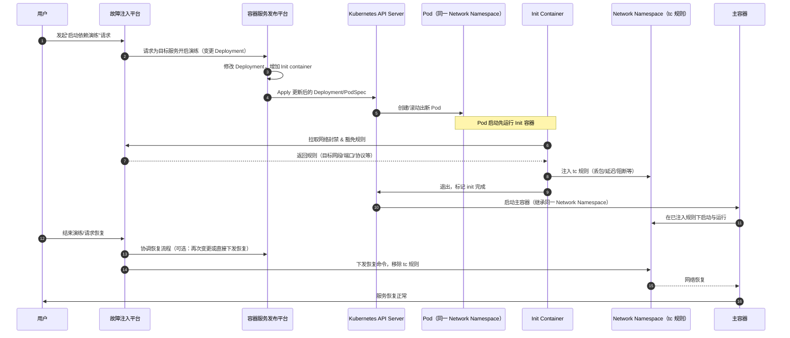
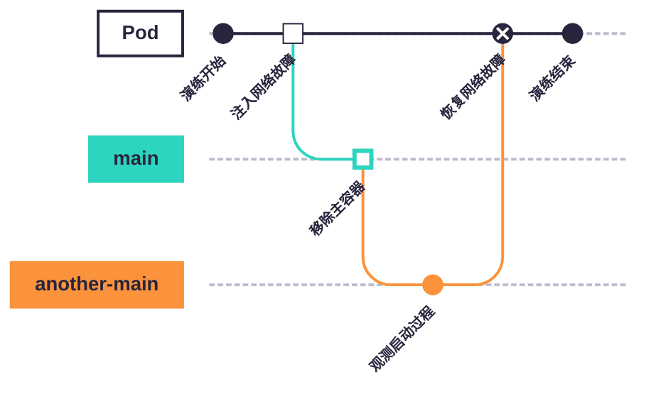
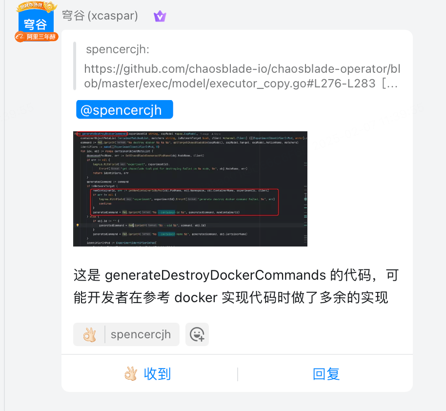

设想一下，你的 Go 服务端程序的 main 函数里存在一些初始化逻辑，比如依赖注入框架 Wire 的 App 初始化，或者是自己手写的初始化逻辑。
阅码无数的你肯定见过在这期间使用 panic 来处理程序初始化错误的场景。请思考以下问题：

1. 所有的依赖组件初始化失败了都需要 panic 吗？
2. 哪些依赖组件初始化失败了需要 panic？哪些不需要？
3. 如果某些依赖组件初始化失败了不需要 panic，那程序应该如何处理？
4. 组件初始化失败后能自愈吗？如何自愈？

每个团队，每家公司的答案都可能不太一样，本文不去深究这些问题的答案。作为“混沌工程领域”从业者，
我更关心如何验证这些答案的正确性，即如何制造故障来验证这些程序启动期间的表现是否符合预期呢？

我在 25 年 H1 完成了启动依赖演练的能力建设和功能推广。本文将分享该实验的背景、需求、方案、实践和成果。

<!-- truncate -->

## 背景

- 重要的底层服务在启动期间存在强依赖组件，出现较大机房维度灾难后，无法成功重启/启动，导致上层服务大面积不可用。
- 不合理的服务启动期间依赖导致在网络故障期间无法进行有效 HPA/VPA 扩容。

## 需求

在上述背景驱动下，老板们就希望混沌工程平台提供相关能力了。

在服务启动期间注入网络故障，验证服务启动期间的表现是否符合预期。观察的内容包括但不限于：1）依赖是否触发降级逻辑；
2）依赖是否触发重试逻辑；3）服务是否能成功启动；4）Pod 的 liveness、readiness 和 startup probe 是否符合预期。

恢复故障后，观察服务的表现是否符合预期。观察的内容包括但不限于：1）依赖是否能成功恢复；2）服务是否能成功提供服务。

## 方案

经过调研，发现目前主流的混沌工程工具均 **不支持** 在服务启动期间注入故障！现有的混沌工程工具都必须在容器启动后才能注入故障。
我的第一反应是我们需要引入一个 Init container，在服务主容器启动前在 Init container 中向故障注入平台拉取网络封禁&豁免规则，
然后执行注入故障的 tc 命令。由于同一个 Pod 下容器的 Network Namespace 是共享的，
所以 Init container 中注入的网络故障会影响主容器。这样就实现了在服务启动期间注入故障的需求。

这个符合直觉的方案需要做 3 块重大工作：

1. 容器服务发布平台需要支持动态修改服务的 Deployment spec，增加 Init container。
2. 故障注入平台与容器服务发布平台进行交互：用户开始演练 -> 容器服务发布平台修改/新增 Deployment spec。
3. Init container 需要实现拉取网络封禁&豁免规则，并注入故障的逻辑。 新实例启动后，
   Init container 从故障注入平台拉取网络封禁&豁免规则，然后注入故障。

下面用一张时序图概括该“假设方案”的端到端交互流程：



很明显，这个方案的工作量巨大，且需要跨多个团队协作，风险也很大。

于是团队想出了一个非常巧妙的方案：



我们将原本健康的 main 容器作为 Init container，利用它作为注入 tc 规则的执行入口。
而 Network Namespace 上的 tc 规则生命周期伴随整个 Pod，并不会因为容器的变化而变化，
因此注入故障后将主容器重启，观测新容器的启动过程就能实现“启动依赖”演练。

## 问题

### 无法正确移除容器

移除容器是一个不常用的故障实验，这次我们一用就用出了问题。
关于这个 bug 的修复详见 [《修复 ChaosBlade 遗留多年的 Bug-正确实现移除容器》](chaosblade-bugfix#正确实现移除容器)。

### 无法正确恢复故障

调试过程中我还发现了 chaosblade-operator 中一段不合理的 [代码](https://github.com/chaosblade-io/chaosblade-operator/blob/master/exec/model/executor_copy.go#L276-L283)。
由于前面提到的移除容器操作，容器的 containerID 必然发生变化，这导致恢复网络故障时会失败，进而导致 tc 规则残留在 Pod 中。

示例代码如下：

```go
if isNetworkTarget {
    generatedCommand = fmt.Sprintf("%s --container-id %s --container-runtime %s", generatedCommand, obj.ContainerId, obj.ContainerRuntime)
} else {
    if obj.Id != "" {
        generatedCommand = fmt.Sprintf("%s --uid %s", command, obj.Id)
    }
    generatedCommand = fmt.Sprintf("%s --container-name %s --container-runtime %s", generatedCommand, obj.ContainerName, obj.ContainerRuntime)
}
```

经过分析和实测，网络实验并不应该特殊对待，使用容器名同样能正确恢复网络故障。询问 maintainer 后更确认了我的想法。



修复方案也非常简单，把 if 分支移除即可。

_由于太过简单，我没有把这个 bugfix 记录在 [《修复 ChaosBlade 遗留多年的 Bug》](chaosblade-bugfix) 中。_

## 演练暴露出来的风险

给老板汇报用的成果总结我就不在此赘述了。我提几个我个人觉得比较有意思的点：

- 公司很多服务没有正确利用 K8s liveness、readiness 和 startup probe 来作为服务就绪的标识，
  也没有正确实现 [GRPC Health Checking Protocol](https://github.com/grpc/grpc/blob/master/doc/health-checking.md)。
- Kratos 内部版本存在较大设计与实现弊端，导致服务启动期间很容易出现依赖阻塞问题。
- 公司缺少用户友好的产品来查看服务启动期间的 stdout 日志，服务正确启动后日志就走 OTel 了，不再输出到 stdout 了。
  现有的容器 stdout 日志产品没有流式输出，翻页极为困难。用户和我抱怨我做出来的这块功能很难用，演练很难观测，我也很无奈。
  我会给测试人员举一个很常见的例子：开一个新服务的时候由于各种各样的原因服务起不来，
  研发也会和你们一样来盲人摸象般探寻为什么服务无法正常启动。这是公司层面的问题，不是我们搞了演练才有的问题，我肯定是没法解决的。

## 引申知识

- [容器重启策略](https://kubernetes.io/zh-cn/docs/concepts/workloads/pods/pod-lifecycle/#restart-policy)：有些用户反映演练过程中新的容器无法再启动了。实际上这是由于指数级回退延迟机制，kubelet 会等待一段时间后才会重启容器。这往往出现在容器由于注入的网络故障，长时间无法启动的场景。
- kubelet 拉取镜像也有类似的机制，但有一个超时时间：在 1.24 前是 kubelet 的 `--image-pull-progress-deadline` 参数，默认 1 分钟；后来该功能迁移到容器运行时，containerd `config.toml` 的相关参数是 `image_pull_progress_timeout`，默认 5 分钟。
