# SSH 会话到底会加载哪些环境变量？

很多研发同学日常需要登录机器（物理机或虚拟机），读完本文你一定会有收获。
本文开头先抛出 3 个问题，足以总结全文内容，也能引起你的兴趣：

1. SSH 会话可以分成哪些种类？
2. `ssh your-name@your-host`，登上目标机器后执行 `env` 命令输出的环境变量是从哪些文件加载的？
3. `ssh your-name@your-host -- env`，`env` 命令输出的环境变量是从哪些文件加载的？

_全文经过 GPT-5 的润色，与 strace 结果分析有关内容由 Claude Sonnet 4（沉思）参与完成。_

<!-- truncate -->

## 背景

我工作内容中的很大部分是维护一个基于 SSH 的作业平台。别看这个平台听起来非常原始和简单，
它支撑了全公司的服务器运维、K8s Node 运维、大数据组件运维、数据库运维、潮汐混部、7 层负载均衡配置分发等核心底层业务。

用下面这幅图来形容都不为过：


2025 年的今天，许多平台用户对 Linux、SSH、Shell 都不甚了解，也不上网搜索，经常直接向我提出这样的问题：

“我的脚本通过堡垒机登录到机器上后可以正常执行，为什么用你的平台就会报错，**环境变量怎么都找不到了呢？**”

## @flowblok 的结论

> 感谢 [@Julia Evans] 的漫画小册子
> [《The Secret Rules of the Terminal》](https://jvns.ca/blog/2025/06/24/new-zine--the-secret-rules-of-the-terminal/)，
> 其中提到了一篇博客：[《Shell startup scripts》](https://blog.flowblok.id.au/2013-02/shell-startup-scripts.html)
> 作为资料来补充说明 `.bashrc` 和 `.bash_profile` 的区别。

@flowblok 在 [《Shell startup scripts》](https://blog.flowblok.id.au/2013-02/shell-startup-scripts.html) 里画的图实在太复杂了，他说他通读了各路资料，不明觉厉啊！

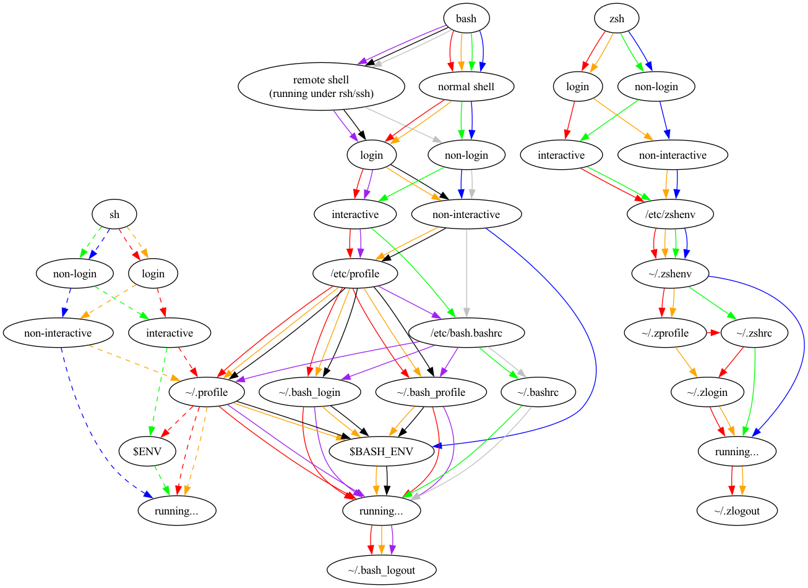

总结上图，**在 SSH 登录启动 Bash 时**，加载什么环境脚本需要考虑以下几个因素：

- 是否是登录 Shell（login shell）？这一点可以通过 Bash 执行 `shopt login_shell` 来判断。
- 是否是交互式 Shell（interactive shell）？这一点可以通过 Bash 执行 `tty` 来判断。

## 验证实验

让我们来验证一下 @flowblok 的结论。

实验环境：

- 机器：OrbStack 上的 Ubuntu 25.04 虚拟机
- Terminal Emulator：Warp

**不同的 Linux 发行版会有不同的表现，欢迎向我补充不同发行版的不同表现。**

### 是否登录和是否交互排列组合傻傻分不清楚

查阅资料我们可以知道，login、interactive、non-login、non-interactive 可以组合成 4 种不同的 Shell 会话。

#### login + interactive

这是最常见的会话形式。通过 `ssh $username@$hostname` 登录机器后执行 `shopt login_shell` 和 `tty` 能看到 `login_shell on`
和 `/dev/pts/X`。

#### login + non-interactive

一般不会出现这种会话。使用命令
`ssh -i ~/.ssh/spencercjh_id_rsa root@192.168.139.193 -- 'bash --login -c "shopt login_shell; tty"'` 可以强行制造，这个命令会输出
`login_shell on` 和 `not a tty`。

#### non-login + interactive

一般不会出现这种会话。`ssh $username@$hostname` 后再次执行 `bash` 打开一个会话（注意没有使用 `--login` flag），然后
`$ shopt login_shell: login_shell off`，`$ tty: /dev/pts/X`。

**使用 Warp 的 Warpify SSH Sessions 功能也会进入这种会话**。其原因会在后文介绍。

#### non-login + non-interactive

这是背景中提到的作业平台使用的 SSH 会话类型，用户疑惑的原因就在这种会话与其他会话的特殊性。
执行命令 `ssh $username@$hostname -- shopt login_shell; tty`，该命令会输出 `login_shell off` 和 `not a tty`。

#### 拓展：SSH Session 的创建过程

使用 `strace` 看看 `sshd` 创建 SSH Session 的过程，来解释为什么 Warp 的 Warpify SSH Sessions 功能会影响
`shopt login_shell` 的结果。

```shell
$ ps -aux | grep sshd
root         284  0.0  0.0   9836  3144 ?        Ss   01:55   0:00 sshd: /usr/sbin/sshd -D [listener] 0 of 10-100 startups
$ sudo strace -f -e trace=execve -p 284
```

##### Warpify SSH Sessions 行为

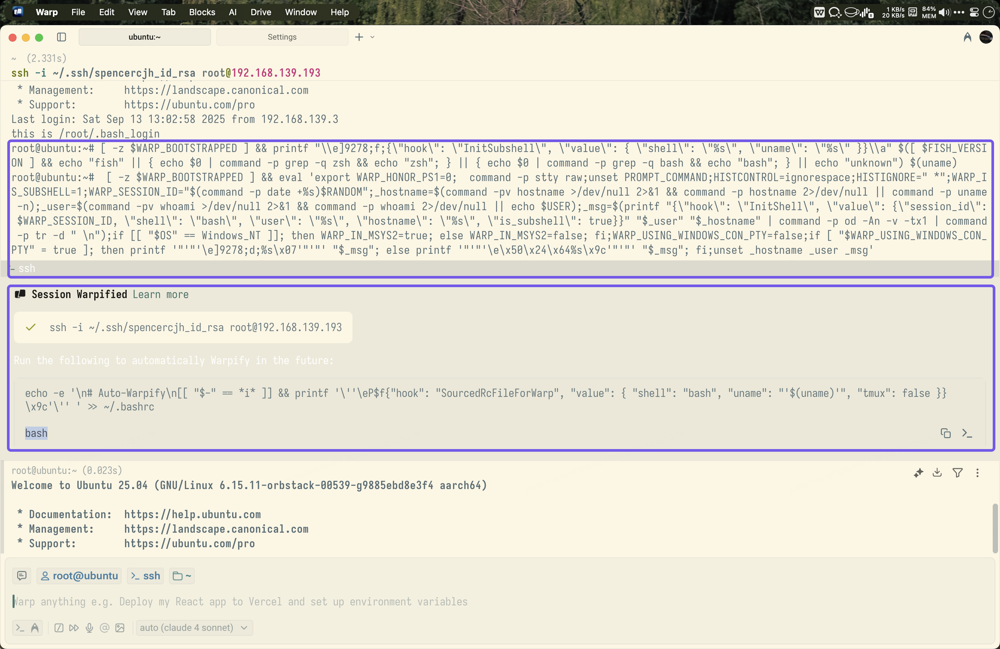

可以发现 Warpify 实际上是替换了 SSH 登录命令，改成了实现增强功能的一大串脚本。

这时打开 Warpify SSH Sessions 功能，再登录机器，strace 结果太多了，交给大模型分析一下：

进程树结构：

```shell
sshd (PID 284) - 主 SSH 守护进程
    │
    ├── sshd-session (PID 147767) - 处理单个连接的会话进程
    │
    ├── sh (PID 147779) - 执行 MOTD 脚本
    │   └── run-parts + MOTD 脚本们 (PID 147780-147787)
    │
    └── bash (PID 147789) - 用户的实际 Shell
        └── 大量子进程 (PID 147790+) - Warp Terminal 的功能进程
```

进一步查看 strace 记录可以发现 Warpify SSH Session 后，用户的 Bash 进程是通过
`/usr/bin/bash", ["bash", "--rcfile", "/dev/fd/63"]` 的方式启动的。

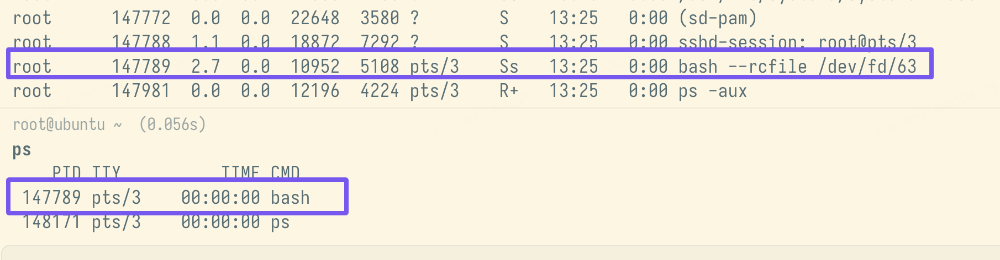

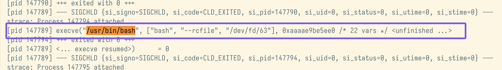

##### 原始行为

关闭 Warp 的 Warpify SSH Sessions 功能，使用 `ssh $username@$hostname` 登录机器。有了上面的经验，我们直接看 Bash 进程的启动方式：

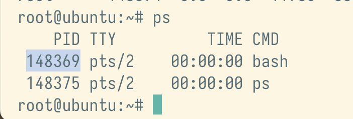

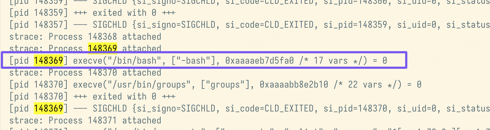

可以发现 Bash 是通过 `"/bin/bash", ["-bash"]` 的方式启动的。阅读 `man bash` 可以发现：

> INVOCATION
>
> A login shell is one whose first character of argument zero is a -, or one started with the --login option.

综上，`-bash` 等于 `--login`，所以 `ssh $username@$hostname` 的行为等同于 `ssh $username@$hostname -- bash --login`，
因此默认情况下打开的 SSH Session 是 login shell。而 Warpify SSH Sessions 功能修改了这一行为，丢失了 `--login` flag，所以
`shopt login_shell` 结果是 `off`。

### 环境变量脚本如何加载？

在下面的文件中增加 `export ENV_XXXX="this is XXXX"` 的环境变量：

- `/etc/environment`（这是 @flowblok 没有提到的全局环境文件）
- `/etc/profile`
- `/etc/bash.bashrc`
- `/root/.profile`
- `/root/.bash_login`
- `/root/.bash_profile`
- `/root/.bashrc`
- `/etc/profile.d/custom.sh`（这是 @flowblok 没有提到的自定义脚本）

然后分别执行开头提到的 2 个命令：

```shell
$ ssh $username@$hostname
$ env | grep ENV

$ ssh $username@$hostname -- 'env | grep ENV'
```

结果与 @flowblok 写得八九不离十了。

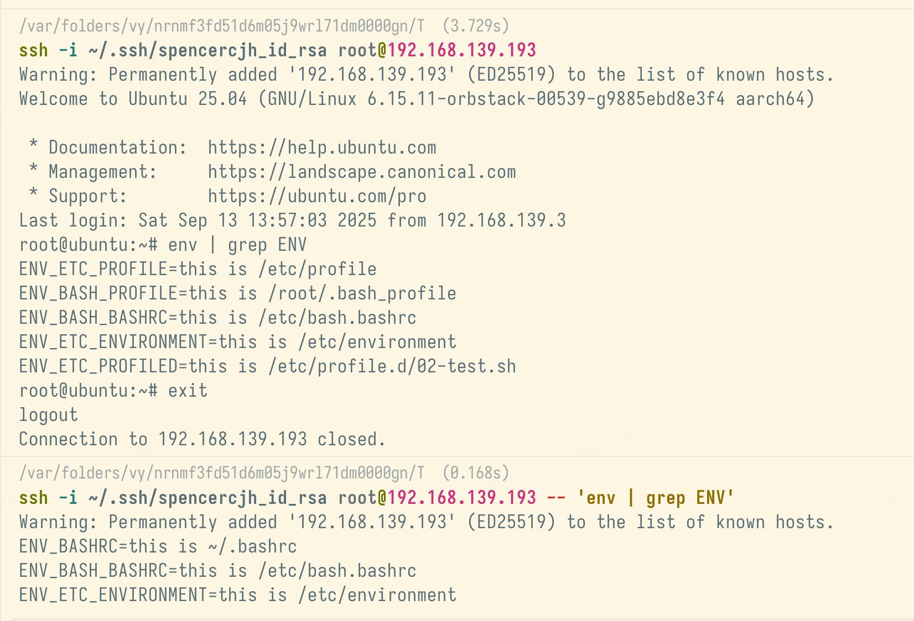

#### 登录交互会话

首先 @flowblok 没有提到 `/etc/environment` 文件，这是两种会话都会加载的。

可以发现 login + interactive 会话会加载紫色线路上的文件。查看 `/etc/profile` 的内容可以发现：

```shell
if [ -d /etc/profile.d ]; then
  for i in $(run-parts --list --regex '^[a-zA-Z0-9_][a-zA-Z0-9._-]*\.sh$' /etc/profile.d); do
    if [ -r $i ]; then
      . $i
    fi
  done
  unset i
fi
```

它会加载 `/etc/profile.d` 中的脚本。

当 `~/.profile`、`~/.bash_login` 和 `~/.bash_profile` 同时存在时，只会加载
`~/.bash_profile`。并且它们还按照一定的顺序来工作，这一点我们可以进一步做实验来验证。

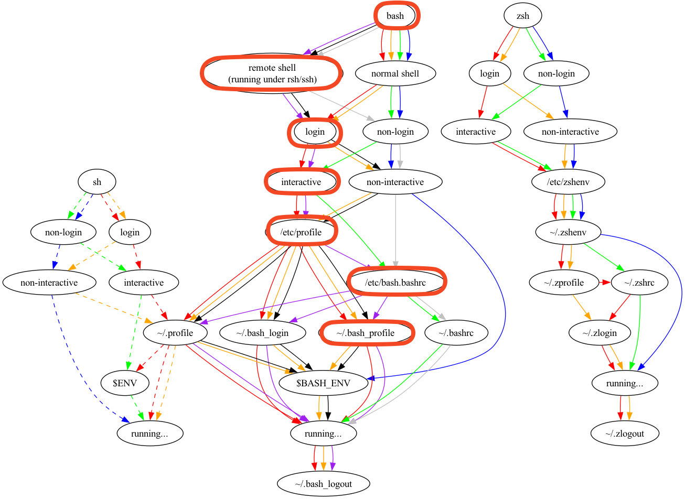

当我们把 `~/.bash_profile` 移走后，`~/.bash_login` 就开始工作了。

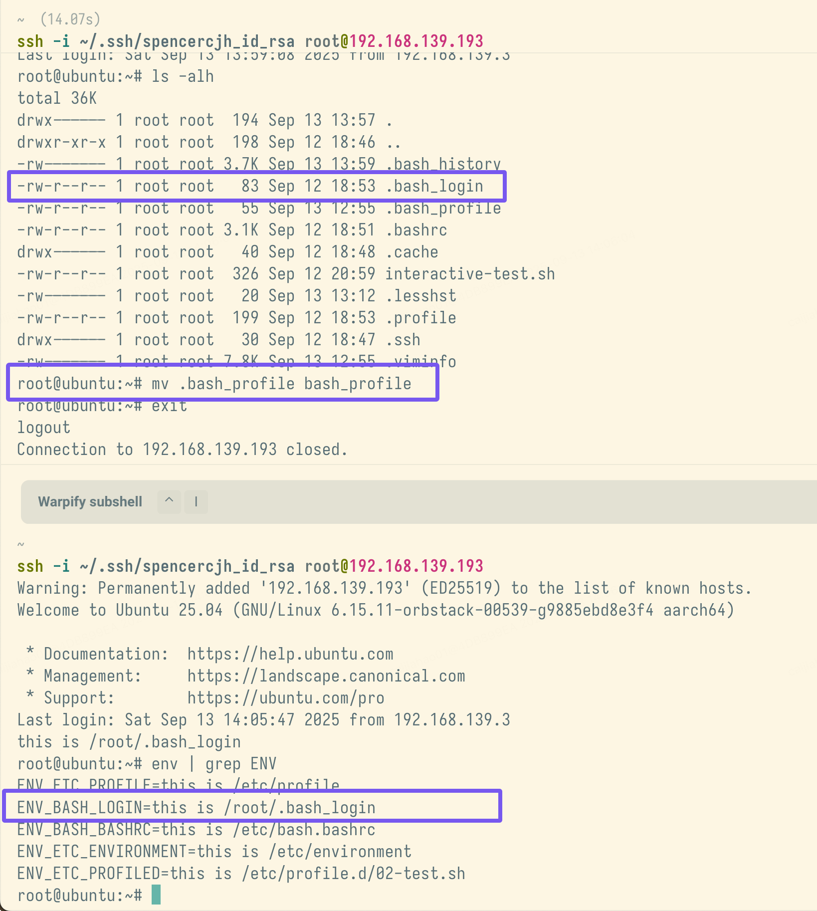

类似地，当我们把 `~/.bash_login` 移走后，`~/.profile` 就开始工作了。在我这个发行版中 `~/.bashrc` 里还会加载 `~/.bashrc`：

```shell
# ~/.profile: executed by Bourne-compatible login shells.

export ENV_PROFILE="this is ~/.profile"
echo "this is ~/.profile"

if [ "$BASH" ]; then
  if [ -f ~/.bashrc ]; then
    . ~/.bashrc
  fi
fi
```

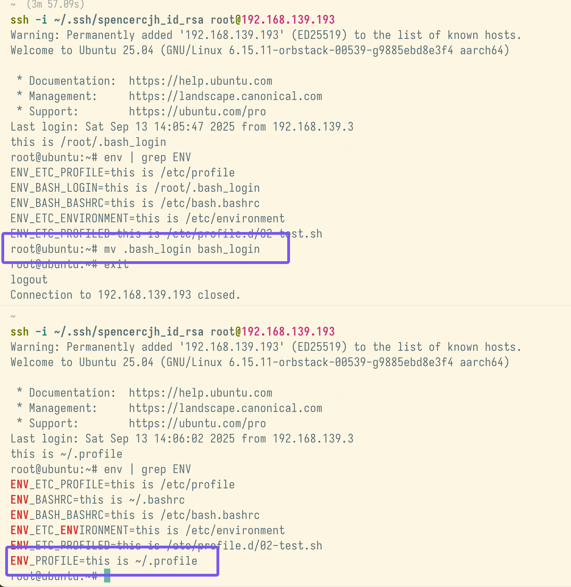

这一点在 `man bash` 中的 `INVOCATION` 里已经有所提及（可能 @flowblok 也写了而我没仔细读……）。

> When `bash` is invoked as an interactive login shell, or as a non-interactive shell with the `--login` option, it
> first reads and executes commands from the file `/etc/profile`, if that file exists. After reading that file, it looks
> for `~/.bash_profile`, `~/.bash_login`, and `~/.profile`, in that order, and reads and executes commands from the first
> one that exists and is readable. The --noprofile option may be used when the shell is started to inhibit this behavior.

文档里说了，在读取 `/etc/profile` 后，会依次读取并执行 `~/.bash_profile`、`~/.bash_login` 和 `~/.profile`，关键后面还有半句 **from the first one that exists and is readable**，这意味着它执行完一个脚本以后就不会再继续读取执行了。

#### 非登录非交互会话

`/etc/environment` 的问题不再赘述。

这里的读取逻辑也在 `man bash` 中的 `INVOCATION` 有提及。

> If bash determines it is being run non-interactively in this fashion, it reads and executes commands from
> /etc/bash.bashrc and ~/.bashrc, if these files exist and are readable.

实验观察到的行为与之保持一致。

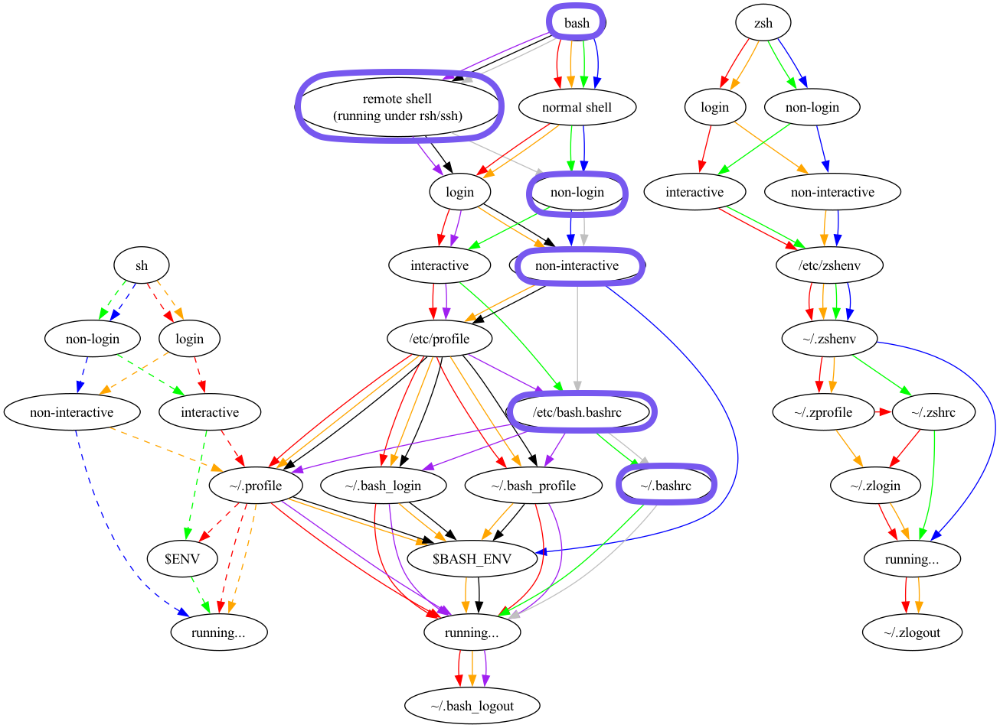

## 总结

1. SSH 会话可以分成 4 种类型：login + interactive、login + non-interactive、non-login + interactive、non-login + non-interactive。
2. `ssh your-name@your-host` 会加载 `/etc/environment`、`/etc/profile`（以及 `/etc/profile.d` 下的脚本）、`/etc/bash.bashrc`、`~/.bash_profile`、`~/.bash_login`（如果 `~/.bash_profile` 不存在）、`~/.profile`（如果 `~/.bash_profile` 和 `~/.bash_login` 都不存在）。
3. `ssh your-name@your-host -- $CMD` 会加载 `/etc/environment`、`/etc/bash.bashrc`、`~/.bashrc`。

## 后记：环境脚本还会影响 SFTP 的工作

维护作业平台的时候我还经常被用户扔过来这样的日志：

```shell
get sftp client: packet too long
```

最后排查下来都是由于 **磁盘满了**，导致作业平台无法把用户脚本分发到目标机器上去。

没想到在公司里做上述实验的时候，也复现了这样的问题。

当我在 `~/.bashrc` 中增加 `echo "YOU CAN't echo here"` 后，SFTP 就报错了。

```shell
sftp -i ~/.ssh/spencercjh_id_rsa root@192.168.139.193
Warning: Permanently added '192.168.139.193' (ED25519) to the list of known hosts.
Received message too long 1498371360
Ensure the remote shell produces no output for non-interactive sessions.
```

### SFTP 是如何工作的

话不多说，直接使用 strace + 大模型分析。

```shell
$ strace -f -e trace=write,read,execve -p 284
```

#### 执行过程

```shell
客户端                SSH 连接               服务端
┌─────────┐          ┌─────────┐          ┌─────────────────┐
│ sftp    │◄────────►│ 加密通道 │◄────────►│ sshd (148831)   │
│ client  │          │         │          │      ↓          │
└─────────┘          └─────────┘          │ sshd (148842)   │ ← SSH session
                                          │      ↓          │
                                          │ bash (148843)   │ ← Shell 启动器
                                          │      ↓          │
                                          │ sftp-server     │ ← 真正的 SFTP 服务
                                          └─────────────────┘

```

```shell
# 1. SSH 协议握手
[pid 148831] write(4, "SSH-2.0-OpenSSH_9.9p1 Ubuntu-3ub"..., 41) = 41
[pid 148831] read(4, "SSH-2.0-OpenSSH_9.9", 21) = 21
# 2. 密钥交换
[pid 148832] write(4, "\0\0\4\214\n\24\n\20\271\355\33\22...", 1168) = 1168
# 3. 用户认证
[pid 148832] write(6, "\0\0\0\4root", 8) = 8

# 4. 请求 SFTP 子系统
[pid 148842] write(6, "\0\0\0!q", 5) = 5
[pid 148842] write(6, "\0\0\0\34/usr/lib/openssh/sftp-server", 32) = 32

# 5. 🎯 创建 Shell 来启动 sftp-server
[pid 148843] execve("/bin/bash", ["bash", "-c", "/usr/lib/openssh/sftp-server"], ...)

# 6. Shell 读取配置文件
[pid 148843] read(3, "# System-wide .bashrc file for i "..., 2371) = 2371
[pid 148843] read(3, "# ~/.bashrc: executed by bash(1)"..., 3170) = 3170

# 7. 💥 执行你的 echo 语句
[pid 148843] write(1, "YOU CAN't echo here\n", 20) = 20

# 8. SFTP 进程读取到被污染的数据
[pid 148842] read(10, "YOU CAN't echo here\n", 32768) = 20

# 9. Shell 启动真正的 sftp-server
[pid 148843] execve("/usr/lib/openssh/sftp-server", ...)

# 10. 💀 SFTP 进程因协议错误退出
[pid 148842] +++ exited with 255 +++

```

可以看到，由于使用了 `"/bin/bash", ["bash", "-c", "/usr/lib/openssh/sftp-server"]` 启动 sftp-server，这个会话会按照上面 non-login & non-interactive 的路径，加载 `/etc/bash.bashrc` 和 `~/.bashrc`。

#### SFTP 协议

```shell
# SFTP 客户端发送初始化消息
[pid 148842] write(9, "\0\0\0\5\1\0\0\0\3", 9) = 9
                     ↑长度=5 ↑类型=1 ↑版本=3
# Shell 的输出破坏了响应流
[pid 148843] write(1, "YOU CAN't echo here\n", 20) = 20
# SFTP 进程读取到混合数据
[pid 148842] read(10, "YOU CAN't echo here\n", 32768) = 20

# 客户端期望的格式：
正确: [长度4字节][消息类型][数据...]
例如: 0x00000009   0x02      [版本响应数据]
# 实际收到的数据：
错误: "YOU CAN't echo here\n" + [正确的 SFTP 响应]
      ↑被解释为长度字段
# ASCII "YOU " = 0x594F5520 = 1498371360
# 这就是 "packet too long 1498371360" 的来源！
```

综上，只要在 SFTP 工作的过程中系统有任何意外输出，都会破坏其二进制协议，导致报错 get sftp client: packet too long。

## 后记：厘清 tty 相关概念

- TTY: Teletypewriter
- PTY: Pseudo Terminal
- PTS: Pseudo Terminal Slave

```shell
Terminal Emulator ←→ PTY Slave ←→ TTY Driver ←→ PTY Master ←→ Program (SSHD)
```

正如 Julia Evans 所言，终端有关的知识太零散了。感兴趣的朋友可以阅读：[《The Secret Rules of the Terminal》](https://jvns.ca/blog/2025/06/24/new-zine--the-secret-rules-of-the-terminal/)。

**下一篇文章将会继续和 tty 有关，详解 `kubectl exec`，尽情期待。**
