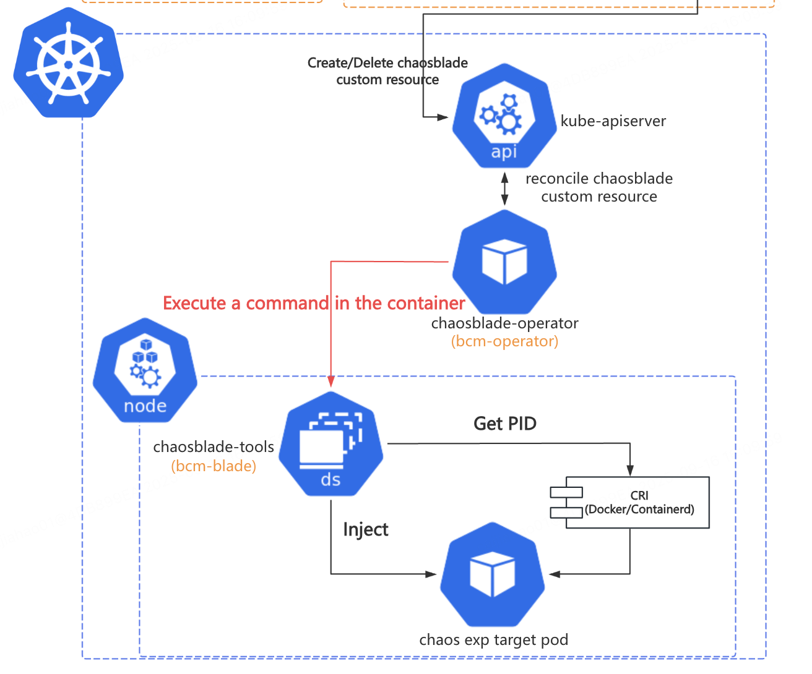
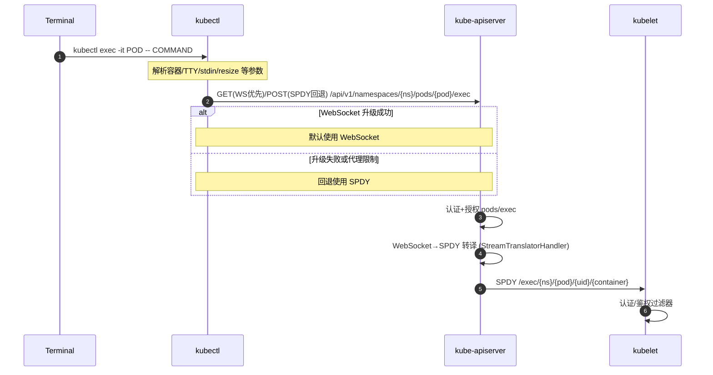
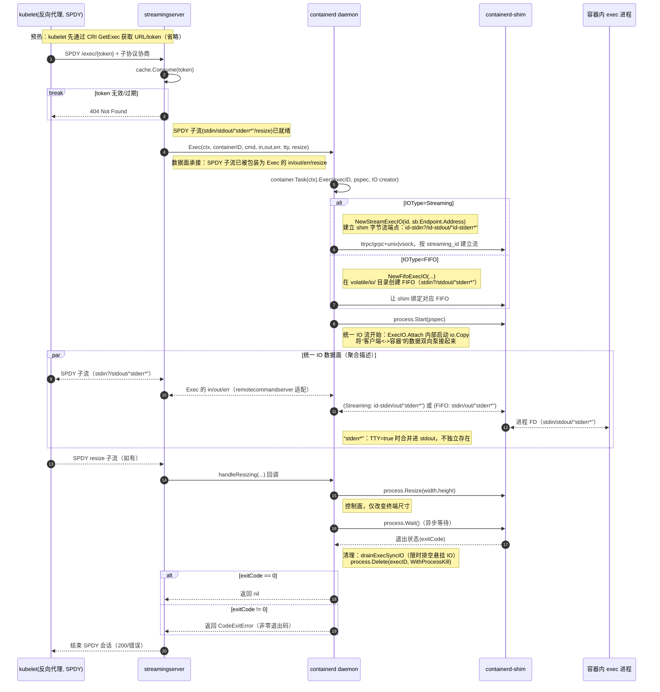
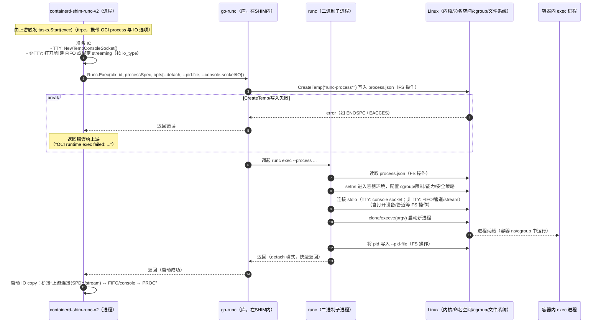
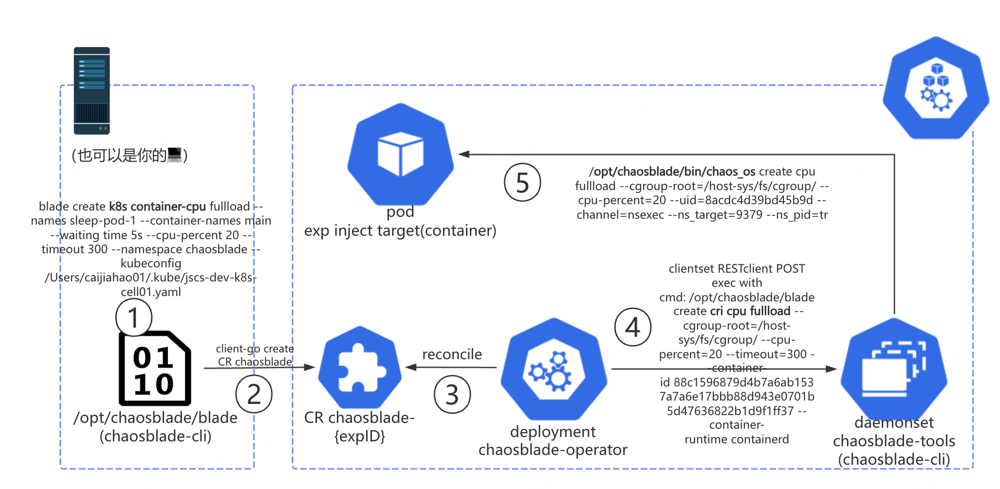
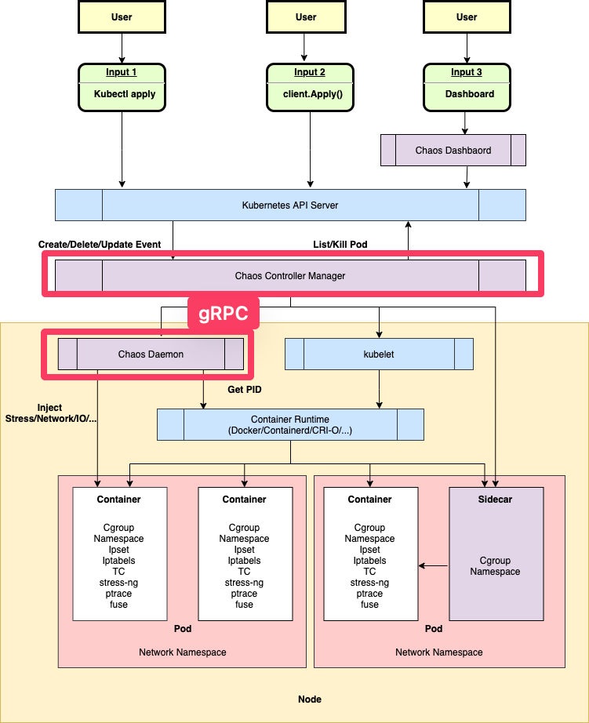

# 探秘源码：从 ChaosBlade 到 `kubectl exec`

[ChaosBlade](https://github.com/chaosblade-io) 和 [`kubectl exec`](https://kubernetes.io/docs/reference/kubectl/generated/kubectl_exec/) 有什么关系？**先说结论，ChaosBlade 里所有在 Kubernetes 中的故障注入本质上都在使用 `kubectl exec` 做 IPC（Inter-Process Communication）。ChaosBlade 简直是“云原生殉道者”，业务逻辑直接依赖 `kube-apiserver`。**

如果您了解 `kubectl exec` 的工作原理，您就会知道这是一个非常“危险”的行为。什么？你觉得这是“站在巨人的肩膀上”？本文将反驳您这样朴素的想法。

如果您对这些话题的认知仅仅停留在 `kubectl exec -it $podName -- bash`，读完全篇，了解其背后的复杂链路与容器技术栈，跟你的运维/SRE 朋友炫耀一番吧！

真是 **不看不知道，一看吓一跳，`kubectl exec` 完整串联了从 Kubernetes，containerd，runc 到操作系统的知识！** 读完本文，您将对 Kubernetes 内的长连接，CRI，OCI 都会有所了解。**没在相关领域团队待过，如有疏漏还请在推特相关评论区/提 issue 狠狠批评我。**

<!-- truncate -->

## 标题从何而来



ChaosBlade 中，[chaosblade-operator](https://github.com/chaosblade-io/chaosblade-operator) 是 CRD chaosblade 的 controller；chaosblade-tools 是一个 Daemonset，是以容器化方式部署的 [chaosblade CLI](https://github.com/chaosblade-io/chaosblade)，它负责执行具体的故障注入逻辑。operator 请求 Daemonset Pod 的方式是使用 `client-go` 创建 `pods/exec` subresource，执行远程命令。

在 `kubectl` 中，`kubectl exec` 做的事情类似，因此有了标题“从 ChaosBlade 到 `kubectl exec`”。

## 剖析 `kubectl exec` 链路

在 Kubernetes 的日常操作中，`kubectl exec` 命令是我们与容器直接交互的重要工具。Kubernetes 官方文档“从来”都不是用于深究技术细节的资料（可能不够严谨）。关于 `kubectl exec` ，你可以从“官方”渠道找到以下信息：

- [Tasks: Get a Shell to a Running Container](https://kubernetes.io/docs/tasks/debug/debug-application/get-shell-running-container/)
- [Reference: kubectl exec](https://kubernetes.io/docs/reference/kubectl/generated/kubectl_exec/)
- [Kubernetes 1.31: Streaming Transitions from SPDY to WebSockets](https://kubernetes.io/blog/2024/08/20/websockets-transition/)

不过也不是没有人做过链路分析：[How does 'kubectl exec' work?](https://erkanerol.github.io/post/how-kubectl-exec-works/)，但他贴了太多源代码，且由于时代所限，runtime 还不是 containerd，给出的图表信息也不太够。

### 开始阅读源码

不算启动 `kubectl` 的 terminal 的话，链路上的组件包括 `kubectl`，`kube-apiserver`, `kubelet`，containerd CRI `streamingserver`, `containerd daemon`，`containerd-shim`，`runc`。这段链路我总结下来总共会涉及三块领域知识：Kubernetes 长连接、CRI、OCI，因此会分三节来分析。

这是我第一次有目的地阅读这些项目的源码，在 Goland 与大模型的支持下不算太辛苦。**没在相关领域团队待过，如有疏漏还请在推特相关评论区/提 issue 狠狠批评我。**

### client ↔️ kubelet

_下面的时序图由 GitHub Copilot Agent 在 Kubernetes 仓库中使用 GPT-5 模型生成。_

在 Kubernetes API 的语境下 `kubectl exec`，实际上是创建了 subresource `pods/exec`（后文的 `pods/exec` 可以和 `kubectl exec` 划等号）。`kubectl` 与 `kube-apiserver` 之间建立 [WebSocket](https://datatracker.ietf.org/doc/html/rfc6455) 长连接，`kube-apiserver` 与 `kubelet` 之间建立 [SPDY](https://www.chromium.org/spdy/spdy-whitepaper/) 长连接，`kube-apiserver` 把 `kubectl` 的 WebSocket 连接中的 stdin, stdout, stderr 流（[`staging/src/k8s.io/apimachinery/pkg/util/httpstream/httpstream.go`](https://github.com/kubernetes/kubernetes/blob/9d560540c5268e0e2aebf5306907494cf522c260/staging/src/k8s.io/apimachinery/pkg/util/httpstream/httpstream.go)）挑选出来，起协程往 SPDY 连接中对应的 stdin, stdout, stderr 流里复制。



- `kubectl` ：结构比较清晰简单。
  - [`staging/src/k8s.io/kubectl/pkg/cmd/exec/exec.go#Run`](https://github.com/kubernetes/kubernetes/blob/640dabd58b04b72f646ed85947cb8b407b36dc08/staging/src/k8s.io/kubectl/pkg/cmd/exec/exec.go)
    - [`staging/src/k8s.io/client-go/tools/remotecommand/websocket.go#StreamWithContext`](https://github.com/kubernetes/kubernetes/blob/3379d5ac4b6a1afbbaead06689a8584ce546a275/staging/src/k8s.io/client-go/tools/remotecommand/websocket.go)
    - [`staging/src/k8s.io/kubectl/pkg/util/term/term.go`](https://github.com/kubernetes/kubernetes/blob/a504aed54d028dbc8ea2508142c94d309f5f1ec6/staging/src/k8s.io/kubectl/pkg/util/term/term.go)
- `kube-apiserver`：路由（`/api/v1/namespaces/{namespace}/pods/{pod-name}/exec`）注册的逻辑太复杂了，看得云里雾里，（将来有机会我要再开新文把它研究清楚！）；handler 本身逻辑不复杂。
  - [`staging/src/k8s.io/apiserver/pkg/endpoints/installer.go#registerResourceHandlers`](https://github.com/kubernetes/kubernetes/blob/72847ee1f7571f1b8b51d4566302c62b31b1edf8/staging/src/k8s.io/apiserver/pkg/endpoints/installer.go#L1060)
    - [`staging/src/k8s.io/apiserver/pkg/endpoints/handlers/rest.go#ConnectResource`](https://github.com/kubernetes/kubernetes/blob/f712b01ddb55f6569b930ca714499051ba8cb311/staging/src/k8s.io/apiserver/pkg/endpoints/handlers/rest.go)
      - [`pkg/registry/core/pod/rest/subresources.go#Connect`](https://github.com/kubernetes/kubernetes/blob/8b447d8c97e8823b4308eb91cf7d75693e867c61/pkg/registry/core/pod/rest/subresources.go#L168)
        - [`staging/src/k8s.io/apiserver/pkg/util/proxy/streamtranslator.go`](https://github.com/kubernetes/kubernetes/blob/7ba22700bfd12cd32ff72db022e4b53ccda1deca/staging/src/k8s.io/apiserver/pkg/util/proxy/streamtranslator.go#L61)
          - [`staging/src/k8s.io/client-go/tools/remotecommand/spdy.go#StreamWithContext`](https://github.com/kubernetes/kubernetes/blob/3379d5ac4b6a1afbbaead06689a8584ce546a275/staging/src/k8s.io/client-go/tools/remotecommand/spdy.go#L145)
            - [`staging/src/k8s.io/client-go/tools/remotecommand/v2.go#stream`](https://github.com/kubernetes/kubernetes/blob/3379d5ac4b6a1afbbaead06689a8584ce546a275/staging/src/k8s.io/client-go/tools/remotecommand/v2.go#L172)
- kubelet：结构非常清晰简单，核心流量转发依靠 go `net/http/httputil/reverseproxy.go`。与 CRI 相关交互放在后面在讲。
  - [`pkg/kubelet/server/server.go#InstallAuthRequiredHandlers`](https://github.com/kubernetes/kubernetes/blob/b276c96ef8632212bf76647dd0746aeb7c8c4cf7/pkg/kubelet/server/server.go#L538-L552)
    - [`pkg/kubelet/server/server.go#getExec`](https://github.com/kubernetes/kubernetes/blob/b276c96ef8632212bf76647dd0746aeb7c8c4cf7/pkg/kubelet/server/server.go#L968)
      - [`pkg/kubelet/kubelet_pods.go#GetExec`](https://github.com/kubernetes/kubernetes/blob/b18cfd6141f4e093a60b6485f6fb9cd2043472a0/pkg/kubelet/kubelet_pods.go#L2514)
      - [`staging/src/k8s.io/apimachinery/pkg/util/proxy/upgradeaware.go#ServeHTTP`](https://github.com/kubernetes/kubernetes/blob/e8bbb221d36f1adf4116752990c0c4f17a9e5deb/staging/src/k8s.io/apimachinery/pkg/util/proxy/upgradeaware.go#L213)
        - [`net/http/httputil/reverseproxy.go`](https://pkg.go.dev/net/http/httputil#NewSingleHostReverseProxy)

#### 报错：unable to upgrade connection: Unauthorized

_这个错误其实更考察 kubelet 侧的排障能力，我那阵子正好在学习 CKA 中的证书部分，所以很快查到了问题。_

在 Kubernetes 中全局搜索 `unable to upgrade connection` 可以发现其位置在 [`staging/src/k8s.io/apimachinery/pkg/util/httpstream/spdy/roundtripper.go`](https://github.com/kubernetes/kubernetes/blob/3f188e5d86b35993c79d23dbcdfb264af0141241/staging/src/k8s.io/apimachinery/pkg/util/httpstream/spdy/roundtripper.go). 阅读上下文发现是 `kube-apiserver` 到 `kubelet` 的 SPDY 连接失败了。unauthorized 指引我前往 `kubelet` 侧排查，最后我发现是机器初始化时证书配置错误，且仅影响 `kube-apiserver` 请求 `kubelet`，不影响 `kubelet` 上报状态。

### kubelet ↔️ containerd-shim

_下面的时序图和介绍由 GitHub Copilot Agent 在 containerd 仓库中使用 GPT-5 模型生成。_

容器运行时是整个问题中比较复杂的部分。我实在无法独立完成下面这段转述，折磨了 GPT-5 很久，还请大家多指教。

承接上节，`kubelet` 会启动一个反向代理，将 `kube-apiserver` 与 `kubelet` 之间的 SPDY 连接反向代理请求到 CRI `streamingserver`。server 校验 token，协商子流（`stdin`/`stdout`/可选的 `stderr` 以及终端 `resize`），随后把这些通道交给 `containerd daemon` 去“执行命令”。`containerd daemon` 会让 `shim` 在容器里启动一个 `exec` 进程，并把进程的标准输入输出接到传输通道上（默认用本地命名管道 FIFO，也可以按配置改成通过 `shim` 的 `ttrpc`/`grpc` 字节流）。从这一步开始，containerd 内部会起后台协程，把来自客户端的输入按字节转发到容器进程，把进程的输出再原路返回给客户端（这就是数据面，独立于用于创建/启动/等待/调整大小的控制面调用）。TTY 模式下不提供单独的 stderr，终端大小变化会被转成对进程的 resize。等进程退出后，containerd 返回退出码并清理资源，最后关闭 SPDY 连接。可以把整个链路理解成：streaming server 负责接入与协商，`containerd daemon`+`shim` 负责“启动并接上管子”，而数据则在 containerd 内部被异步、连续地在“客户端 ↔ 容器进程”之间搬运。



- `containerd` CRI server/daemon

  - [`internal/cri/server/container_exec.go#Exec`](https://github.com/containerd/containerd/blob/c0cdcb34f189459e11f8b90d271577914aee7339/internal/cri/server/container_exec.go)
    - [`internal/cri/streamingserver/server.go#GetExec`](https://github.com/containerd/containerd/blob/7063ee65972bb1fcab08f654a089c7ca5cb7561e/internal/cri/streamingserver/server.go#L197)
  - [`internal/cri/streamingserver/server.go#NewServer`](https://github.com/containerd/containerd/blob/7063ee65972bb1fcab08f654a089c7ca5cb7561e/internal/cri/streamingserver/server.go#L147)
    - [`internal/cri/streamingserver/server.go#serveExec`](https://github.com/containerd/containerd/blob/7063ee65972bb1fcab08f654a089c7ca5cb7561e/internal/cri/streamingserver/server.go#L283)
      - [`internal/cri/streamingserver/remotecommand/exec.go`](https://github.com/containerd/containerd/blob/d498e690eb503b725896158d7011f8ead72fd7c6/internal/cri/streamingserver/remotecommand/exec.go#L61)
        - [`internal/cri/server/container_execsync.go#execInternal`](https://github.com/containerd/containerd/blob/68a55252fba6717ebd75b1a689ad93cc6beb9d8e/internal/cri/server/container_execsync.go)
          - [`client/process.go#Start&Wait`](https://github.com/containerd/containerd/blob/2f24aa00a58de442713ea60e4206041e00dcf012/client/process.go)
          - [`internal/cri/io/exec_io.go#Attach`](https://github.com/containerd/containerd/blob/42f778fc14124d6f81afae075960778d682f3457/internal/cri/io/exec_io.go)

- containerd-shim
  - [`cmd/containerd-shim-runc-v2/process/exec.go#start`](https://github.com/containerd/containerd/blob/49664dab53ac04dd3294d0d74e2fea7d0ab480cd/cmd/containerd-shim-runc-v2/process/exec.go)
  - 后续调用使用了 [`containerd/go-runc`](https://github.com/containerd/go-runc)。

### containerd-shim ↔️ proc

原本在大纲中并不存在这一节，但当我尝试分析“为什么执行 `kubectl exec` 时会报错 ` OCI runtime exec failed: open /tmp/runc-process2116393344: no space left on device: unknown`”时犯了难，造成这个错误的源码并不在上文中。那好吧，只能继续学习了。

_下面的时序图由 GitHub Copilot Agent 在 containerd 仓库中使用 GPT-5 模型生成。_



_OCI 的世界真是“别有洞天”。_

上图已经介绍得比较清楚了，麻烦大家仔细阅读。

源码我就不列了，出于篇幅原因 [`containerd/go-runc`](https://github.com/containerd/go-runc) 和 [`opencontainers/runc`](https://github.com/opencontainers/runc) 这里就不展开了。如果有机会我会再写博客来讨论这些 OCI 相关的内容。

#### 报错： OCI runtime exec failed: open /tmp/runc-process2116393344: no space left on device: unknown

ChaosBlade 注入 Kubernetes Pod/container 故障时，有时候会出现上述错误。oncall 的时候我只能根据文本去排查 Pod 所在 Node，最后定位到磁盘空间不足导致临时文件无法写入。但我无法向自己和老板解释为什么执行一个命令还需要写入文件呢？

根据上面的时序图，我们可以深入 `vendor/github.com/containerd/go-runc/runc.go#Exec`，可以看到这样的代码：

```go
f, err := os.CreateTemp(os.Getenv("XDG_RUNTIME_DIR"), "runc-process")
...
err = json.NewEncoder(f).Encode(spec)
```

shim 内部用库 go-runc 调用 runc（二进制进程）；为了完整表达 `specs.Process` 的所有字段、避免命令行转义与泄漏，go-runc 把内存结构序列化成 JSON 临时文件，再用 runc `exec --process <临时文件>`。这并不是 OCI spec 的明文要求，而是“对 CLI 最稳妥”的工程选择；同类低层运行时基本都采用“文件承载复杂结构”的接口形态。

> [OCI runtime#Start](https://github.com/opencontainers/runtime-spec/blob/main/runtime.md#start)
>
> ```
> start <container-id>
> ```
>
> This operation MUST [generate an error](https://github.com/opencontainers/runtime-spec/blob/main/runtime.md#errors) if it is not provided the container ID. Attempting to `start` a container that is not [`created`](https://github.com/opencontainers/runtime-spec/blob/main/runtime.md#state) MUST have no effect on the container and MUST [generate an error](https://github.com/opencontainers/runtime-spec/blob/main/runtime.md#errors). This operation MUST run the user-specified program as specified by [`process`](https://github.com/opencontainers/runtime-spec/blob/main/config.md#process). This operation MUST generate an error if `process` was not set.
>
> [OCI config#Process](https://github.com/opencontainers/runtime-spec/blob/main/config.md#process)
>
> **`process`** (object, OPTIONAL) specifies the container process. This property is REQUIRED when [`start`](https://github.com/opencontainers/runtime-spec/blob/main/runtime.md#start) is called.
>
> ...
>
> Example(Linux): https://github.com/opencontainers/runtime-spec/blob/main/config.md#example-linux-1

因此，文件是用来传递给 `runc` 进程详细信息的，当系统盘完全无法写入时，`kubectl exec` 会报错。

## 为什么业务不能依赖 `pods/exec`？

这里再给不熟悉 ChaosBlade 的读者介绍一些背景知识。以下是 ChaosBlade 中故障注入的命令流。命令从最上层的客户端到最终容器中执行，经历了至少 4 次进程创建：

- chaosblade CLI 创建 k8s 实验；
- operator 创建 pods/exec，通过 daemonset pod，到目标 Node 上创建 cri 实验；
- daemonset pod 上的 chaosblade CLI 通过 ChaosBlade 自己开发的 nsexec （一个 C 语言开发的程序）进入目标 Linux namespace 执行程序
- nsexec 拉起 chaos_os（chaosblade-exec-os 中的主程序），执行具体的网络、CPU、内存等故障注入。



_`chaosblade-operator` -> Daemonset `chaosblade-tools` 这一跳借助 `pods/exec` 实现了远程命令执行，这一设计与实现“站在了巨人的肩膀”上，让 `chaosblade-cli` 这个 CLI 程序代码可以_ _“编写一次，到处运行”_ _，赢了，彻底赢了！_

根据上面的链路分析，我们可以发现 `pods/exec` 是一个开销比较大的操作，长连接层层转发，链路非常“漫长”。这就导致，一旦 `kube-apiserver`，`kubelet`, `containerd daemon` 这几个组件出状况，这时候故障注入就会受到影响，出现“实际注入成功但因为报错认为没有注入成功”的问题。而 `chaosblade-operator` 粗糙的设计与实现并没有能力处理这样的边缘情况。

在 B 站的实际使用环境里，特别是用户广泛开展混沌测试的 UAT 环境，机器负载水位常年偏高。高峰期间很容易出现 `kubelet` 因故重启，但上面业务服务正常工作的情况。特别是考虑到 B 站 Kubernetes 容器服务“去 Kubernetes”程度较高，不使用 CoreDNS，不使用 Service，不使用 ConfigMap/Secret，故障情况下 pod probe 不影响服务流量进入。`kubelet` 挂掉重启是非常正常的事情。`kubelet` 乃至 `containerd` 挂掉都是对业务服务来说可以接受的（_如果在读者您的公司是另外一种情况欢迎在相关推特评论区拍砖_），但对 ChaosBlade 却是 **完全不能承受的极端场景**。

你能想象公司里有一个业务是需要依靠 `pods/exec` 做 IPC 来获取另一个服务的结果？举个有些极端的例子，现在有一个视频服务 A，转码服务 B（_我没做过音视频，我只是想用一个家喻户晓的 cli 程序来举例……_），在 B 的业务域里可能会起进程调用 `ffmpeg`，但 B 对外暴露的一定是 API。比如让 A 拿到一个转码后的视频 URL，而不是让 A 直接 `kubectl exec pods/B-pod -- ffmpeg ……`。

这种操作是不是和上面那张图很像了？

笔者自诩有一点 SRE 经验，也耳濡目染学习了 B 站 SRE 团队治理服务，提升稳定性的一些思路和经验。我认为这种“**徒增依赖**”的设计是非常危险的。在平时的开发过程中，如果某一个三方组件很重要但关键时候老出问题，若不能推着它提升稳定性，那就只能把它从系统里踢出去了。`pods/exec` 帮助 ChaosBlade 实现了 CLI 四处使用，不用额外的客户端和服务端就能适配 Kubernetes 的使用环境。相当于是公司有个团队出了个万金油组件，又能做运维操作，还能搭便车执行故障注入脚本。 坏处就是上了 `pods/exec` 的“贼船”，把自己的服务稳定性寄托在这条链路上。

**我不是说在服务里启动进程就一定是错的！** 这 `kubectl exec` 链路中也不是没有执行命令，最后容器上的进程也是靠 `exec --process <临时文件>` 启动的，启动进程必然需要在靠近目标容器的地方起进程。**关键是有没有必要，需求到底是什么？** `pods/exec` 层层转发 stdin/stdout/stderr 流，错误处理恰当。而 ChaosBlade 仅仅为了执行故障注入就用如此牛刀，还没有做好错误处理，限制了许多特性的进一步迭代。

在混沌工程领域，[chaos-mesh](https://github.com/chaos-mesh/chaos-mesh) 已经做出了良好示范，operator 和 daemonset 之间用 gRPC 交互，传递故障注入参数。云原生项目不是用 `kube-apiserver` 跑业务逻辑啊，ChaosBlade 疑似有些太极端了！



## 总结

把 `kubectl exec` 链路完整走一遍，你会发现这根本不是一条“轻量调用”：

- 客户端到节点：WebSocket/（回退）SPDY 的多跳长连接，apiserver 在中间做流量转译，`kubelet` 反向代理到 CRI streaming。
- 节点内：containerd 接管控制面，`shim`+`runc` 在容器命名空间里真正起进程，数据面以字节流持续搬运 stdin/stdout/stderr/resize。
- 任何一环波动（证书、代理、kubelet 重启、磁盘写满、runtime 抖动）都可能让 exec 表现为“明明生效却报错”。

理解这条链路，不只是为了一次性把问题修好，更是为了在系统设计上少走弯路：让运维利器回归运维场景，让业务通信走稳定可控的服务化通道。

---

<SponsorIframe
  src="https://github.com/sponsors/spencercjh/card"
  title="Sponsor spencercjh"
  width={600}
  height={225}
  style={{ borderRadius: 6, overflow: 'hidden' }}
  allow="payment *; clipboard-read; clipboard-write"
/>
