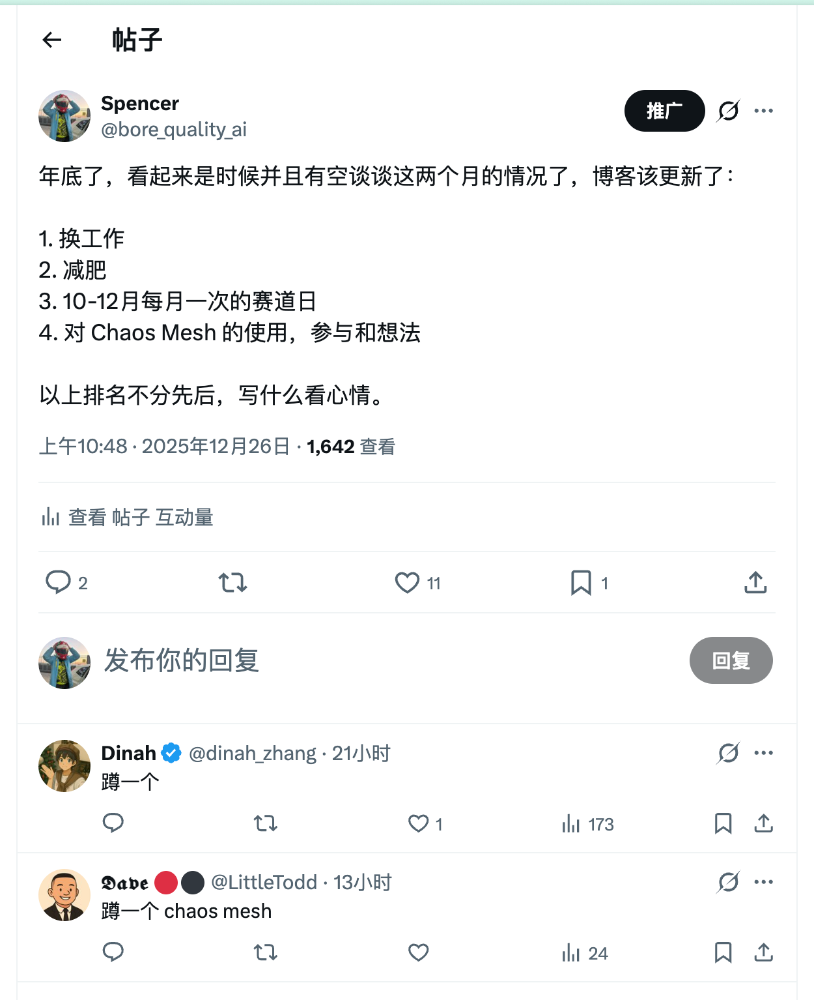
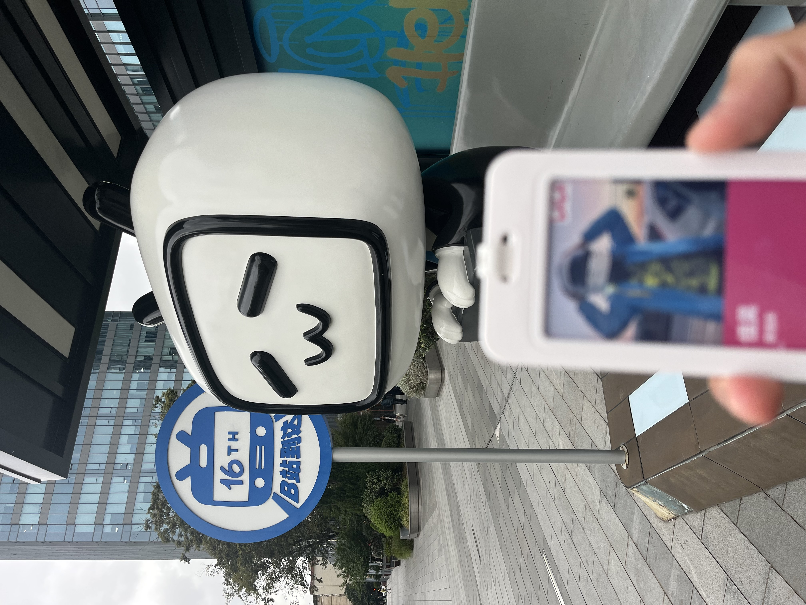
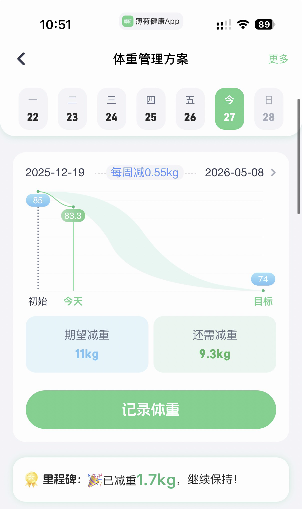
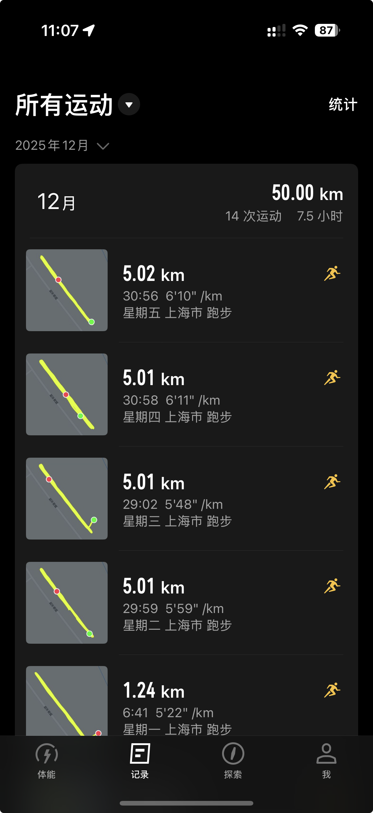
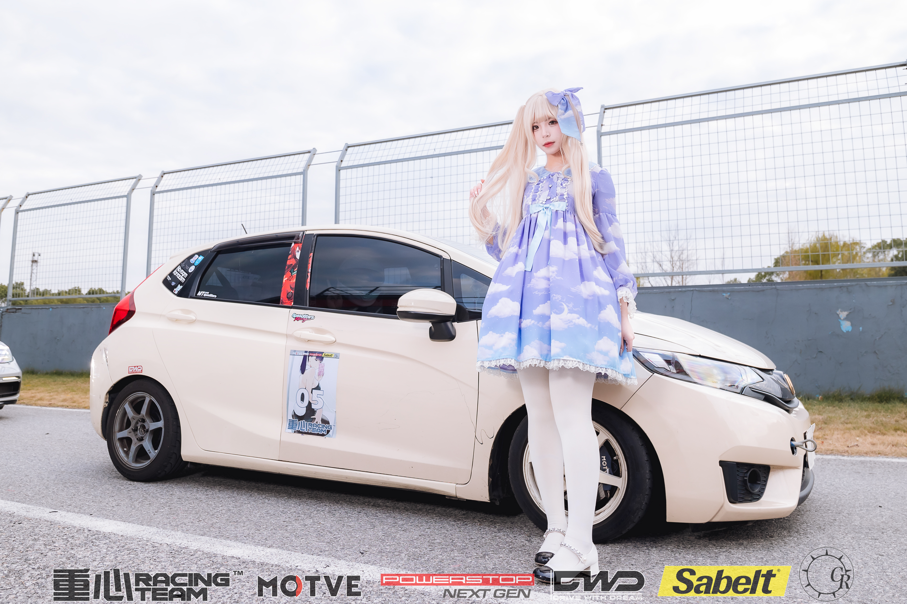
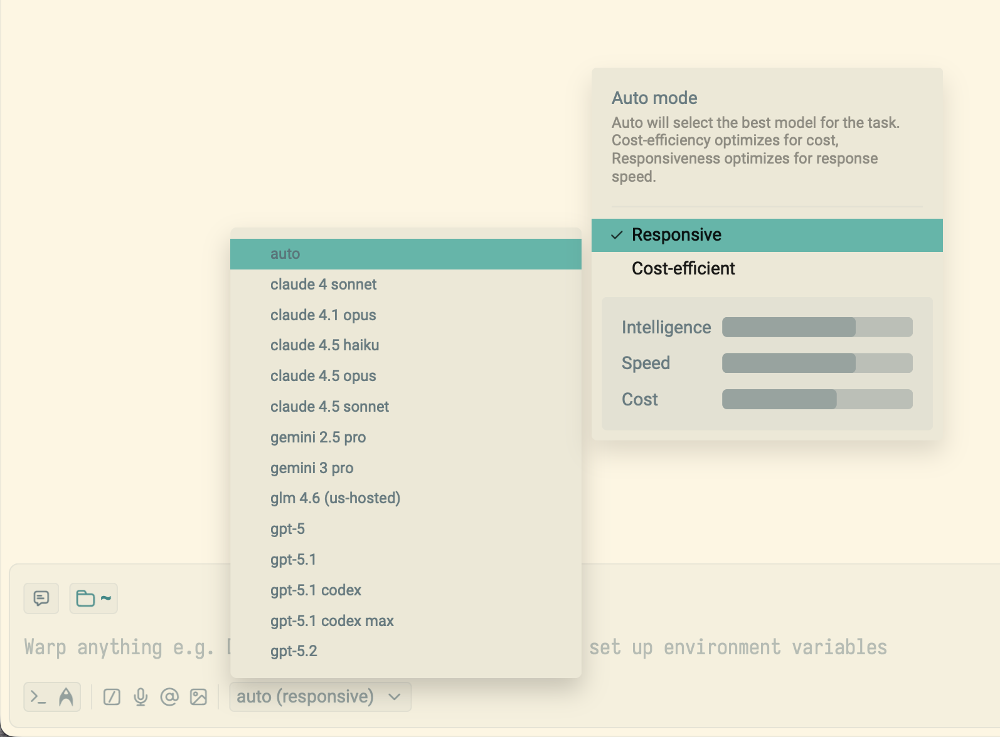
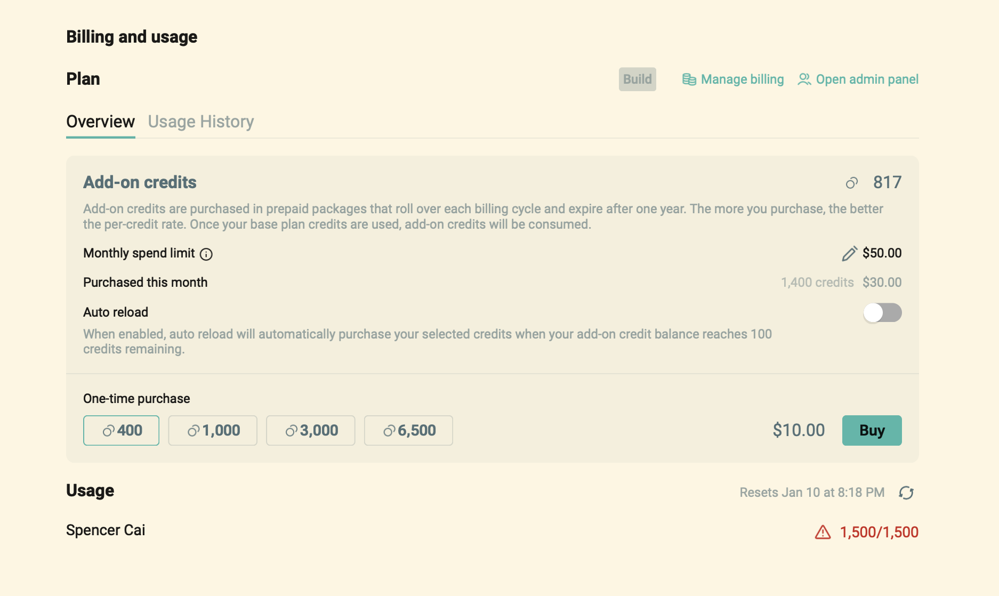
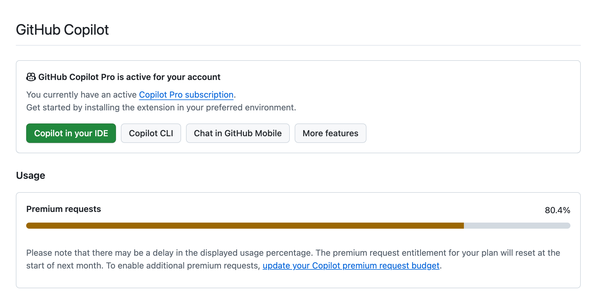
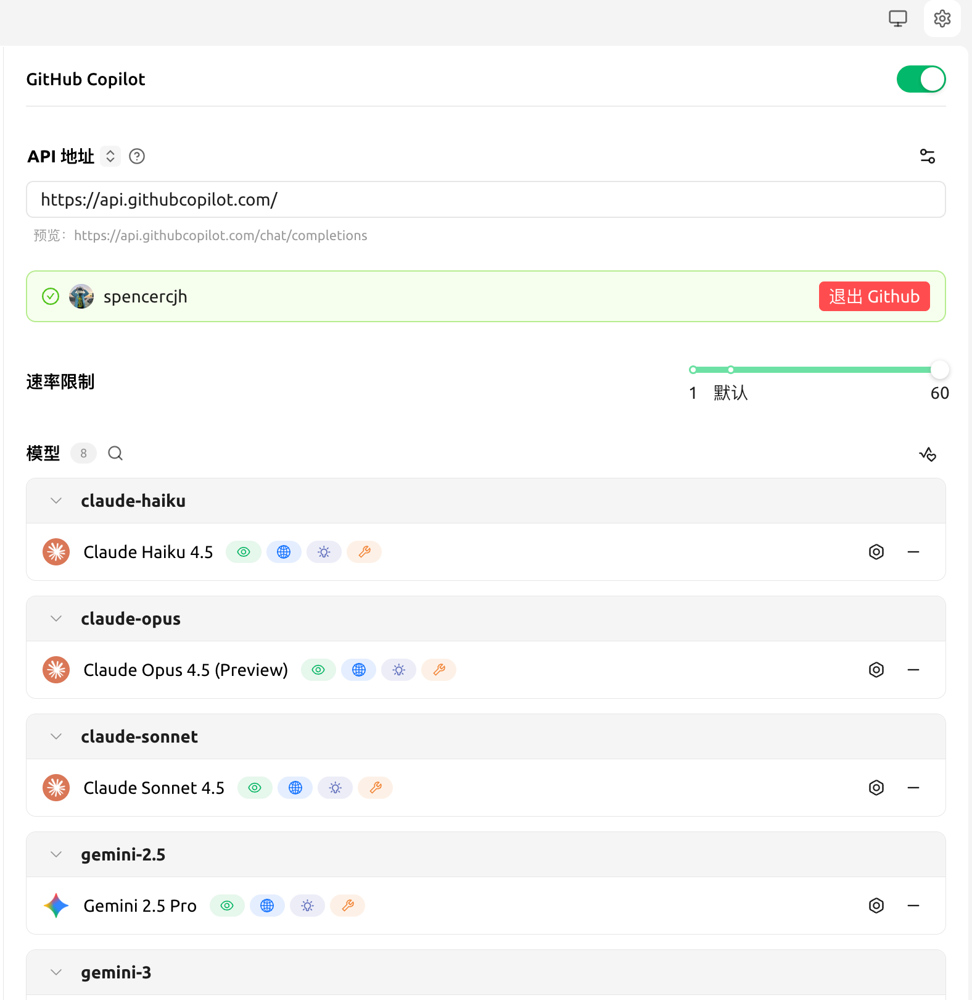
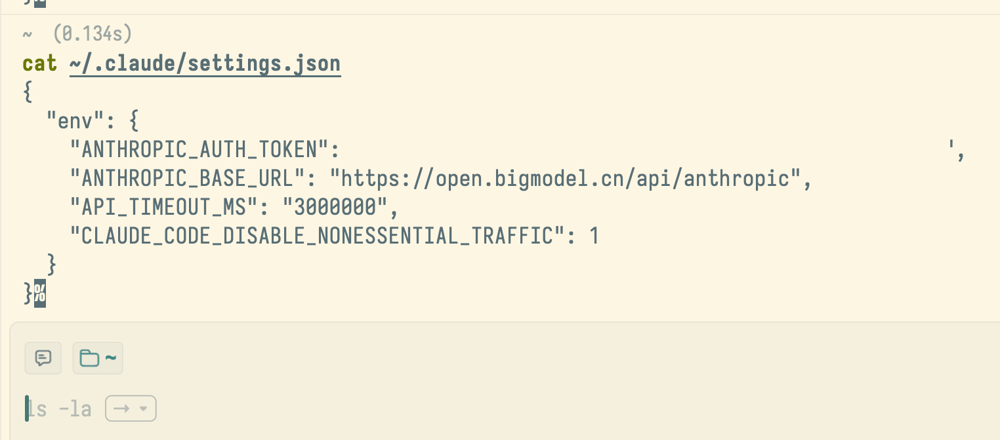

# 2025 Q4 碎碎念

Q4 断更至今，今天来输出一些碎碎念。我们抛弃繁文缛节，也不用大模型助力，直接上观点。由于单个 topic 的内容都不长，我就合在一起了。

<!-- truncate -->

## 换工作

2025 年 11 月 7 日是我在 bilibili 的最后一天，离开了工作 844 天的地方。

### 为什么想走？

1. 无意义超时工作越来越多。为什么大家都不走？
2. 推广混沌工程产品的倦怠感越来越强，成就感越来越低。我到底是来做什么的？我是高级测试开发工程师吗？
3. 缺少发展机会。

简单介绍一下我的履历：

- 职业生涯起点低，硕士肄业，直接跳过校招。
- 从商用清扫机器人开始，自认处于行业龙头，可惜哪儿哪儿都是草台班子。
- 被忽悠跟去创业 SaaS，结局令人唏嘘，n+1 离场。
- 后经朋友提携进入互联网行业，接过混沌工程“烫手山芋”。

### 目标

- 离家近一点（坐标上海嘉定南翔镇江桥镇交界位置），能 full remote 就更好了。
- 搞点新意思。
- 工资涨一点。

### 去哪儿？

9 月份看了以下机会：

- adastralab.ai：https://shimo.im/docs/gXqmd9YEORieP53o/read。推上网友介绍的，感谢 @isunjn。
- dify：https://dify-careers.notion.site/We-are-Hiring-fc1d344e2f384afa999e61b018c4744e。自己找到的。
- Mewtant：https://mewtant.io/。大家的朋友 @Manjusaka_Lee 目前任职的公司。
- A 公司：脉脉上投了 JD 还算匹配的一家 full remote 的区块链公司。
- 光轮智能：boss 直聘上找到的，在安亭有办公室。这是一家“仿真合成数据公司”，老板谢晨上过张小珺的播客：https://www.xiaoyuzhoufm.com/episode/68767e4c93fd2d72b8607c80。

结果：

- adastralab.ai：招满了。
- dify：两轮技术面通过后终止流程。
- Mewtant：要做 Leetcode mid &hard，放弃面试。
- A 公司：两轮技术面通过后发放 Offer。
- 光轮智能：我拿到 A 公司 offer 前后才发现这家公司（似乎是 HR 先打招呼的），结果无论我怎么回话，hr 都不回消息了，真遗憾。12 月底才重新找到我，加了微信保持联络。

我曾经和所有联系过我的猎头说“不考虑区块链行业”…… I'm too young, too simple.

既然去意已决，我也没有心思在留下来混日子了。It's time to say goodbye.

这里要感谢 bilibili up 主 [@由嘉由嘉](https://space.bilibili.com/3461579800578670)，[@青月已经不困了](https://space.bilibili.com/3493267270273493)和 [@polebug《分享 web3 入门计划｜2025 版》](https://polebug.github.io/2025/07/05/web3_2025/)。虽然我还是个“基架”相关程序员，完全不碰钱相关的业务，感谢你们输出的内容让人们了解区块链技术及行业相关情况。

### 现在在干嘛？

- Chaos Mesh 安装师傅&操作员 🤡
- 公司级/业务线级 go 语言相关开发框架/公共库维护者 🤡

人生不如意事十之八九，但考虑到 full-remote，工作上的事情就都还能接受。

## 新生活

### timetable

- 8:40 起床，开始加工早餐。
- 9:00 公司要求的开始工作时间。
- 9:10 晨会 A。我基本能在 9 点 10 分前把早餐准备好，并在晨会 A 后，晨会 B 前吃完。
- 9:50 晨会 B。
- 12:00 公司要求的午休开始时间。开始加工午餐。
- 12:30-12:45 一般这段时间里我能做完，开始吃午餐。
- 13:00 公司要求的午休结束时间。开始下午的工作。
- 17:55 写日报。
- 18:00 公司要求的下班时间。我所在的团队可以准时下班😆。开始加工晚餐。
- 18:15-30 一般这段时间里我能做完，开始吃晚餐。
- 19:00 吃完晚餐，沙发上看电视 or 电脑前继续工作 or 玩点游戏。
- 20:00 准备出门跑步，筋膜枪热身。
- 20:30 前后，出门 5km。
- 23:00 准备第二天的食谱，备餐。
- 00:00 - 00:30 睡觉

### 减肥

10 月开始我的两侧肩膀就患上了肩峰撞击综合症，有些肌肉有撕裂，有积液。这导致我没法再尽力伸出双手去扑救，去摘球了。除了每周一次的康复科理疗&手法，我还得做点其他的事情。full-remote 不能在家“坐月子”，多出来非常多的时间，**我得强身健体，我得减肥！**

身高 176，体重 85kg，BMI 28，这样的身材干什么都差点意思，不能再这样下去了！

#### 锻炼

一开始几天尝试了晚上去游泳，但由于我的游泳水平较低（不走水），心率只能在“有氧耐力区”浮动，想游快都游不快，在泳道里也挺尴尬的。和跑步相比，游泳的强度实在太低了，消耗的时间也更长，还要花钱……

由于体重大，体脂率高，跑 5km 对我来说并不是一件非常容易的事情。不是我找借口，跟腱天生就短，体重又大，这导致我的跟腱和小腿在 3-4 km 后会开始酸痛，在热身不足的情况下脚掌都会麻。经过一些朋友的指点，我在跑前用筋膜枪做放松，在户外也多拉伸一会儿，麻的症状延后，缓解了不少。

**重在坚持。**

目前我已持续 2 周，工作日 5km，休息日休息。影响跑步表现的因素很多，周日如果熬夜看球了，周一就跑不动……

#### 饮食

已经坚持 8 天了。

- 控热量，控碳水，控油。蛋白质可以超，其他不能超。
- 不吃猪肉。鸡胸肉的 n 种做法。
- 不吃普通米饭。替代品是窝窝头和荞麦面。
- 多吃蔬菜。由于需要控油，索性蔬菜全都吃生的，不放任何酱料。

### 运动

full-remote 后，肩膀受伤之前，我的一周运动安排大概是这样的。

- 周二晚上 ⚽，蓝梦俱乐部，20:00-22:30，有 25 分钟一节共 4 节的门需要守，最后守 1-2 轮点球大战。
- 周四晚上 ⚽，桃浦体育公园，20:00-22:00 守门 2 小时。
- 周末两天中的一天 ⚽，甯宝体育公园，不定期，守门 2 小时。
- 不踢球的工作日晚上 19:30-21:00，游泳。

守门都守得肩膀积液了，还能说是站岗放哨吗？🤡

肩膀受伤后

- 周一至周五，🏃 5km。
- 周三下午，康复训练，需要我活动的时间大概是 1h。

**放以前我想都不敢想，工作日晚上有那么多时间可以出去运动。**

### 赛道日

2025 Q4 我一共参加了三场赛道日：

- 10 月 31 日：In lap 14，当日最快圈速 1:23:556
- 11 月 22 日：In lap 16，当日最快圈速 1:22:106
- 12 月 21 日：In lap 30，当日最快圈速 1:20:830

这三场赛道日都用的同一套轮胎。现在车子上的残血半热熔轮胎已经很难在公开道路上正常行驶，打方向轮胎都会“当当当”地叫。

**当我下次换上新胎后，我定能冲进 1:19 的“美妙新世界”。**

我应该没有 [@n0vad3v](https://x.com/n0vad3v) 那样的精力去写有关汽车改装的[博客](https://fk7.nova.moe/)。关于汽车改装，特别是赛道取向的改装，我只有一个心得体会：找到真正靠谱的商家，并相信他们。在你没有找到靠谱商家之前，全都是经验教训……

### 工作

新公司新团队，部分新的工作内容，工作方式也完全变了。目前我的编码方式是这样的：

- 使用 Warp 的 Agent 编写一份 markdown spec 文档，其中包括了背景、需求、设计和大致实现方式，用于需求/技术评审。我很喜欢 Warp 的交互方式😁，它很适合我跨 n 个 repo 协同工作。（比如开发框架/公共库相关的工作）
- 评审通过后，打开具体的 Repo，使用 Github Copilot Agent 实现具体功能。在这个过程中先让它去读取之前通过评审过的 spec，根据其中内容来实现。
- 人工/本地 Github Copilot review。
- 自测
- 叫同事 review。

如果是 Chaos Mesh chaos-dashboard 的前端 UI 开发，只能把所有事情都交给 Agent 了，我只能做个提出需求者和验收者。我暂时还不会调整 React 页面样式……

Warp Agent 的 auto-responsive 模式响应速度非常快，但 credit 使用得非常快。这让我已经额外花了 $20 补充 credit。

下周我试试调到 cost-efficient 模式，看看费用能不能降下来……

copilot 每个月的 premium requests 基本可以通过 Goland 里的插件用完。此外我还会用 cherry-studio 来直接使用它的模型，体验还不错。

总之，这些东西的体验都比[质谱](https://bigmodel.cn/glm-coding?_channel_track_key=8BAeCdUS)好用，我感觉主要问题是响应速度上面。我就搞不懂了为什么它需要消耗那么多时间……

## [Chaos Mesh](https://chaos-mesh.org/)

在离开 bilibili 后，我本想再也不趟混沌工程这个浑水。我受够了和什么都不懂的测试工程师打交道。可没想到，新团队里我还得干老本行故障演练。这次我有了选择的机会，可以彻底抛弃 [Chaosblade](https://github.com/chaosblade-io/chaosblade) 了。

**新公司的质量保障相关同事人还不错，懂的也不少😁。**

### My contribution&plan

- 为 chaosd 增加了一些 troubleshooting 文档；
- 移除了可以移除的 CGO 依赖；
- 修复了 quick start 安装脚本里不符预期的报错。

- 内部 Fork 版本里我为 chaos-dashboard 做了一个 PhysicalMachine CR 的管理页，可以增/删/改（只能改 labels）/查。
- 内部 Fork 版本里我为 chaos-dashboard 还以 SAML 协议接入了公司的 SSO 系统，但感觉这个东西我目前很难抽象封装成一个开源项目里的内容。需要参考 Argo CD 的 SAML 实现。
- Event 事件中增加绝对时间/相对时间差的切换，方便用户记录事件发生时间。这个是内部第一次演练后发现的问题，还没开始开发。

希望 2026 年能在 Chaos Mesh 里看到我的更多 feature。由于公司安全机制，我得在个人电脑上重复一遍开发🤡。

### Reflection

跟着 [@strrlthedev](https://x.com/strrlthedev) 参与了 2 次 [Chaos Mesh 双周会](https://docs.google.com/document/d/1s9X6tTOy3OGZaLDZQesGw1BNOrxQfWExjBFIn5irpPE/edit?tab=t.0#heading=h.94nzmll6m8n5)，结合新公司内的使用情况，随便说两句。

- 网路不通是最大的障碍。云原生服务，operator 并不能保证联通每个外部演练目标（PhysicalMachine、RemoteCluster kube-apiserver）。还好目前大家还能接受我搭建 n 个站点：a-dev-chaos-mesh.xxx, dev-chaos-mesh.xxx, pre-chaos-mesh.xxx。
- chaos-dashboard 大有可为：
  - 大部分演练相关表单还是英文的，没有国际化。
  - “实验”和“工作流”里的表单应该保持一致但实际没有。后者是通过代码生成方式实现的，前者是硬编码的。
